# Use Case 2 – Build a data pipeline to ingest data from Azure Blob Storage to Lakehouse

**Overview**

In this lab, you build a data pipeline to move a CSV file from an input
folder of an Azure Blob Storage source to a Lakehouse destination.

**Objectives**

- Set up a workspace in Microsoft Fabric.

- Create a data pipeline to move a CSV file.

- Copy data using the Copy Assistant.

- Configure the source and destination.

- Run and schedule the data pipeline.

## Exercise 1 - Create a Data pipeline

The objective of this exercise is to create a Microsoft Fabric workspace
and build a data pipeline that ingests data from Azure Blob Storage into
a Lakehouse. This includes setting up the workspace, and creating a data
pipeline within the workspace.

### **Task-1: Create a New Workspace**

To create a workspace:

1.  From left pane,
    select **Workspaces** \> **New workspace**.

    

2.  In the Create a workspace tab, enter the following details and click
    on the **Apply** button.

    - **Workspace name** – Enter +++**DataPipeline-DF**+++

    - **Semantic Model storage format -**Small semantic model storage format

    - **Capacity-** Trial

    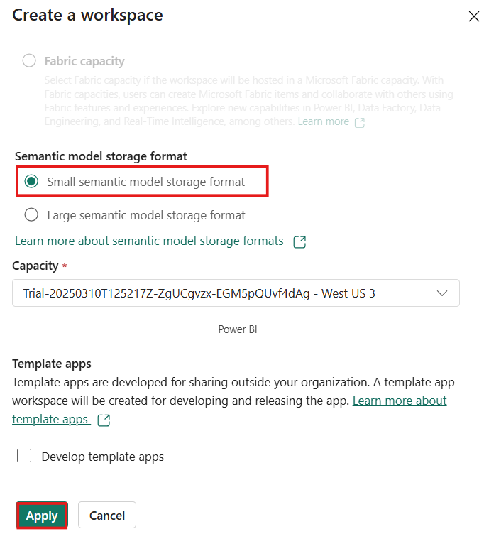

    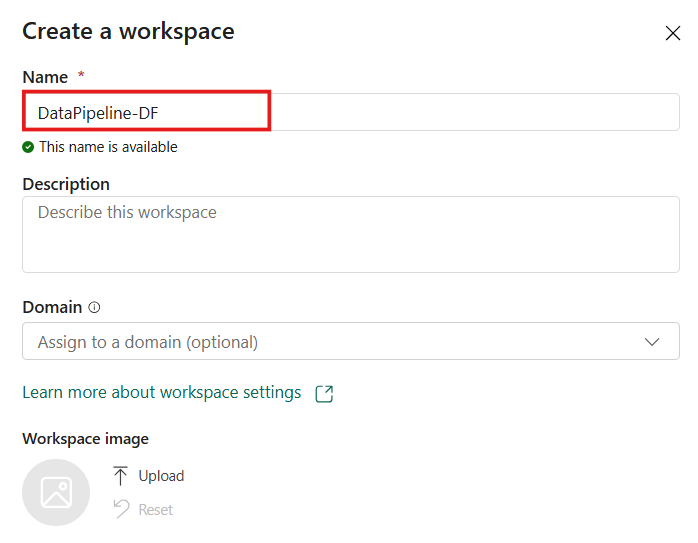

3.  You’ll be navigated to the workspace page.

    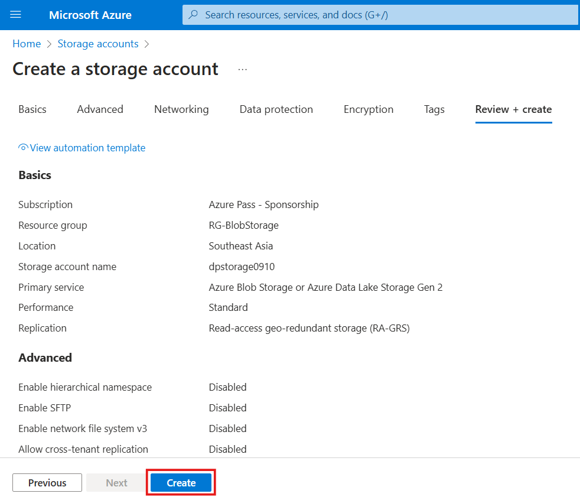

### **Task-2: Create a Data Pipeline**

1.  Click on **+ New item** and select Data pipeline card.

    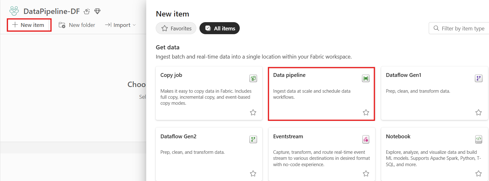

2.  Provide a name to the pipeline as pipeline1 which is a default name for a pipeline and select        **Create**.

    

3.  You’ll be navigated to the **Build a data pipeline** page.

    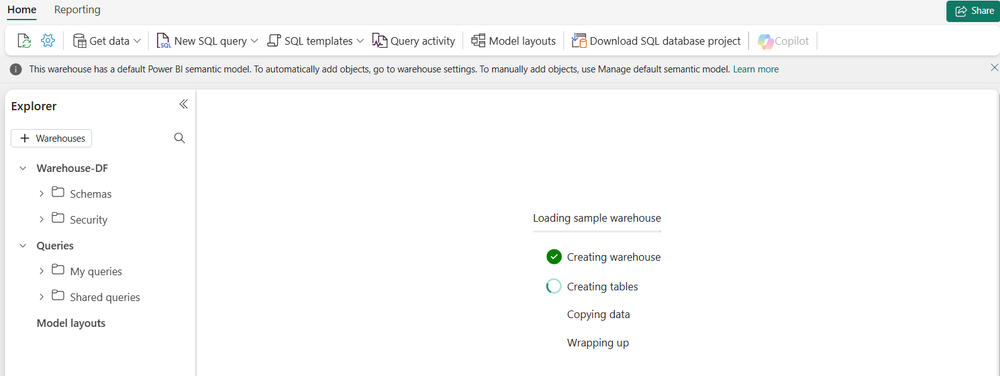

## Exercise 2 – Copy data using the Copy data assistant

The objective of this exercise is to guide users in using the **Copy
data assistant** within a data pipeline in Microsoft Fabric Data Factory
to simplify and accelerate the data copying process. This involves
selecting source and destination data stores, automatically generating
the required Copy Data activity, and executing the pipeline. By
completing these tasks, users will gain hands-on experience with a
streamlined, user-friendly approach to data movement from Azure Blob
Storage to a Lakehouse.

### **Task-1: Start with Copy data assistant**

Follow these steps to monitor a copy job in the copy job panel.

1.  Select **Copy data assistant** on the canvas to open the **copy data assistant** tool
    to get started Or Select **Use copy data assistant** from
    the **Copy data** drop-down list under the **Activities** tab on the
    ribbon.

    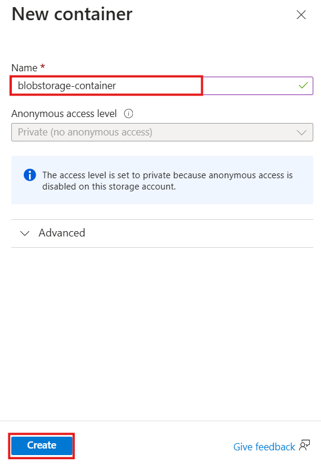

### **Task-2: Configure your source**

1.  Type +++Azure Blobs+++ in the selection filter,
    then select **Azure Blobs** and select **Next**.

    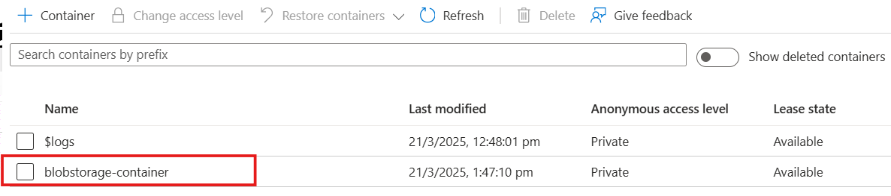

2.  Provide your account name or URL and create a connection to your
    data source by selecting **Create a new connection** under
    the **Connection** drop-down.

    a. Specify the **storage account** name in the **Account name field as
        fabricdatafactory2321**

    b. After selecting **Create new connection** with your storage account
        specified, you only need to fill in the **Authentication kind**. In
        this lab, we preferred the **Account key**. Enter the Account key
        as:

    ```
    bDDHwLs7sTZ5YP2dYJsSchnEys4a/5mnmSA3NvK/IL1yey7CIy12HU5KeBA7+ZLtKch/N2B5yMHo+AStGvYKpw==
    ```

    

    c. Once your connection is **created successfully**, you only need to
    select **Next** to Connect to a data source.

3.  Choose the file **moviesDB2.csv** in the source configuration to preview, and then
    select Next.

    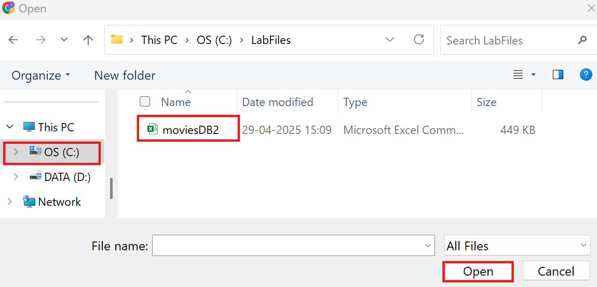

### **Task-3: Configure your destination**

1.  Select **Lakehouse**.

     

2.  Provide a name for the new Lakehouse as +++Lakehouse1+++. Then select **Create and Connect**.

    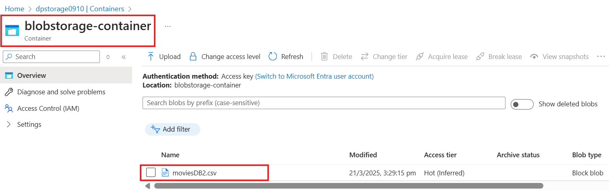

3.  Configure and map your source data to your destination; change the load settings to
    **Load to new table**, then select **Next** to finish your
    destination configurations.

    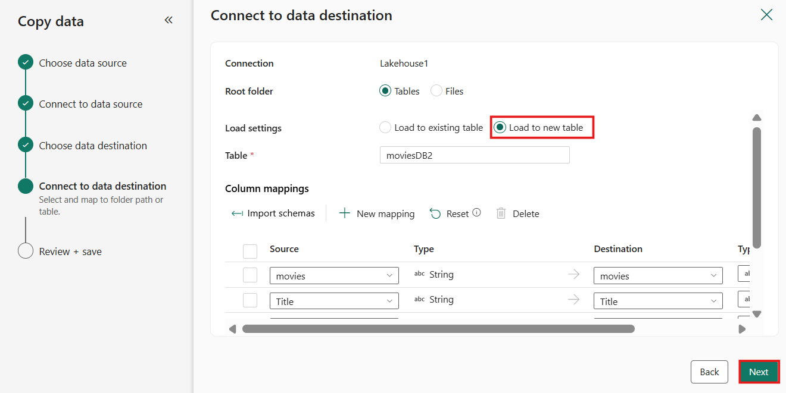

### **Task-4: Review and create your copy activity**

1.  Check the checkbox of Start data transfer immediately so that it
    will run directly once the copy activity is added to the data
    pipeline canvas.

    Review your copy activity settings in the previous steps and select Save + run to
    finish. Or you can go back to the previous steps to edit your settings
    if needed in the tool.

    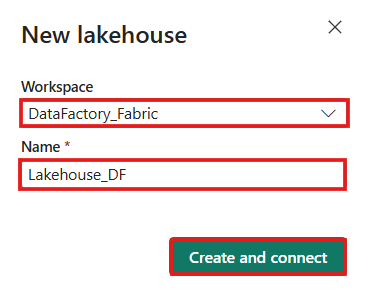

2.  Once finished, the
    copy activity is added to your data pipeline canvas and runs
    directly if you leave the Start data transfer immediately checkbox
    selected. It’ll take 2-3 mins to show the status as succeeded.

    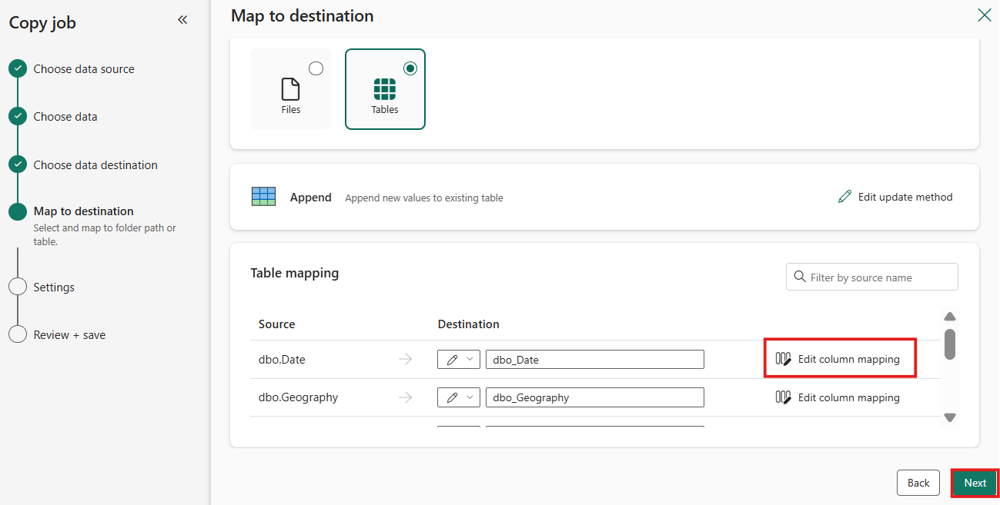

## Exercise 3 – Run and Schedule your data pipeline

The objective of this exercise is to enable users to run and schedule
their data pipeline in Microsoft Fabric Data Factory. This includes
manually triggering the pipeline to verify successful data movement and
configuring a schedule for automated, recurring runs. By the end of this
task, users will understand how to operationalize their data workflows
by setting up reliable and time-based execution of pipelines.

1.  If you didn't leave the Start data transfer immediately checkbox on the 
    **Review + Create** page, switch to the **Home** tab and select **Run**. Then
    select **Save and Run**.

    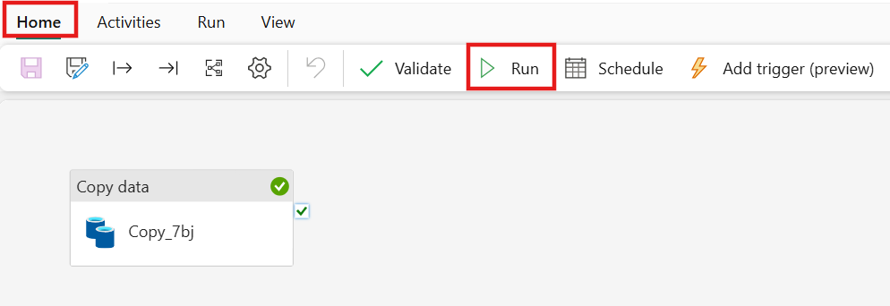

2.  On the **Output** tab, select the link with the name of your Copy
    activity to monitor progress and check the results of the run.

    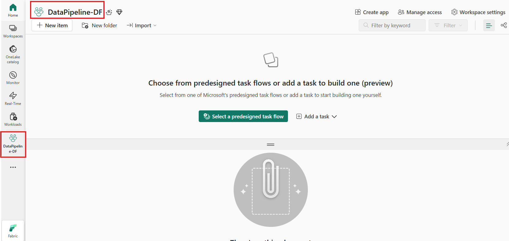

3.  The **Copy data** details dialog displays the results of the run
    including status, volume of data read and written, start and stop
    times, and duration. To see duration breakdown, select **Duration
    breakdown** dropdown.

    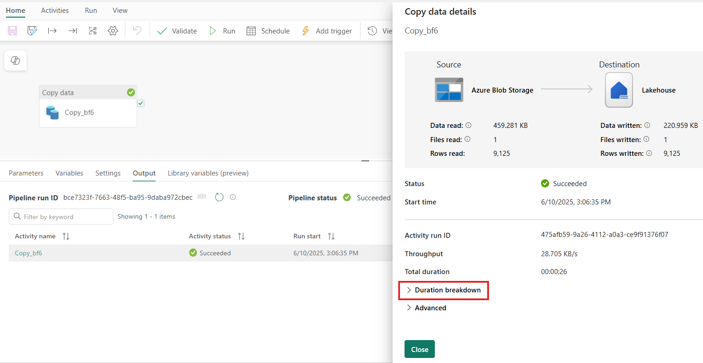

4.  This breakdown provides a detailed view of the time spent in
    different stages of the copy process, helping you pinpoint potential
    bottlenecks or performance issues. 

    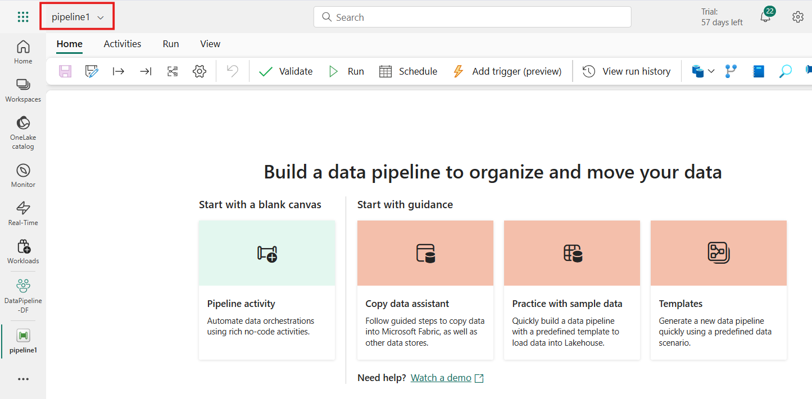

5.  Now, to view Advanced section click on the **Advanced** dropdown.
    This shows Manual trigger for this copy activity which means that
    the pipeline containing the Copy Activity was manually started by a
    user, rather than being triggered by a scheduled trigger, an
    event-based trigger.

    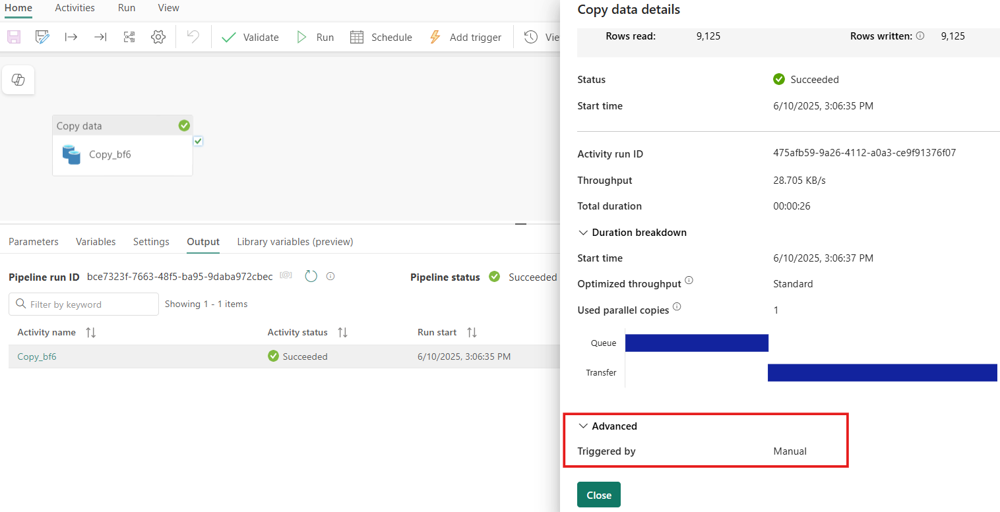

6.  You can also schedule
    the pipeline to run with a specific frequency as required. The
    following example shows how to schedule the pipeline to run every 15
    minutes.

    

    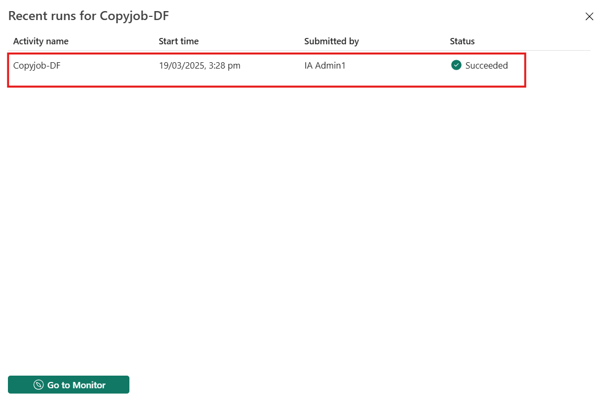

## Summary

By implementing Microsoft Fabric Data Factory, Contoso successfully
modernized its data pipeline infrastructure. This hands-on approach not
only improved operational efficiency but also empowered the analytics
team with timely, trusted data—all without writing a single line of
code. The new solution drastically reduced data ingestion time from
hours to just minutes, allowing for faster data availability.
Additionally, the pipeline's scalability enabled it to handle
high-volume data files seamlessly, supporting the organization’s growing
data needs.
