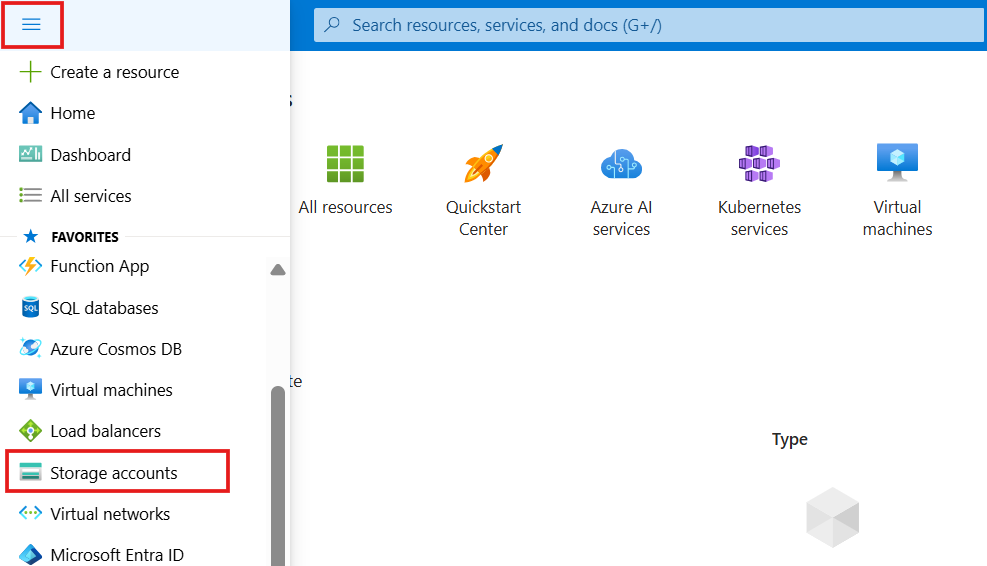
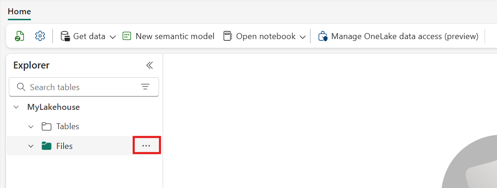
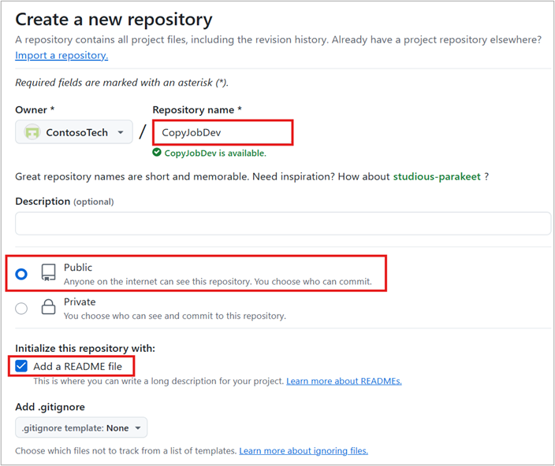
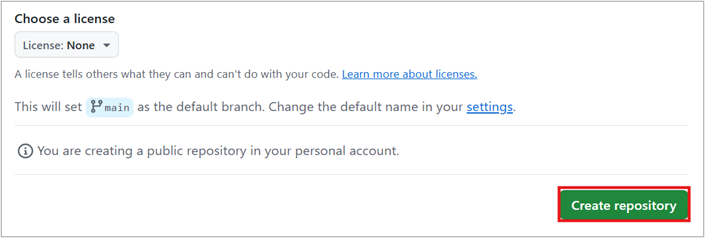
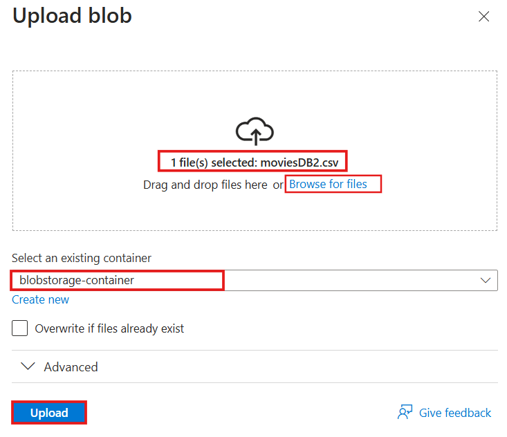
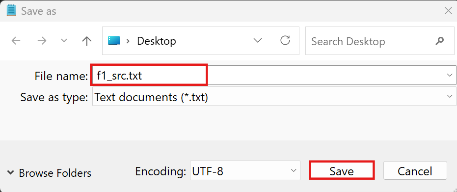
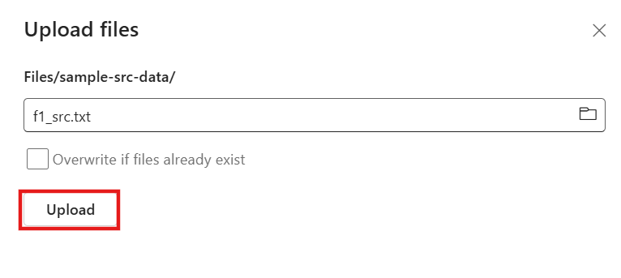
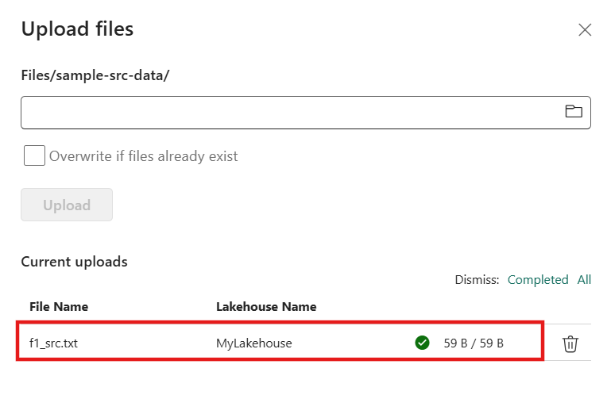
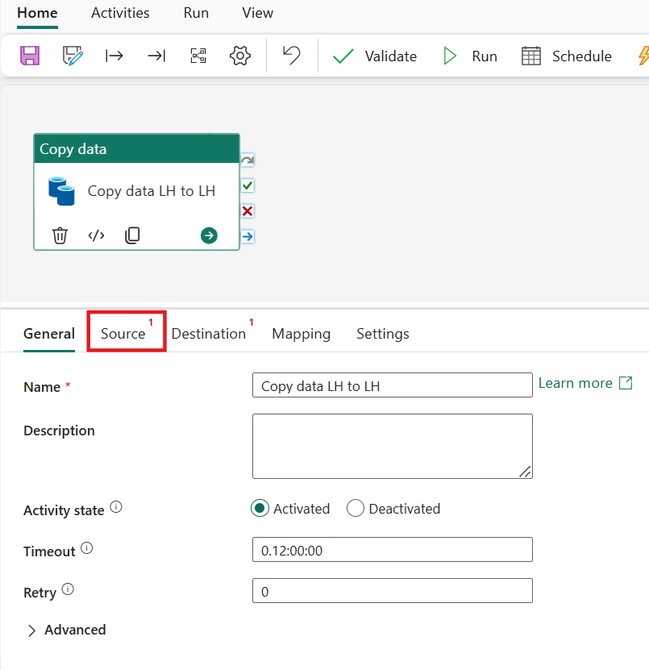

# Use Case 3 – Enhance Data Pipeline with Parameters in Microsoft Fabric 

**Overview**

In this lab, you'll learn how to enhance the data pipeline with
parameters. This is designed to make moving files in the Lakehouse in
Microsoft Fabric more flexible and efficient. Instead of hardcoding file
names or paths, it uses parameters that you can easily change when
running the pipeline. That means you can reuse the same pipeline for
different files or folders without rewriting anything—making it quicker
to manage data transfers, especially as your data grows or changes over
time.

**Objectives**

- Enable dynamic file copying in the Lakehouse using parameters.

- Allow flexible input of file names and paths at runtime.

- Improve pipeline reusability and scalability.

- Simplify maintenance by avoiding hardcoded values.

- Support automated and configurable data movement in Microsoft Fabric.

## Exercise 1 – Setting up the Environment

The objective of this exercise is to guide you through the essential
**environment setup required to create a Copy Job in Microsoft Fabric
Data Factory**. You will learn how to prepare the foundational
components needed to enable smooth data movement and pipeline execution.

### **Task-1: Create a New Workspace**

To create a workspace:

1.  From left pane, select **Workspaces** \> **New workspace**.

    

2.  In the Create a **workspace tab**, enter the name of the workspace
    as +++**DataFactory-Param**+++ and click on the **Apply** button.

    

### **Task-2: Create a Lakehouse and Upload a file** 

3.  In the **DataFactory-Param** Workspace page, select **+New Item.**

    

4.  Look for the **Lakehouse** card under Store Data section **and click
    on it.**

    

5.  On the **New Lakehouse** dialog, provide a name for your lakehouse
    as +++**MyLakehouse**+++ and click on the **Create** button.

    

6.  The create action creates a new Lakehouse.

    

7.  Now, you need a folder to upload a file to
    move it from source to destination lakehouse. In order to create a
    **new** **subfolder** under files section, click on **context menu
    (…)** of files section.

    

    From the Files menu, select **new subfolder** option.

    

8.  Name the new subfolder as +++**sample-src-data**+++ and click on
    **Create** button.

    

9.  A New subfolder is created. Click on
    the **subfolder name** to move ahead with uploading a file.

    

10. Now, you need to create a sample txt file to upload in the folder
    that you have just created and to test in the later steps that if
    this folder with the txt file is copied from the source to
    destination lakehouse.

    To create a new txt file, open notepad and write a sample content in
    it i.e., +++**Enhancing Data Pipeline with Parameters in Microsoft Fabric.**+++

    

11. Save the txt file as +++**f1_src.txt.**+++

    

    

12. Click on the folder name that you have created in the lakehouse and select **Get data** button.

    

13. From the **Get data** dropdown, select **Upload files** option.

    

14. Click on the **Files** icon to browse the **f1_src.txt** file that
    you have created in the previous steps.

    

15. Select the file from the destination and click on **open** button.

    

16. You can see the file is now selected to uploaded. Proceed with
    clicking on the **Upload** button.

    

17. The **f1_src.txt** file is now successfully uploaded.

    

## Exercise 2 - Create and Configure a Data Pipeline in Microsoft Fabric

### **Task-1: Create a Data Pipeline**

1.  Navigate to the existing workspace
    i.e., **DataFactory-Param** from the left pane.

    

2.  In the workspace, select **+ New item** to create a new data
    pipeline.

    

3.  Select **Data Pipeline** card under Get data section.

    

4.  Enter a name of the pipeline as
    +++**DF-pipeline**+++ and click on **Create** button.

    

5.  To add a pipeline activity in the
    data pipeline, select **pipeline activity** option.

    

6.  From the dropdown menu, select **copy data** activity.

    

7.  Rename the copy data activity to +++**Copy data LH to LH**+++

    

### **Task-2: Add Parameters in Data Pipeline**

1.  To add parameters, first click
    somewhere on the **blank canvas**. Then, you’ll see the parameters
    tab will be displayed.

    

2.  Click on **+New** option.

    

    

3.  Here, create two parameters for the
    pipeline that are both going to be of string type. Name the **first
    parameter** which represents the source file as +++**src_filename**+++

    

4.  File type can be changed here but for this lab, we are keeping it as
    **String** which is selected by default for both the parameters.

    

5.  To create **second parameter**, again click on **+New** option.

    

6.  Second parameter represents the **destination file**. Provide a name
    to this parameter as +++**dst_filename**+++.

    **Note: Default values for these parameters will be added while
    running the pipeline later in the steps.**

    

### **Task-3: Configure Source Lakehouse**

1.  Select the **copy activity** to add
    source and destination lakehouse.

    

2.  Name for the copy activity specified. Now, navigate to the source
    tab to configure the source lakehouse.

    

3.  In the connection dropdown, select
    the Lakehouse - **MyLakehouse** that you created initially in this lab.

    

4.  In the root folder field, select **Files** as the root folder since you need to
    copy the raw files.

    
    
    

5.  To add a file path, select **Browse** option.

    

6.  Select the **source folder** that you
    have created in the lakehouse as **sample-src-data**. However, even
    though on double clicking on this folder you can see the .txt file
    but no need to select the file since we don't want to hard code the
    file name to our file pad so we can just click **OK** without
    selecting any files and this will then just add this folder to the
    path.

    

7.  Root folder is now added.
    Furthermore, click the **file name field** to make it **active**.

    

8.  As soon as the field is active, the
    **Add dynamic content** option will be displayed under the input
    field.

    

9.  This will open the dynamic expression builder. You can see two
    parameters are available and those are the same parameters that you
    defined to this pipeline previously. Since, you are configuring the
    source, click on the source parameter i.e., **src_filename.**

    

10. This will then automatically create
    the **expression** that will point to that parameter. Click on
    **OK** button.

    

11. **Parameter expression** is added in
    the file path after the source folder.

    

12. Now, quickly check that we are using
    **binary** as the **file** **format** since in this lab, files are
    copied as binary blocks without caring about the file contents.

    

Now, you are done with the source configuration!

### **Task-4: Configure Destination Lakehouse**

1.  In order to configure the destination
    lakehouse, switch to the **destination** tab. This will be done in a
    similar fashion like configuring the source.

    

2.  In the connection dropdown, select
    the same Lakehouse i.e., **MyLakehouse** that you selected for
    configuring the source.

    

3.  In the root folder field, again
    select **Files** as the root folder since you are using the raw files.

    

4.  Provide a name of the destination
    folder as +++**sample-dst-data**+++ in the directory field of the File path.

    

5.  Now, click the **file name field** to make it **active** and select
    **Add dynamic content** option.

    

6.  This will again open the dynamic
    expression builder. Since, now you are configuring the destination,
    click on the **destination** **parameter** i.e., **dst_filename.**

    

7.  The expression is automatically generated. Click on **OK** button.

    

8.  **Parameter expression** is added in
    the file path after the destination folder.

    

9.  Make sure the **file format** is
    selected to **binary**.

    

**You are done with destination configuration!**

### **Task-5: Validate the data pipeline**

1.  Click on Validate option from the Home tab to check that there are
    no configuration errors in the Pipeline.

    

2.  There are no errors found. So,
    everything should be fine from a configuration perspective. Click on
    the **Close** button.

    

## Exercise 3 – Run and Test the Data Pipeline

### **Task-1: Save and Run the Data Pipeline**

1.  Now, to run the pipeline successfully, click **Run** option under
    the **Home** tab.

    

2.  This will prompt you to save and run
    the pipeline. Give a confirmation by clicking on **save and run**
    button.

    

3.  Now, provide values for the parameters that you have defined for
    this pipeline. To the **first parameter as src_filename**, input the
    file name of the first file created in the Lakehouse as
    +++**f1_src.txt**+++

    

4.  To the **destination parameter as dst_filename**, input the file
    name as +++**f1_dst.txt**+++. The file will be renamed after it has been
    copied to the Lakehouse.

    

5.  Click on **OK** button to trigger the run.

    

6.  Wait for 2-3 mins to finish the run
    process. You’ll see that the pipeline’s activity status is now
    updated to **Succeeded**.

    

### **Task-2: Test the parameters in data pipeline** 

1.  Before checking the Lakehouse that if
    the file is successfully copied, you can double check which
    parameter values were used when running the pipeline. This can be
    done by clicking the **@** symbol beside pipeline run ID.

    

2.  Both the parameters specified in the pipeline are used while running
    the pipeline.

    

3.  The second way to check activity
    input to see what was the value that went to the file name when the
    pipeline ran is by clicking the **input icon.**

    

4.  In this input, find the value of the file name property which is the
    parameter value that you gave to the pipeline.

    

### **Task-3: Check the Lakehouse for the destination folder**

1.  Next, navigate to the lakehouse i.e.,
    **MyLakehouse** from the left pane.

    

2.  Refresh the Lakehouse to see the **copied destination folder** under
    the **Files** section.

    

3.  After refreshing the Lakehouse,
    you’ll see that the destination folder is now successfully copied to
    the Lakehouse.

    

4.  Click on **sample_dst_data** to check
    once if the file that we named in the parameter as **f1_dst.txt**
    while running the pipeline has also been copied in this destination
    folder. Now, you have the idea about the use of parameters in data
    pipeline.

    

## Summary

In Microsoft Fabric, parameters can be used in a data pipeline to
dynamically copy files from in the Lakehouse. By defining pipeline
parameters—such as file name, folder path, or date—you can construct
dynamic source and destination paths. These parameters are then
referenced within the Copy Data activity using expressions, allowing the
pipeline to adapt to different file inputs or destinations without
manual changes. This approach enhances reusability, simplifies
automation, and supports scalable data movement across Lakehouse in a
flexible and efficient manner.
