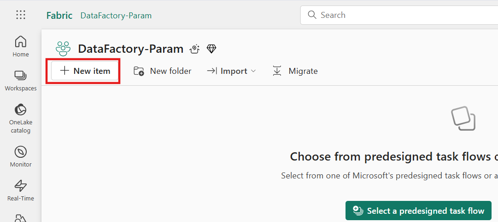

# Use Case 3 – Enhance Data Pipeline with Parameters in Microsoft Fabric 

In this lab, you'll learn how to create a **Copy Job pipeline** to
transfer data from a source system (like Azure Data Lake or Warehouse)
to a destination storage — all through a **code-free, visual
interface**. This lab showcases how Copy Jobs can automate and
streamline **data movement across various services**, making it easier
to prepare and deliver data for reporting, analytics, and business
intelligence.

## Exercise 1 – Setting up the Environment

The objective of this exercise is to guide you through the essential
**environment setup required to create a Copy Job in Microsoft Fabric
Data Factory**. You will learn how to prepare the foundational
components needed to enable smooth data movement and pipeline execution.

### **Task-1: Create a New Workspace**

To create a workspace:

1.  From left pane, select **Workspaces** \> **New workspace**.

2.  In the **Create a workspace** tab, enter the name of the workspace
    as **DataFactory-Param** and click on the **Apply** button.

### **Task-2: Create a Lakehouse and Ingest a file** 

1.  In the **DataFactory-Param** Workspace page,
    select **+New Item.**

2.  Look for the **Lakehouse** card under Store Data section **and click
    on it.**

3.  On the **New Lakehouse** dialog,
    provide a name for your lakehouse as **MyLakehouse** and click on
    the **Create** button.

4.  The create action creates a new Lakehouse.

## Exercise 2 - Create a Data Pipeline in Data Factory

### **Task-1: Create a Copy job in Data Factory**

1.  Navigate to the existing workspace i.e., Warehouse-DF page.

## Conclusion

Congratulations! You've successfully built and executed a **Copy Job
pipeline in Microsoft Fabric Data Factory**, gaining hands-on experience
with one of the most essential tools for **cloud-scale data movement and
integration**.
