# Use Case 4: Data Factory solution for moving and transforming data with dataflows and data pipelines

**Overview**

This lab helps you accelerate the evaluation process for Data Factory in
Microsoft Fabric by providing a step-by-step guidance for a full data
integration scenario within one hour. By the end of this tutorial, you
understand the value and key capabilities of Data Factory and know how
to complete a common end-to-end data integration scenario.

**Objectives**

The lab is divided into three exercises:

- **Exercise 1:** Create a pipeline with Data Factory to ingest raw data
  from a Blob storage to a bronze table in a data Lakehouse.

- **Exercise 2:** Transform data with a dataflow in Data Factory to
  process the raw data from your bronze table and move it to a Gold
  table in the data Lakehouse.

- **Exercise 3:** Automate and send notifications with Data Factory to
  send an email to notify you once all the jobs are complete, and
  finally, setup the entire flow to run on a scheduled basis.

# Exercise 1: Create a pipeline with Data Factory

## Task 1: Create a workspace

Before working with data in Fabric, create a workspace:

1.  Open your browser and browse to
    +++<https://app.fabric.microsoft.com/>+++

2.  In the **Microsoft Fabric** window, enter your credentials, and
    click on the **Submit** button.

    

3.  Then, in the **Microsoft** window, enter the password and click on
    the **Sign in** button**.**

    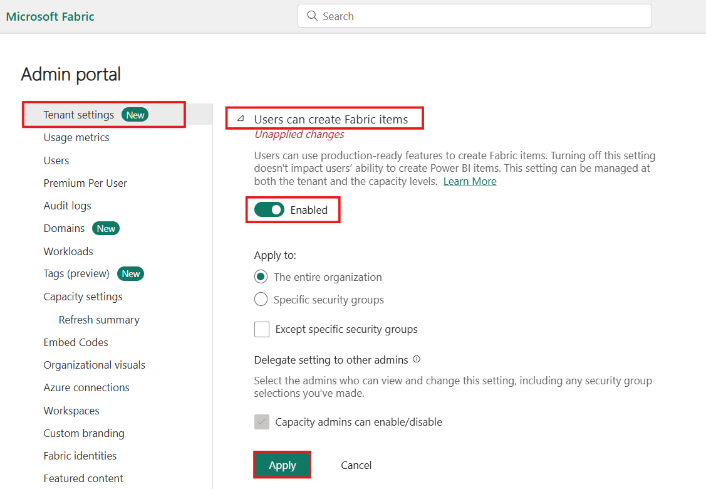

4.  In the **Microsoft Fabric** home page, select the **Power BI**
    template.

    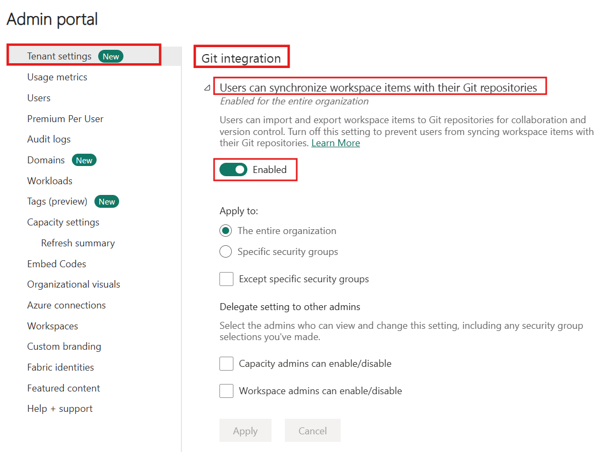

5.  In the **Power BI Home** page
    left-sided navigation bar, select **Workspaces** (the icon looks
    similar to 🗇).

    

6.  In the Workspaces pane,
    select **+** **New workspace**.

    

7.  In the **Create a workspace** tab, enter the following details and
    click on the **Apply** button.

    |   |    |
    |-----|-----|
    |Workspace Name|	Enter a unique name. for example – Data-Factory67|
    |Advanced	|Under License mode, select Trial|
    |Default storage format	|Small semantic model storage format|

    

    

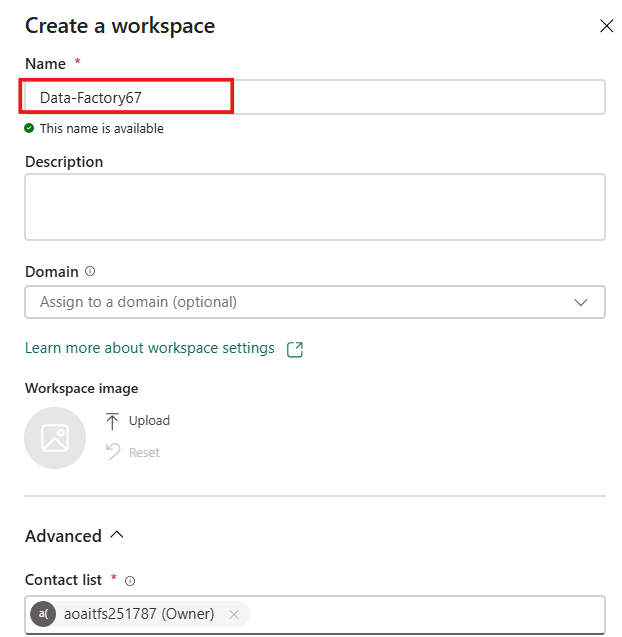

8.  Wait for the deployment to complete. It’ll take approximately 2-3
    minutes.

9.  In the **Data-FactoryXX** workspace page,
    navigate and click on **+New** button, then select **Lakehouse.**

    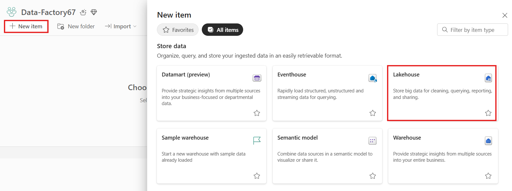

10. In the **New lakehouse** dialog box, enter
    +++**DataFactoryLakehouse+++** in the **Name** field, click on the
    **Create** button and open the new lakehouse.

    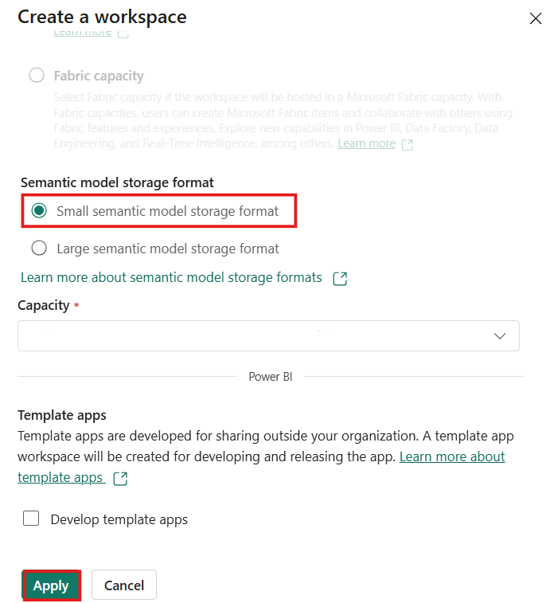

    

11. Now, click on **Data-FactoryXX** on the left-sided navigation pane.

    
    
### **Task-2: Create a Data Pipeline** 

1.  Select the default Power BI icon at the
    bottom left of the screen, and select **Fabric**.

    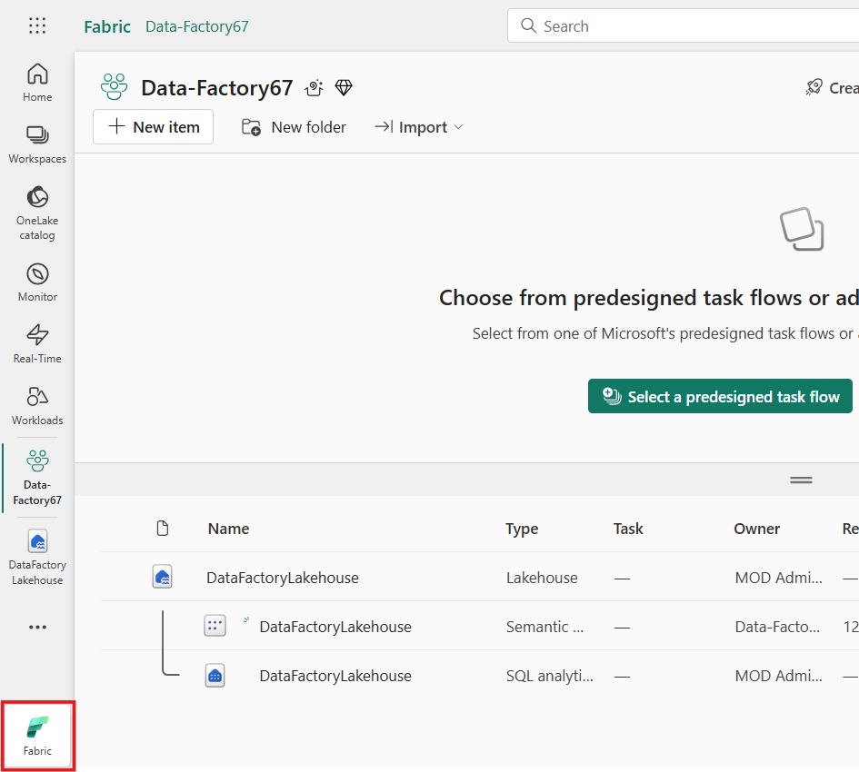

2.  Select a workspace from the **Workspaces**
    tab, then select **+New item** and choose **Data Pipeline**.

    

3.  Provide a Pipeline Name and then select **Create**.

    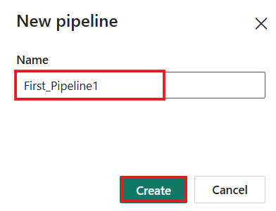

## Task 3: Use a Copy activity in the pipeline to load sample data to a data Lakehouse

1.  In the **First_Pipeline1** home page, Select **Copy data assistant**
     to open the copy assistant tool.

    

2.  The **Copy data** dialog is displayed with
    the first step, **Choose data source**, highlighted. Select
     **Sample data** section, and select the **NYC Taxi-Green** data
    source type. Then select **Next**.

    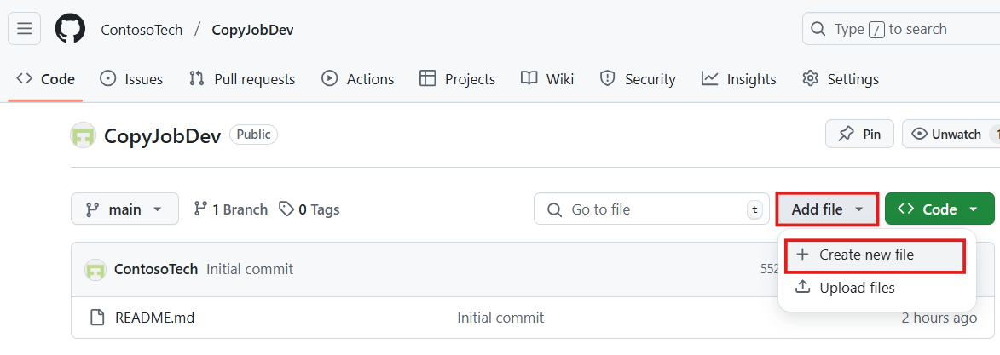

3.  In the **Connect to data source**, click on **Next** button.

    

4.  Select OneLake data hub and
    select **Existing Lakehouse** on the data destination configuration
    page that appears.

    

5.  Now configure the details of your Lakehouse destination on
    the **Select and map to folder path or table.** page.
    Select **Tables** for the **Root folder**, provide a table name
    +++**Bronze+++**, and select the **Next**.

    

7.  Finally, on the **Review + save** page of the copy data assistant, review the
    configuration. For this lab, uncheck the **Start data transfer
    immediately** checkbox, since we run the activity manually in the
    next step. Then select **OK**.

   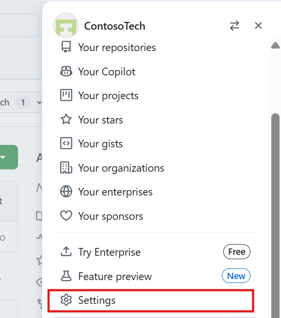

## Task 4: Run and view the results of your Copy activity.

1.  On the **Home** tab of the pipeline editor window, then select
    the **Run** button.

    

2.  In the **Save and run?** dialog box, click
    on **Save and run** button to execute these activities. This
    activity will take around 11-12 min

    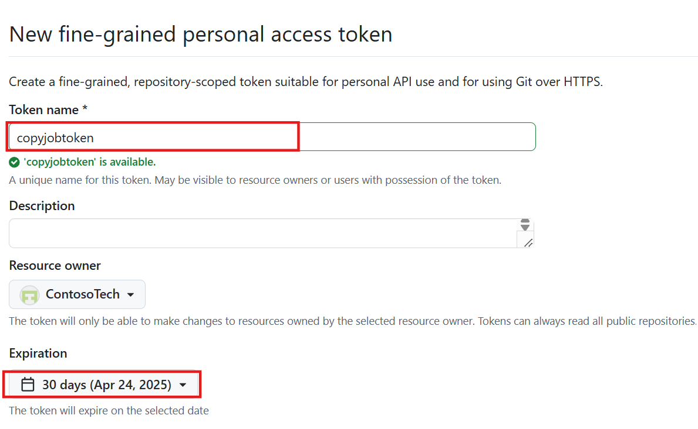

    

3.  You can monitor the run and check the results on the **Output** tab
    below the pipeline canvas. Select the **activity name** to view the
    run details.

    

4.  The run details show 76,513,115 rows read
    and written.

    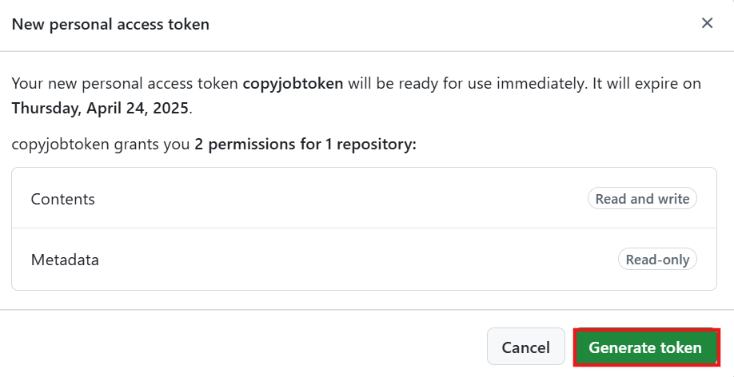
    
5.  Expand the **Duration breakdown** section to
    see the duration of each stage of the Copy activity. After reviewing
    the copy details, select **Close**.

    

**Exercise 2: Transform data with a dataflow in Data Factory**

## Task 1: Get data from a Lakehouse table

1.  On the **First_Pipeline1** page, from the sidebar select **Create.**

    

2.  On the **Data Factory Data-FactoryXX** home page, to create a new
    dataflow gen2 click on **Dataflow Gen2** under the **Data
    Factory.** 

    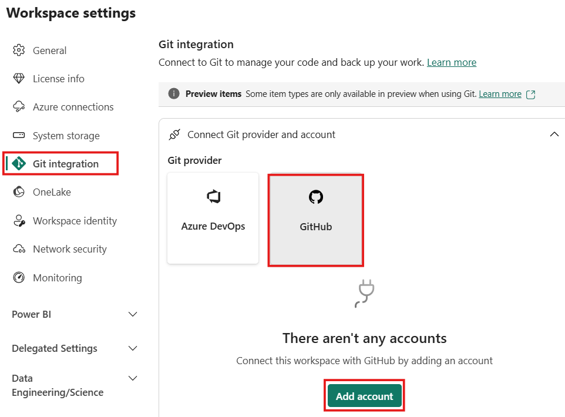

3.  From the new dataflow menu, under the
    **Power Query** pane click on **Get data drop down**, then select
    **More...**.

    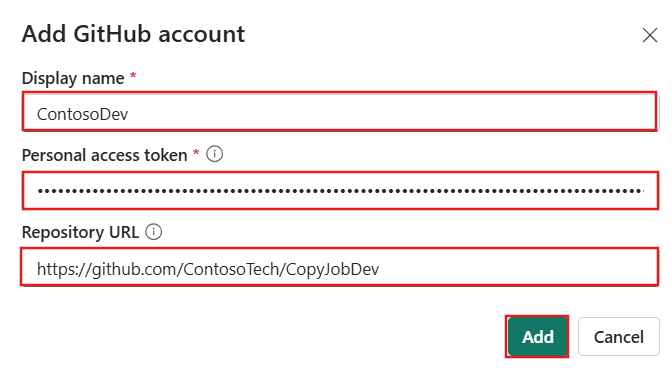

4.  In the **Choose data source** tab, search
    box search type +++**Lakehouse+++** and then click on the
    **Lakehouse** connector.

    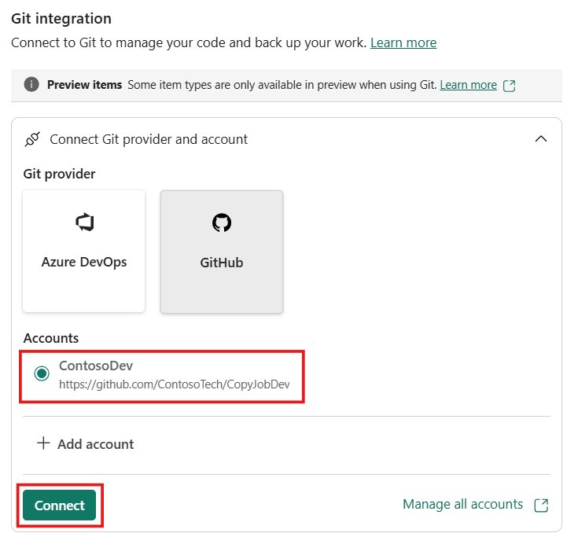

5.  The **Connect to data source** dialog appears, and a new connection
    is automatically created for you based on the currently signed in
    user. Select **Next**.

    

6.  The **Choose data** dialog is displayed. Use
    the navigation pane to find the Lakehouse you created for the
    destination in the prior module, and select
    the **DataFactoryLakehouse** data table then click on **Create**
    button.

    

7.  Once your canvas is populated with the data, you can set **column
    profile** information, as this is useful for data profiling. You can
    apply the right transformation and target the right data values
    based on it.

    To do this, select **Options** from the ribbon
    pane, then select the first three options under **Column profile**, and
    then select **OK**.

    

## Task 2: Transform the data imported from the Lakehouse

1.  Select the data type icon in the
    column header of the second column, **IpepPickupDatetime**, to
    display a dropdown menu and select the data type from the menu to
    convert the column from the **Date/Time** to **Date** type.

    

2.  On the **Home** tab of the ribbon, select
    the **Choose columns** option from the **Manage columns** group.

    

3.  On the **Choose columns** dialog, **deselect** some columns listed
    here, then select **OK**.

    - lpepDropoffDatetime

    - puLocationId

    - doLocationId

    - pickupLatitude

    - dropoffLongitude

    - rateCodeID

    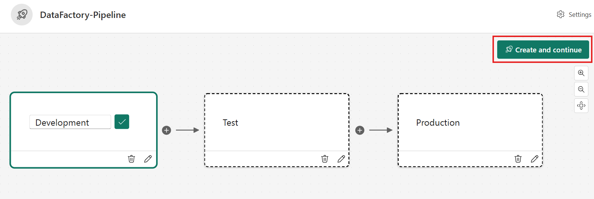

4.  Select the **storeAndFwdFlag** column's
    filter and sort dropdown menu. (If you see a warning **List may be
    incomplete**, select **Load more** to see all the data.)

    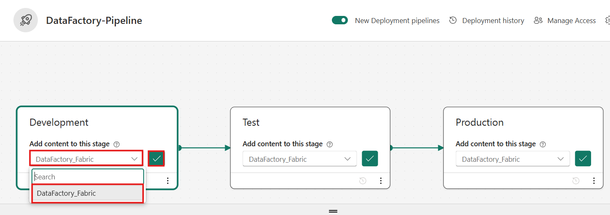

5.  Select '**Y'** to show only rows where a discount was applied, and
    then select **OK**.

    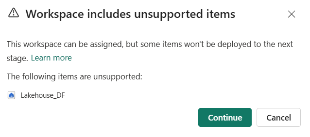

6.  Select the **Ipep_Pickup_Datetime** column
    sort and filter dropdown menu, then select **Date filters**, and
    choose the **Between...** filter provided for Date and Date/Time
    types.

    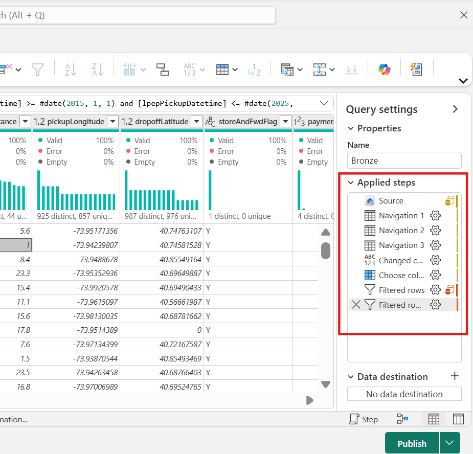

7.  In the **Filter rows** dialog, select dates between **January 1,
    2015**, and **January 31, 2015**, then select **OK**.

    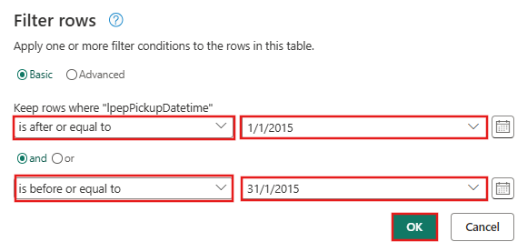

## Task 3: Enable Fast Copy and Interpret Query Folding 

1.  To enable the fast copy option, navigate to **Options** under the
    **Home** tab.

    

2.  Select **Scale** option and make sure the checkbox to **allow use of
    fast copy connectors** is checked. Click on **OK.**

    

3.  Before moving ahead with fast copy and avoid performance issues, you
    need to check the **Applied Steps** under **Query Settings** and
    examine the **query folding indicator** next to the steps to
    determine how many steps can use fast copy for better performance.

    

4.  The last two steps shows a red icon, indicating that the **Filter
    rows** step isn't supported by fast copy. However, all previous
    steps showing the yellow icon can be potentially supported by fast
    copy.

    

5.  At this point if you directly publish and run your Dataflow Gen2, it
    might doesn't use the fast copy engine to load your data. To still
    use the fast copy engine, you can **delete** these last two
    transformations for **Filtered rows** showing red, indicating that
    they aren't supported by fast copy but for this lab, we are not
    preferring that.

6.  Right-click on the query name to enable fast copy.

    

7.  Navigate to your workspace from the left pane.

    

8.  You’ll be redirected to the **workspace** page. Select **More**
    options for the **Dataflow 1** by clicking on the three dots beside
    dataflow name.

    

9.  Select **Refresh History** option from the more options menu.

    

10. Click on the **start time** to see the details.

    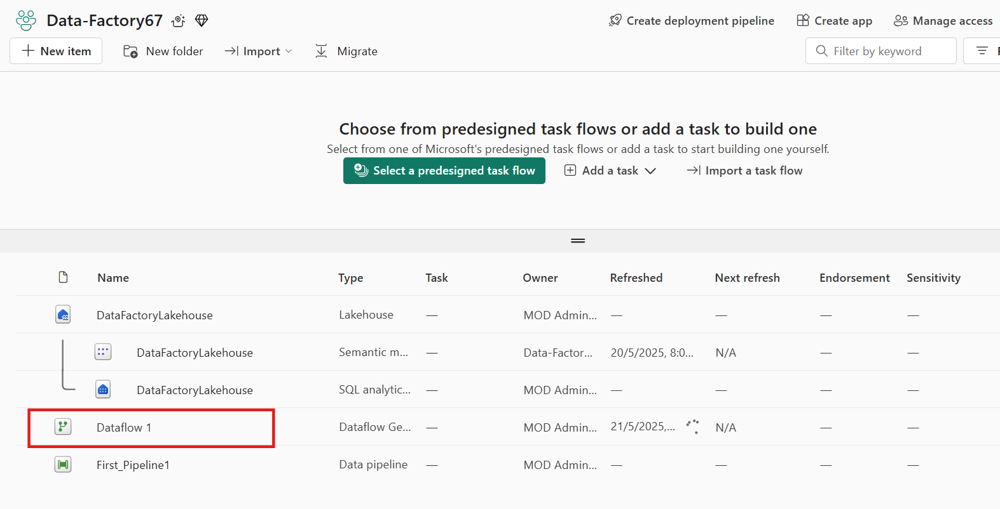

11. Now, select the **Bronze** table to see if this query used Fast Copy
    or not.

    

12. You can see in the **Engine**- **CopyActivity** is used. This
    represents that **Fast** **Copy** is used.

    

## Task 4: Incremental Refresh in Dataflow Gen 2

1.  Navigate to your dataflow from the workspace page and click on the
    **dataflow1**.

    

2.  To move ahead with **incremental refresh**, you must have a data
    that contains a **DateTime**, **Date**, or **DateTimeZone** column
    that you can use to filter the data. In the Bronze table, you
    already have a column with Date data type named
    **IpepPickupDatetime**.

3.  Also, Ensure that the query fully folds, which means that the query
    is fully pushed down to the source system. If the query doesn't
    fully fold, you need to delete the query so that it fully folds. You
    can ensure the query fully folds by deleting the steps with red
    indicator in the query editor.

    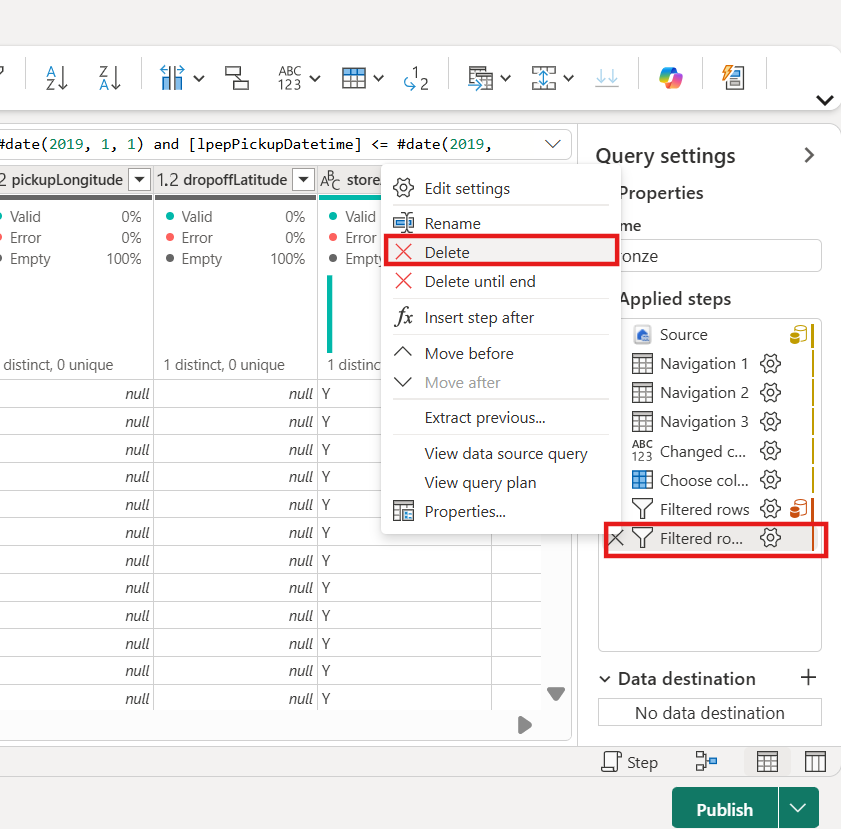

    

4.  You’ll see now that all the queries are now fully folded.

    

5.  Right-click the **Bronze** table name and select **Incremental
    refresh** from the menu.

    

6.  Provide the required settings for incremental refresh.

    1.  Enable Incremental refresh by clicking on the checkbox.

    2.  Choose a **DateTime** column to filter by i.e.,
        **IpepPickupDatetime.**
    3.  Extract data from the past- **2 Weeks.**

    4.  Bucket size - **Day**

    5.  Only extract new data when the maximum value in this column changes-
        **IpepPickupDatetime.**

    6.  Advanced Settings – Enable **require incremental refresh query to
    fully fold.**

    Click on **OK** to save the settings.

    

7.  **Publish** the Dataflow Gen2.

    

After you configure incremental refresh, the dataflow automatically
refreshes the data incrementally based on the settings you provided. The
dataflow only retrieves the data that changed since the last refresh.
So, the dataflow runs faster and consumes less resources.

## Task 5: Connect to a CSV file containing discount data

Now, with the data from the trips in place, we want to load the data
that contains the respective discounts for each day and VendorID, and
prepare the data before combining it with the trips data.

1.  From the **Home** tab in the dataflow editor
    menu, select the **Get data** option, and then choose **Text/CSV**.

    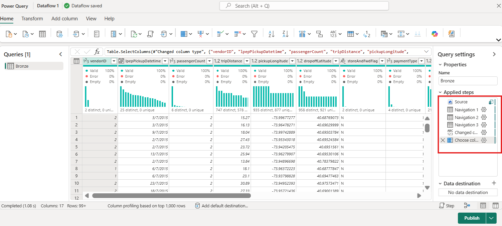

2. In the Connect to data source pane, under Connection settings, select **Link to file** radio button, then enter +++https://raw.githubusercontent.com/ekote/azure-architect/master/Generated-NYC-Taxi-Green-Discounts.csv+++, make sure **authentication kind** is set to **Anonymous**. click on the **Next** button.

   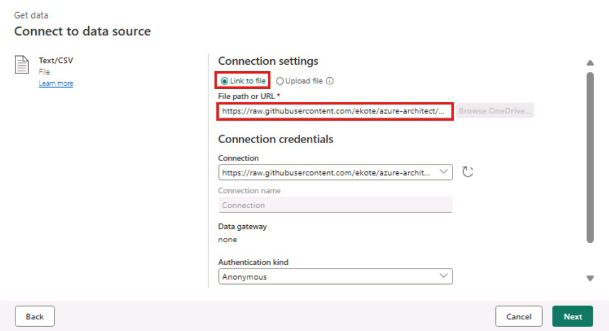

5.  On the **Preview file data** dialog, select **Create**.

    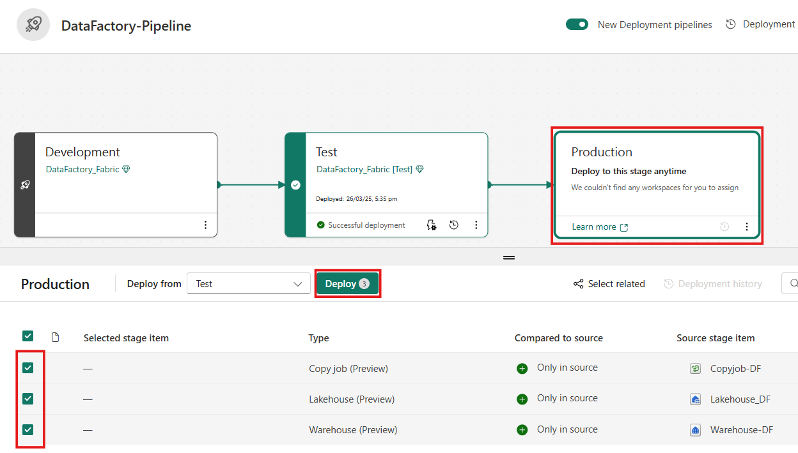

## Task 6: Transform the discount data

1.  Reviewing the data, we see the headers appear to be in the first
    row. Promote them to headers by selecting the table's context menu
    at the top left of the preview grid area to select **Use first row
    as headers**.

    ***Note:** After promoting the headers, you can see a new step added
    to the **Applied steps** pane at the top of the dataflow editor to the
    data types of your columns.*

    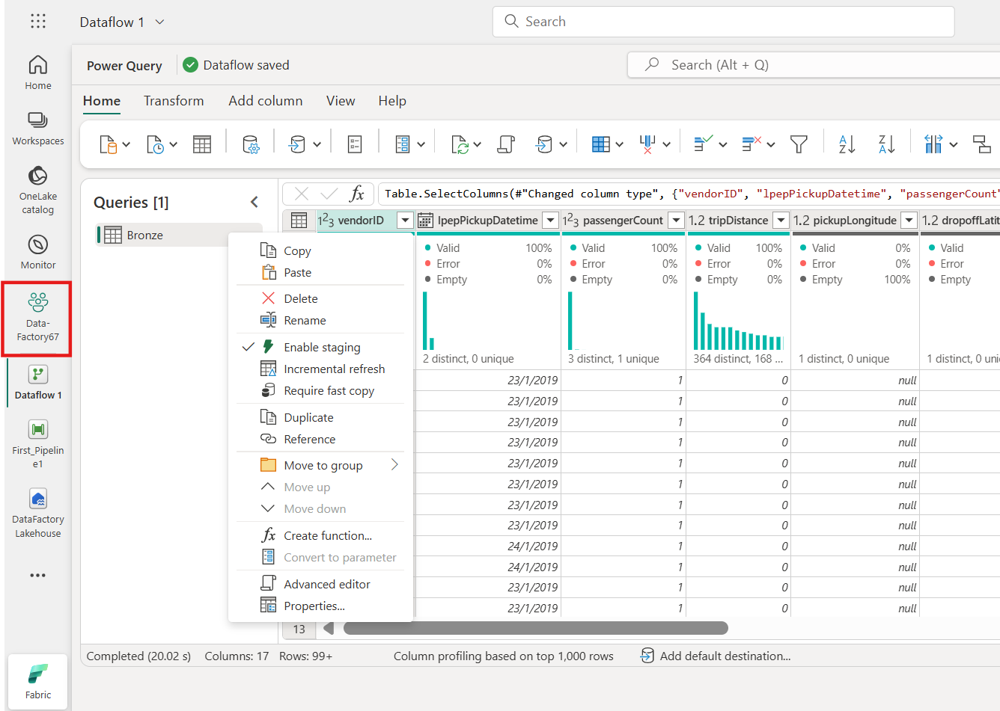

2.  Right-click the **VendorID** column, and
    from the context menu displayed, select the option **Unpivot other
    columns**. This allows you to transform columns into attribute-value
    pairs, where columns become rows.

    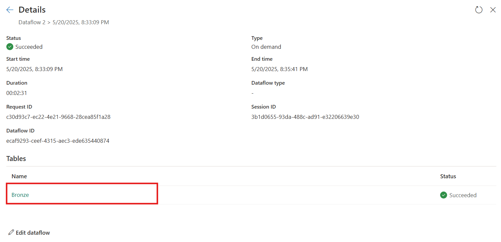

3.  With the table unpivoted, rename
    the **Attribute** and **Value** columns by double-clicking them and
    changing **Attribute** to **Date** and **Value** to **Discount**.

    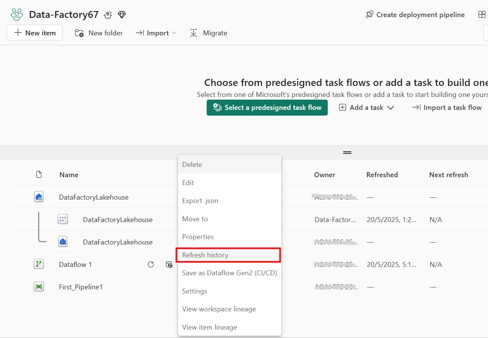

    

    

    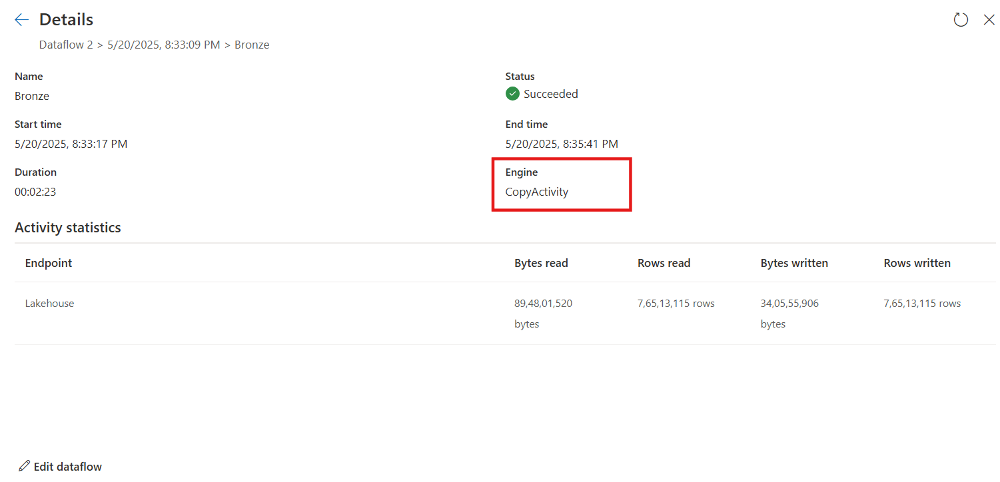

4.  Change the data type of the Date column by selecting the data type
    menu to the left of the column name and choosing **Date**.

    

5.  Select the **Discount** column and then
    select the **Transform** tab on the menu. Select **Number column**,
    and then select **Standard** numeric transformations from the
    submenu, and choose **Divide**.

    

6.  On the **Divide** dialog, enter the value +++100+++, then click on
    **OK** button.

    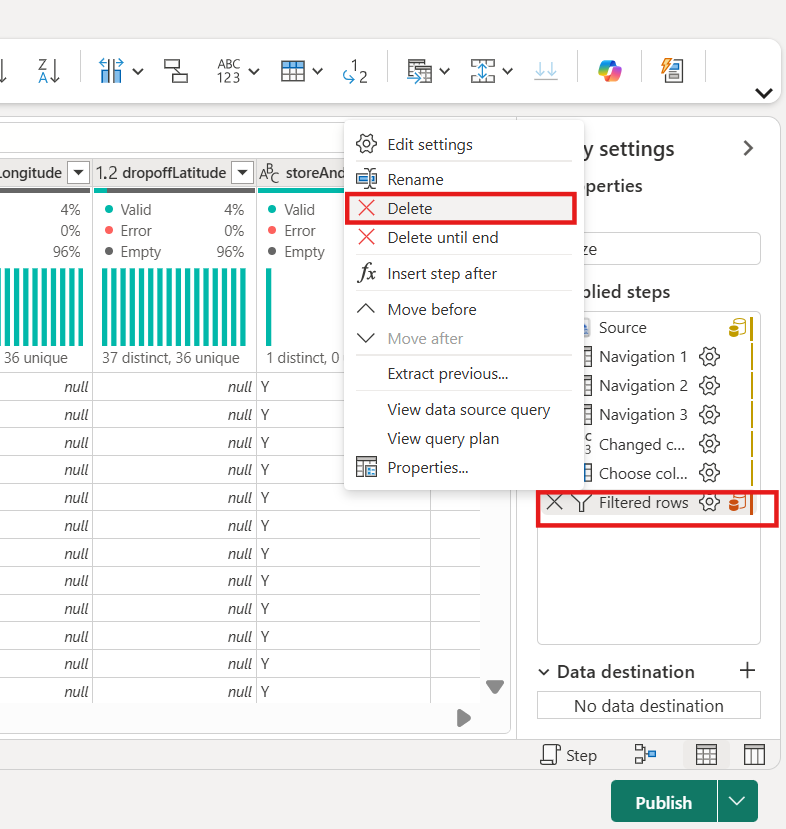

**Task 7: Combine trips and discounts data**

The next step is to combine both tables into a single table that has the
discount that should be applied to the trip, and the adjusted total.

1.  First, toggle the **Diagram view** button so you can see both of
    your queries.

    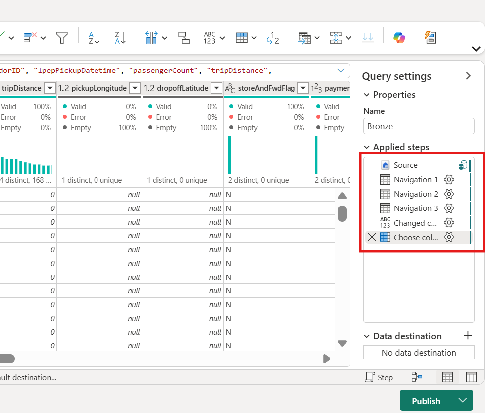

2.  Select the **Bronze** query, and on the **Home** tab, Select
    the **Combine** menu and choose **Merge queries**, then **Merge
    queries as new**.

    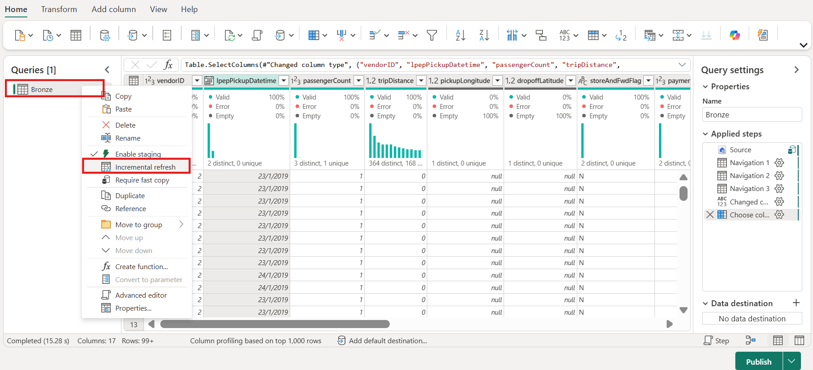

3.  On the **Merge** dialog,
    select **Generated-NYC-Taxi-Green-Discounts** from the **Right table
    for merge** drop down, and then select the "**light bulb**" icon on
    the top right of the dialog to see the suggested mapping of columns
    between the three tables.

    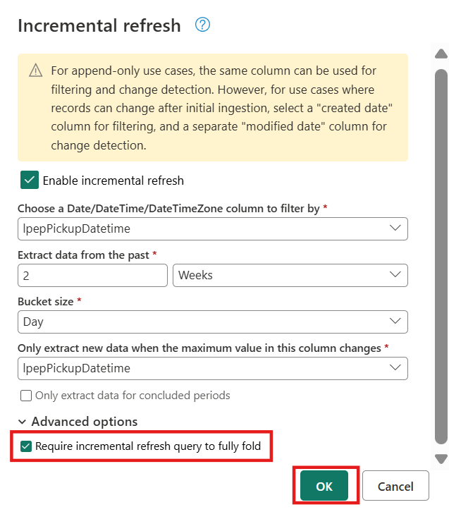

4.  Choose each of the two suggested column
    mappings, one at a time, mapping the VendorID and date columns from
    both tables. When both mappings are added, the matched column
    headers are highlighted in each table.

    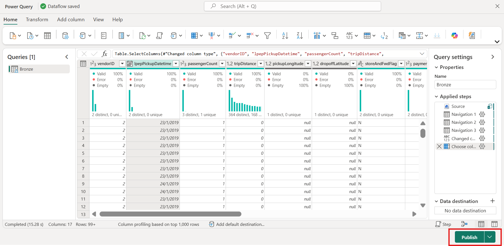

5.  A message is shown asking you to allow combining data from multiple
    data sources to view the results. Select **OK** 

    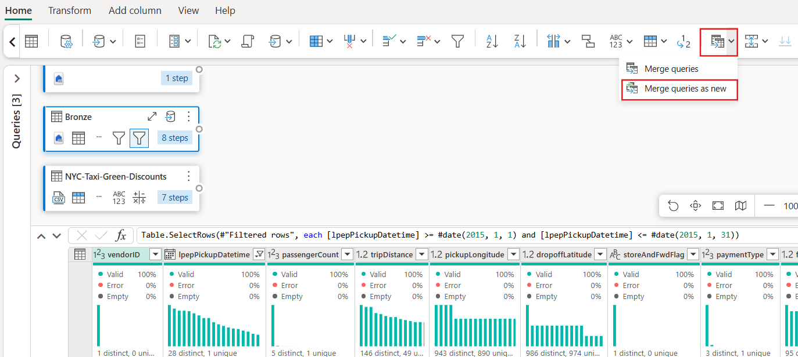

6.  In the table area, you'll initially see a
    warning that "The evaluation was canceled because combining data
    from multiple sources may reveal data from one source to another.
    Select continue if the possibility of revealing data is okay."
    Select **Continue** to display the combined data.

    

7.  In Privacy Levels dialog box, select the
    **check box :Ignore Privacy Lavels checks for this document.
    Ignoring privacy Levels could expose sensitive or confidential data
    to an unauthorized person** and click on the **Save** button.

    

    

    

8.  Notice how a new query was created in Diagram view showing the
    relationship of the new Merge query with the two queries you
    previously created. Looking at the table pane of the editor, scroll
    to the right of the Merge query column list to see a new column with
    table values is present. This is the "Generated NYC
    Taxi-Green-Discounts" column, and its type is **\[Table\]**. In the
    column header there's an icon with two arrows going in opposite
    directions, allowing you to select columns from the table. Deselect
    all of the columns except **Discount**, and then select **OK**.

    

9.  With the discount value now at the row level, we can create a new
    column to calculate the total amount after discount. To do so,
    select the **Add column** tab at the top of the editor, and
    choose **Custom column** from the **General** group.

    

10. On the **Custom column** dialog, you can use the [Power Query
    formula language (also known as
    M)] to define how
    your new column should be calculated.
    Enter +++**TotalAfterDiscount+++** for the **New column name**,
    select **Currency** for the **Data type**, and provide the following
    M expression for the **Custom column formula**:

    *+++if \[totalAmount\] \> 0 then \[totalAmount\] \* ( 1 -\[Discount\]
    ) else \[totalAmount\]+++*

    Then select **OK**.

     

    

12. Select the newly
    create **TotalAfterDiscount** column and then select
    the **Transform** tab at the top of the editor window. On
    the **Number column** group, select the **Rounding** drop down and
    then choose **Round...**.

    

13. On the **Round** dialog, enter **2** for the
    number of decimal places and then select **OK**.

    

14. Change the data type of the **IpepPickupDatetime** from **Date** to
    **Date/Time**.

    
    
    

15. Finally, expand the **Query settings** pane
    from the right side of the editor if it isn't already expanded, and
    rename the query from **Merge** to **Output**.

    

    

**Task 8: Load the output query to a table in the Lakehouse**

With the output query now fully prepared and with data ready to output,
we can define the output destination for the query.

1.  Select the **Output** merge query created
    previously. Then select the **Home** tab in the editor, and from the
    **Default data destination** drop-down, select **Add** option**.**

    

2.  On Choose data destination page, search and
    select **Lakehouse** option.

    

3.  On the **Connect to data destination** dialog, your connection
    should already be selected. Select **Next** to continue.

    

4.  On the **Choose destination target** dialog,
    browse to the Lakehouse where you wish to load the data and name the
    new table+++ **nyc_taxi_with_discounts+++**, then
    select **Next** again.

    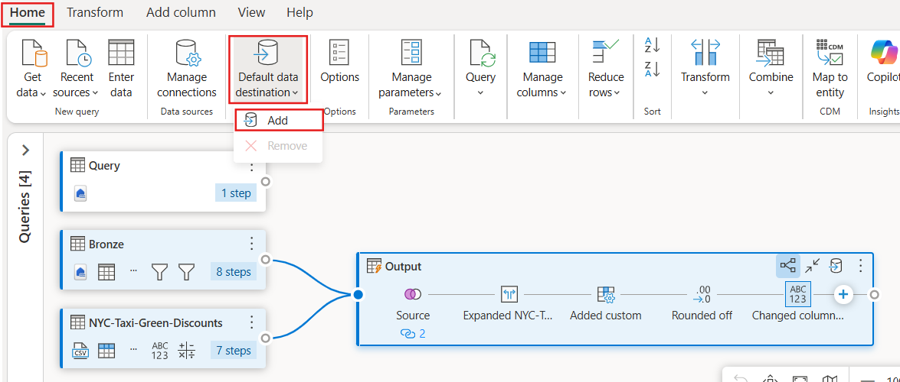

5.  On the **Choose destination settings** dialog, leave the
    default **Replace** update method, double check that your columns
    are mapped correctly, and select **Save settings**.

    

6.  Back in the main editor window, confirm that
    you see your output destination on the **Query settings** pane for
    the **Output** table, and then select **Publish**.

    

    

7.  On the workspace page, you can rename your
    dataflow by selecting the ellipsis to the right of the dataflow name
    that appears after you select the row, and choosing **Properties**.

    

8.  In the **Dataflow 1** dialog box,
    enter +++**nyc_taxi_data_with_discounts+++** in the name box, then
    select **Save**.

    

9.  Select the refresh icon for the
    dataflow after selecting its row, and when complete, you should see
    your new Lakehouse table created as configured in the **Data
    destination** settings.

    

10. In the **Data_FactoryXX** pane, select **DataFactoryLakehouse** to view the
    new table loaded there.

    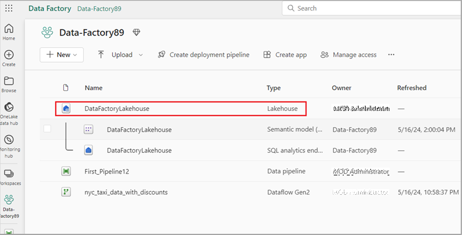
    
    

# Exercise 3: Automate and send notifications with Data Factory

## Task 1: Add an Office 365 Outlook activity to your pipeline

1.  From **Tutorial_Lakehouse** page, navigate
    and click on **Data_FactoryXX** Workspace on the left-sided
    navigation menu.

    

2.  In the **Data_FactoryXX** view, select the **First_Pipeline1**.

    

3.  Select the **Activities** tab in the
    pipeline editor and find the **Office Outlook** activity.

    

4.  Select and drag the **On success** path (a
    green checkbox on the top right side of the activity in the pipeline
    canvas) from your **Copy activity** to your new **Office 365
    Outlook** activity.

    

5.  Select the Office 365 Outlook activity from
    the pipeline canvas, then select the **Settings** tab of the
    property area below the canvas to configure the email. Click on
    **Sing in** button.

    

6.  Select your Power BI organizational account
    and then select **Allow access** to confirm.

    

    **Note:** The service doesn't currently support personal email. You must
    use an enterprise email address.

7.  Select the Office 365 Outlook activity from the pipeline canvas, on
    the **Settings** tab of the property area below the canvas to
    configure the email.

    - Enter your email address in the **To** section. If you want to use
      several addresses, use **;** to separate them.

    - For the **Subject**, select the field so
      that the **Add dynamic content** option appears, and then select
      it to display the pipeline expression builder canvas.

    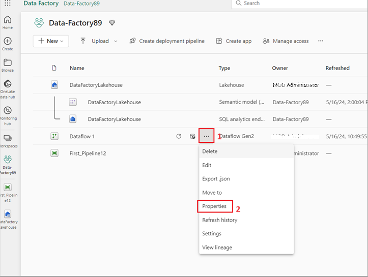

8.  The **Pipeline expression builder** dialog appears. Enter the
    following expression, then select **OK**:

    *+++@concat('DI in an Hour Pipeline Succeeded with Pipeline Run Id',
    pipeline().RunId)+++*

    

9.  For the **Body**, select the field again and choose the **View in
    expression builder** option when it appears below the text area. Add
    the following expression again in the **Pipeline expression
    builder** dialog that appears, then select **OK**:

    *+++@concat('RunID = ', pipeline().RunId, ' ; ', 'Copied rows ',
    activity('Copy data1').output.rowsCopied, ' ; ','Throughput ',
    activity('Copy data1').output.throughput)+++*

    

    

    ** Note:** Replace **Copy data1** with the name of your own pipeline
    copy activity.

10. Finally select the **Home** tab at the top of the pipeline editor,
    and choose **Run**. Then select **Save and run** again on the
    confirmation dialog to execute these activities.

    

    

    

11. After the pipeline runs successfully, check your email to find the
    confirmation email sent from the pipeline.

    

    

**Task 2: Schedule pipeline execution**

Once you finish developing and testing your pipeline, you can schedule
it to execute automatically.

1.  On the **Home** tab of the pipeline editor window,
    select **Schedule**.

    

2.  Configure the schedule as required. The example here schedules the
    pipeline to execute daily at 8:00 PM until the end of the year.

    

**Task 3: Add a Dataflow activity to the pipeline**

1.  Hover over the green line connecting the **Copy activity** and the
    **Office 365 Outlook** activity on your pipeline canvas, and select
    the **+** button to insert a new activity.

    

2.  Choose **Dataflow** from the menu that
    appears.

    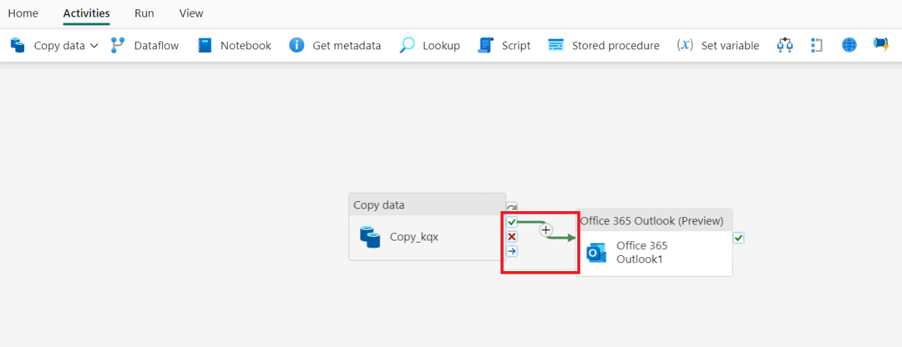

3.  The newly created Dataflow activity is inserted between the Copy
    activity and the Office 365 Outlook activity, and selected
    automatically, showing its properties in the area below the canvas.
    Select the **Settings** tab on the properties area, and then select
    your dataflow created in **Exercise 2: Transform data with a
    dataflow in Data Factory**.

    

4. Select the **Home** tab at the top of the
    pipeline editor, and choose **Run**. Then select **Save and
    run** again on the confirmation dialog to execute these activities.

    

    

    

## Task 4: Clean up resources

You can delete individual reports, pipelines, warehouses, and other
items or remove the entire workspace. Use the following steps to delete
the workspace you created for this tutorial.

1.  Select your workspace, the **Data-FactoryXX** from the left-hand
    navigation menu. It opens the workspace item view.

    

2.  Select the  **Workspace settings** option on the workspace page
    located at the top right corner.

    

3.  Select **General tab** and **Remove this workspace.**

    
