# Use case 01: Implementing Medallion Architecture with Data Factory in Microsoft Fabric for Scalable Data Processing

**Introduction:**

Modern organizations generate large volumes of data from diverse
sources. Effectively organizing, processing, and transforming this data
is critical to enable reliable analytics and data-driven decisions.
Microsoft Fabric's Medallion Architecture provides a robust, scalable
solution by layering data across Bronze (raw), Silver (transformed), and
Gold (curated) stages. This use case explores how to implement a
complete data lifecycle using Microsoft Fabric’s capabilities—Data
Pipelines, Lakehouses, Warehouses, and Dataflows—within the Medallion
framework.

**Objective:**

- Setting up a Fabric workspace and Medallion task flow.

- Ingesting raw data into the Bronze layer.

- Transforming and enriching data in the Silver layer.

- Curating refined data for analytics in the Gold layer.

- Automating orchestration using pipelines and dynamic expressions.

- Demonstrating end-to-end integration of Power BI and T-SQL with Direct
  Lake mode.

# Exercise 1: Setting Up a Medallion Architecture for Scalable Data Processing

## **Task 1: Create a Fabric workspace**

In this task, you create a Fabric workspace. The workspace contains all
the items needed for this lakehouse tutorial, which includes lakehouse,
dataflows, Data Factory pipelines, the notebooks, Power BI datasets, and
reports.

1.  Open your browser, navigate to the address bar, and type or paste
    the following URL: https://app.fabric.microsoft.com/ then press the
    **Enter** button.

2.  In the **Home** page click on **+ New Workspaces** as shown in the
    below image.

> 

3.  In the **Create a workspace** pane that appears on the right side,
    enter the following details, and click on the **Apply** button.

[TABLE]

> 
>
> 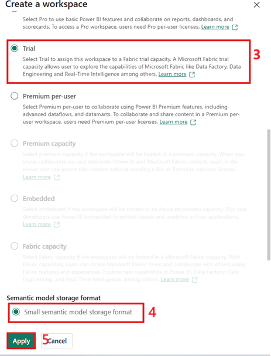
>
> 

## Task 2: Medallion task flow

1.  From the empty workspace, select the option **Select a predefined
    task flow** to choose one of Microsoft's task flows. These
    predesigned task flows provide a structured approach to managing
    data projects

> 

2.  From the **Select a task flow** window, choose
    the **Medallion** option.

3.  This option includes the description "Organize and improve data
    progressively as it moves through each layer," which is crucial for
    data projects. The medallion architecture helps in structuring data
    into different layers, such as bronze, silver, and gold, to enhance
    data quality and accessibility.

4.  Select the **Select** option to continue.

> 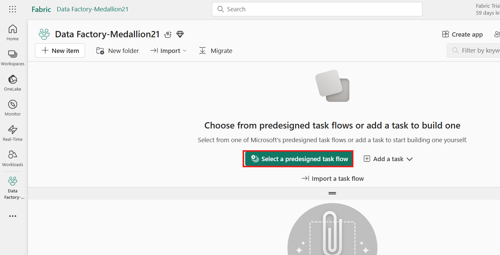

5.  A task flow has now been created within your workspace, which can be
    considered an architectural template. This template provides a
    structured framework for your data project.

> 

6.  Select the **New item** option on the **Bronze data** task to start
    adding items to task flow.

> 

7.  In the Create an item window, the available options within Microsoft
    Fabric have been filtered down to **Recommended items**. This
    filtering is helpful for choosing the correct items for project.

8.  Select the **Lakehouse** item for data storage.

> 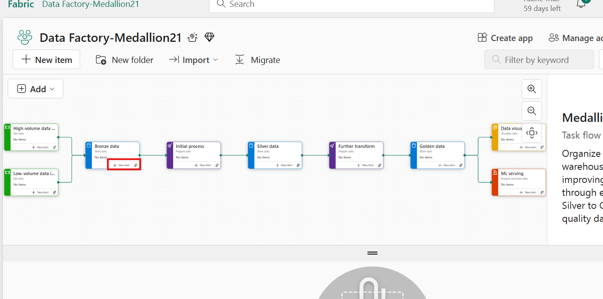

9.  In the New lakehouse window, set the lakehouse name to
    +++**bronze_Lakehouse**+++ and then select **Create**. 

> 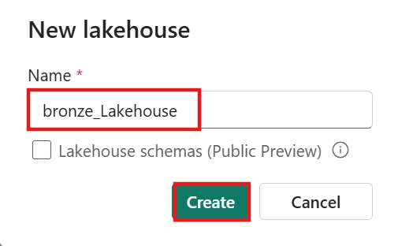
>
> 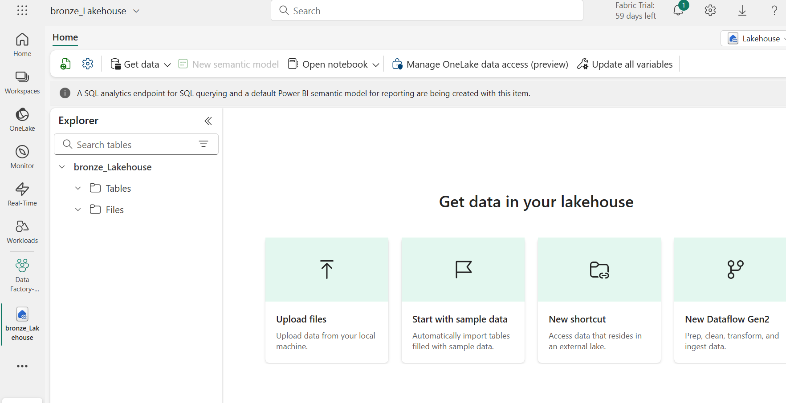

10. In the left-sided navigation menu, navigate and click on ***Data
    Factory-MedallionXX***, as shown in the below image.

> 

11. Within the workspace, you will notice that three items have now been
    created and are associated with your lakehouse. These items include
    the lakehouse (storage), SQL analytics endpoint, and a default
    Semantic model.

> 

12. Select **New item** from the **High-volume data ingest** task. This
    task is crucial for handling large volumes of data efficiently,
    ensuring that your data ingestion processes are scalable and robust.

> 

13. In the **Create an item** window, the available options within
    Microsoft Fabric have been filtered down to **Recommended items**.
    Select the **Data pipeline** item which is essential for automating
    the movement and transformation of data from various sources to
    destinations.

> 

14. In the New pipeline window, set the data pipeline name to
    +++**samplePipeline**+++ and then select **Create**.

> 

## Task 3: Copy activity

1.  From the data pipeline page, select the **Copy data assistant.**

2.  The **Copy data** dialog is displayed with the first step, **Choose
    data source**, highlighted. Select **Sample data** section, and
    select the **Public Holidays** data source type.

3.  A preview of the data source will now be displayed to verify the
    correct selection and understand the data structure. After reviewing
    the preview, select **Next** to proceed.

4.  Select the **bronze_Lakehouse** lakehouse item as the data
    destination from the **OneLake catalog list**. It determines the
    storage location for the data.

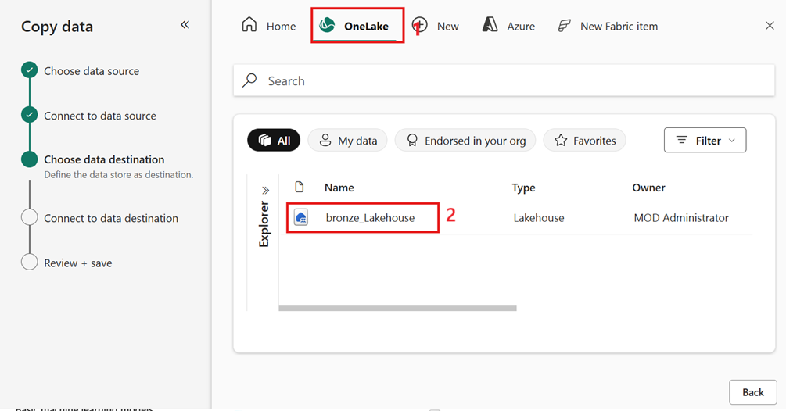

5.  Within the data destination configuration, select
    the **Files** option and set the File name
    to +++**Holidays.csv+++**. Set the Copy behavior to **Merge
    files** before selecting **Next**.

6.  Set the Compression type to **None**. This setting is important for
    determining how your data will be stored and accessed. In this case,
    no compression is applied, which can be useful for maintaining the
    original data format.

> 

7.  Set the **File format** to **DelimitedText** and then
    select **Next**. This format is commonly used for storing tabular
    data, making it easy to import and export data between different
    systems.

> 

8.  Within the **Review + save** window, disable the **Start data
    transfer immediately** option and then select **OK** to review the
    configured copy activity within the data pipeline canvas.

> 

## Task 4: Authoring canvas

1.  Within the authoring canvas, select the **Copy data activity**.

2.  The properties section below provides access to configurations for
    Source, Destination, Settings, and more. These configurations can be
    edited directly to ensure the data copy activity is correctly set up
    and aligned with specific requirements.

3.  Next, from the **Home** tab on the ribbon, select
    the **Validate** option.

This step is important to ensure that the entire pipeline (in this
sample, just the Copy activity) is valid. In the Pipeline validation
output window, a confirmation message stating 'The pipeline has been
validated. No errors were found.' should appear. This validation step
helps identify any potential issues before executing the pipeline

4.  Select the **Run** option to start the pipeline and begin your data
    ingestion process. Running the pipeline initiates the data transfer
    from the source to the destination.

5.  In the **Save and run?** dialog box, click on **Save and
    run** button to execute these activities. This activity will take
    around less than 1 min.

6.  The global properties and **Output** view will then become visible.
    After starting the run of your pipeline, both the **Pipeline
    status** and the **Activity status** should show
    a **Succeeded** status. This indicates that everything ran as
    intended, confirming that your data ingestion process was
    successful.

7.  In the left-sided navigation menu, navigate and click on
    **bronze_Lakehouse lakehouse** created in the previous task.

> 

8.  The **Holidays.csv** file has been successfully added to the
    **Files** section. Selecting the file provides a preview of the
    data, helping confirm that the ingestion process was completed
    correctly.

> 
>
> 

## Task 5: Pipeline expression builder

1.  Delete the existing **Holidays.csv** file from our lakehouse by
    selecting the ellipses (**...**) and then the **Delete** option.

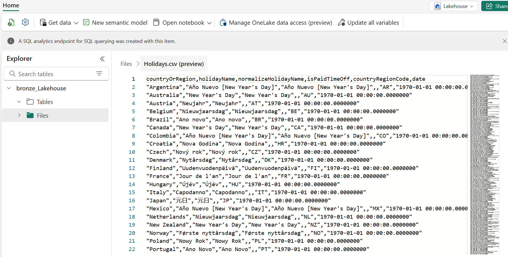

2.  A confirmation window will be displayed. Select **Delete** to
    confirm the removal of the file.

3.  In the left-sided navigation menu, navigate and click on
    **samplePipeline** 

4.  Select the **Copy data** activity and then go to
    the **Destination** tab.

5.  Select the text box input for the **File path**, where after
    selection you will see the text **Add dynamic content
    \[Alt+Shift+D\]**. Select this text to open the pipeline expression
    builder.

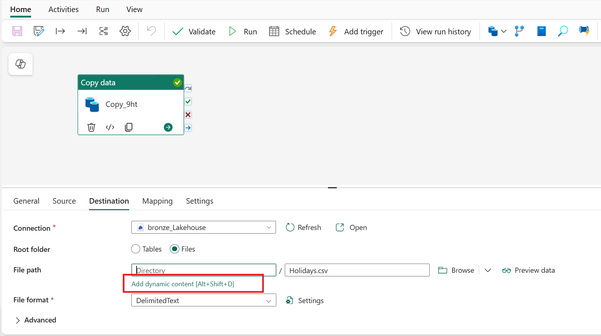

6.  Within the Pipeline expression builder window, select
    the **Functions** tab. Here, you can explore various functions that
    exist within the expression library. These functions provide
    powerful tools for creating dynamic expressions. When you're ready,
    copy and paste the code block below into the expression input box.
    Press **Ok** when complete.

> @formatDateTime(
>
> convertFromUtc(
>
> utcnow(), 'Central Standard Time'
>
> ),
>
> 'yyyy/MM/dd'
>
> )

**Note:** This expression will be used to create a folder structure
within your pipeline that writes the file to nested folders based on the
current year, the current month, and the current date of the run time.
The forward slash "**/**" character is how the folder structure is
defined. This dynamic folder structure helps in organizing your data
based on the date, making it easier to manage and retrieve.

7.  From the **Home** tab on the ribbon, select the **Validate** option
    once again.

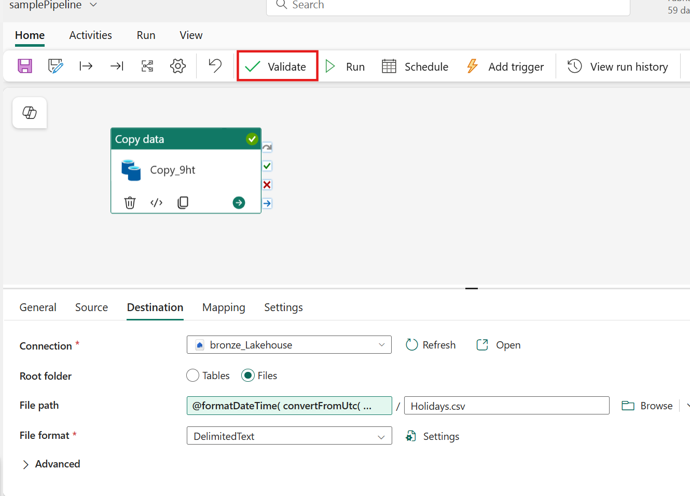

8.  Select the **Run** option to start the pipeline and begin data
    ingestion process. Running the pipeline initiates the data transfer
    from the source to the updated destination folder path.

9.  In the **Save and run?** dialog box, click on **Save and
    run** button to execute these activities. This activity will take
    around less than 1 min.

> 

10. The global properties and **Output** view will then become visible.
    After starting the run of your pipeline, both the **Pipeline
    status** and the **Activity status** should show
    a **Succeeded** status. This indicates that everything ran as
    intended, confirming that your data ingestion process was
    successful.

11. In the left-sided navigation menu, navigate and click on
    **bronze_Lakehouse lakehouse** created in the previous task.

12. The **Holidays.csv** file has been successfully added to the
    **Files** section, organized within a nested folder structure based
    on the **year, month, and date** of execution. This confirms that
    the dynamic file output is functioning correctly and that the data
    is being structured as intended.

**Note:** If the contents are not yet visible, navigate to the Home tab
and select the Refresh icon to start the metadata sync process and
update the lakehouse viewer content.

13. Select the **ellipses (...)** next to the top level year folder and
    then the **Delete** option to remove the **sample data**

> 

14. A confirmation window will appear, select **Delete** to proceed with
    removing the contents.

> 
>
> 

# Exercise 2: Orchestrating data movement

In this exercise, it will guide you through the process of creating a
comprehensive data ingestion solution using data pipelines in Microsoft
Fabric. We will start by setting up the copy activity to transfer data
from a sample source to a dynamic destination within a lakehouse. This
includes using the expression builder to create a dynamic folder
structure based on the current date of execution.

## Task 1: Create a data pipeline

1.  In the left-sided navigation menu, navigate and click on ***Data
    Factory-MedallionXX***, as shown in the below image.

> 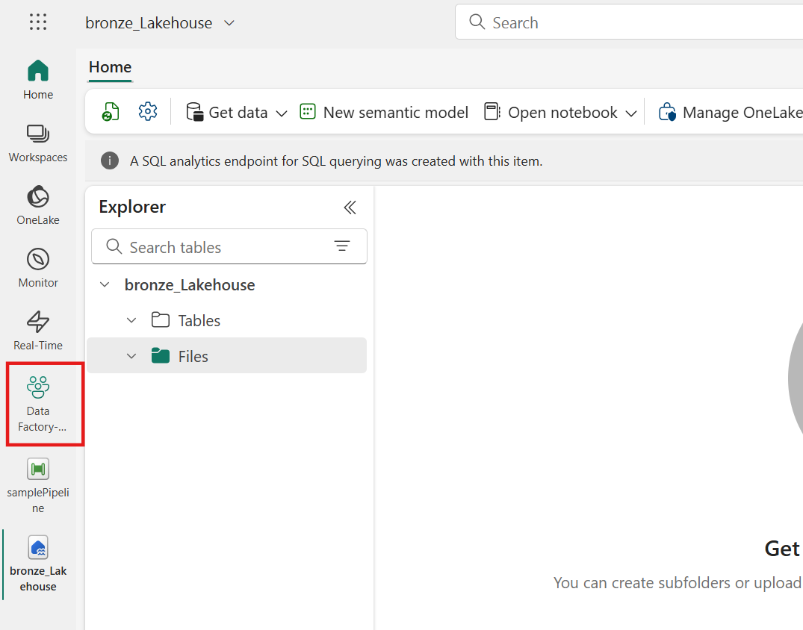

2.   Now proceed to select and add a **New item** from the **High-volume
    data ingest** task.

> 

3.  Within the Create an item window, the available options within
    Microsoft Fabric have been filtered down to **Recommended
    items** only again. Select the **Data pipeline** item.

> 

4.  In the New pipeline window, set the data pipeline name to
    +++**getContosoSample**+++ and then select **Create**.

> 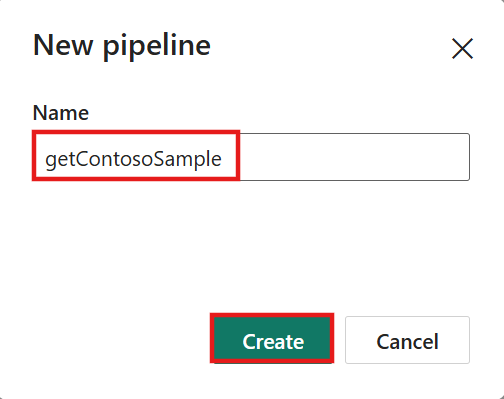

## Task 2: Creating a data connection

1.  From the new and empty data pipeline, select the **Pipeline
    activity** watermark option and then choose **Copy data** to add
    this activity to the authoring canvas.

2.  With the **Copy data** activity selected, navigate to
    the **Source** tab. Within the **Connection** drop-down menu, select
    the **More** option to launch the Get data navigator. 

This navigator provides a comprehensive interface for connecting to
various data sources, ensuring that you can easily integrate different
data streams into pipeline.

3.  From the Get data navigator, select **Add** from the left side-rail.

4.  From the list of **New sources**, select **View more**, search
    for **Http** and select it. The Http connector allows you to connect
    to web-based data sources, providing flexibility in accessing data
    from various online resources. 

5.  n the **Connect to data source** window, enter the details from the
    table below and select **Connect**.

[TABLE]

## Task 3: Copy activity settings

1.  In the **Copy data** activity selected and the **Source** tab
    displayed, select the **Settings** option next to the File format
    field

2.  In the **Compression type** setting, choose **ZipDeflate
    (.zip)** and select **OK** to complete.

3.  In the Source tab, expand the **Advanced** section. Deselect the
    option to **Preserve zip file name as folder**. This allows you to
    customize the folder name for your zip contents, providing more
    flexibility in organizing data.

4.  In the Copy data activity, navigate to the **Destination** tab.

5.  From the list of connections, select the configured
    lakehouse **bronze_Lakehouse**. 

This step ensures that the data is being copied to the correct
destination, which is essential for maintaining data integrity and
organization.

6.  Within the Destination settings, select the **Files** option and
    then the **Directory** file path text input box. This will display
    the **Add dynamic content \[Alt+Shift+D\]** property.

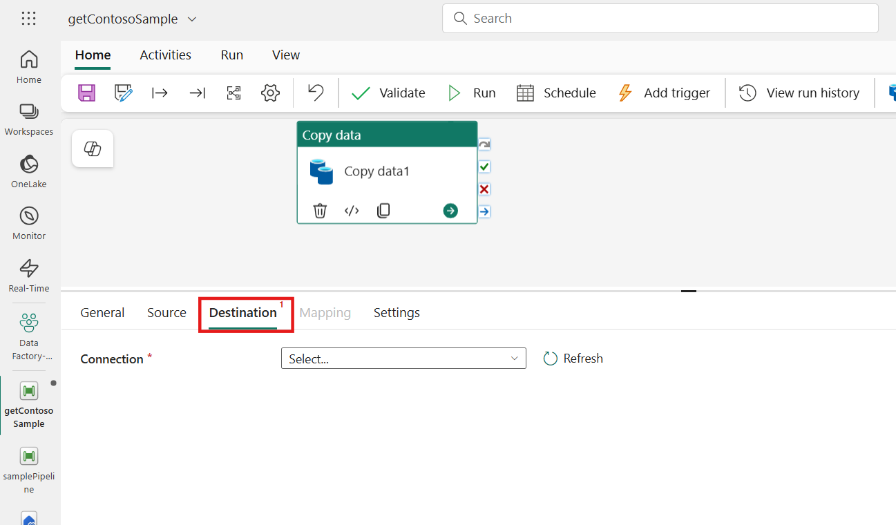

7.  Select this text to open the pipeline expression builder. The
    expression builder allows us to create dynamic file paths, which can
    be customized based on various dynamic parameters such as date and
    time or static text values.

8.  In the Pipeline expression builder window, select
    the **Functions** tab. Here, you can explore various functions that
    exist within the expression library, in this example we'll use both
    date and string functions to create a dynamic folder path. Copy and
    paste the code block below into the expression input box.
    Press **Ok** when complete.

@concat(

'ContosoSales\\,

formatDateTime(

convertFromUtc(

utcnow(), 'Central Standard Time'

),

'yyyy/MM/dd'

)

)

9.  With the Copy data activity and Destination settings still selected,
    expand the **Advanced** section, select the drop-down for the **Copy
    behavior** and then choose the **Preserve hierarchy** option.

10. This option maintains the original file names as they are within the
    zip file, ensuring that the file structure is preserved during the
    copy process.

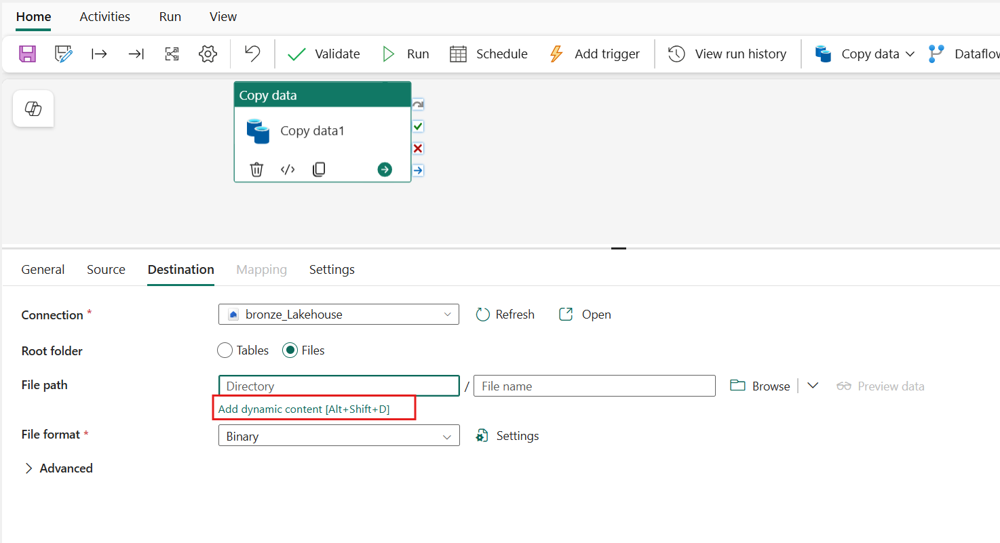

11. Navigate to the **General** tab with the Copy data activity
    selected. Update the **Name** and **Description** fields with the
    appropriate text. This step helps in identifying and managing the
    activity within your pipeline, making it easier to understand its
    purpose and functionality.

[TABLE]

12. From the **Home** tab, select the **Validate** option to first
    confirm that there are no issues with your pipeline. This validation
    step helps in identifying any errors to be fixed before running the
    pipeline.

13. Once validated, select the **Save** option and then **Run** to start
    the ingestion from the data pipeline. Running the pipeline initiates
    the data transfer, allowing you to see the results of your
    configuration in action within the output window.

14. This action will make the global properties and **Output** view
    visible. After starting the run of your pipeline, both the Pipeline
    status and any individual Activity statuses should show
    a **Succeeded** status. This indicates that everything ran as
    intended, confirming that your data ingestion process was
    successful.

15. In the left-sided navigation menu, navigate and click on
    **bronze_Lakehouse lakehouse**

16. The contents of the **zip file** have been successfully added to the
    **Files** section, organized in a nested folder structure based on
    the data source title, year, month, and date of the pipeline run.

## Task 4: Enriching raw data

1.  In the left-sided navigation menu, navigate and click on **Data
    Factory-MedallionXX**, as shown in the below image.

2.  Select the **New item** option on the **Silver data** from your task
    flow to add another storage item to project. Within the **Item
    type** selection, select **Lakehouse**.

3.  In the New lakehouse window, set the lakehouse name to
    +++**silver_Lakehouse**+++ and then select **Create**. 

> 

4.  Within the lakehouse item from the **Home** tab select **Get
    data** from **New data pipeline**.

5.  In the New pipeline window, set the data pipeline name to
    +++**createContosoTables**+++ and then select **Create**

6.  If prompted with the **Copy data assistant** window, select **X** in
    the top right corner to be taken into an empty authoring canvas.
    This ensures that start with a clean slate for pipeline
    configuration.

7.  Select the **Activities** tab and then the **Set variable** activity
    to add this to your canvas. The Set variable activity allows to
    define and assign values to variables that can be used throughout
    pipeline.

8.  With the Set variable activity selected, navigate to the
    **Settings** tab. Next to the Name property, select '**New'** to
    create a variable that will be used within the pipeline.

9.  In the **Add new** **variable** window, set the **Name** value
    to +++**fileDirectory+++** and ensure the Type remains as a string
    before selecting **Confirm.**

10. Select the **Value **text input box. This will display the **Add
    dynamic content** \[Alt+Shift+D\] property. Select this text to open
    the pipeline expression builder.

11. In the Pipeline expression builder window **copy and paste** the
    code block below into the expression input box. Press **Ok** when
    complete.

> 
>
> 

12. Navigate to the **General** tab with the Set variable activity
    selected. Update the **Name** field with the text +++**Set file
    directory**+++.

This step helps in identifying and managing the activity within your
pipeline in subsequent steps, making it easier to understand its purpose
and functionality.

13. Navigate to the **Activities** tab and select the **Get
    metadata** activity to add it to your canvas.

14. In the **Settings** options, set
    the **Connection** to **bronze_Lakehouse** from the available
    connection options.

15. Choose the **Files** option and then click on the **Directory** file
    path text input box. This will display the **Add dynamic content
    \[Alt+Shift+D\]**. Click on this text to open the pipeline
    expression builder.

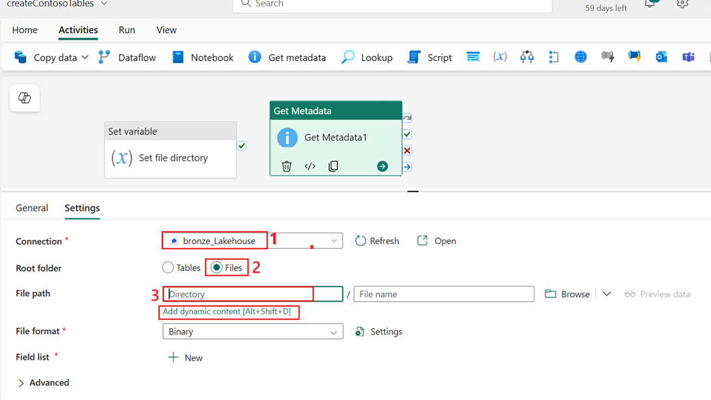

16. In the Pipeline expression builder window, select
    the **Variables** option. Within the available variable list,
    select **fileDirectory** and then **OK**.

17. This step ensures that the file path for the metadata retrieval is
    dynamically set based on the value of the fileDirectory variable.

18. Select Get metadata activity, navigate to the **Settings** tab. From
    the **Field list** select **New**.

19. Within the drop-downs, configure the value as **Child items**. This
    ensures that the metadata activity retrieves information about the
    child items and their names within the specified directory.

20. Select the **Get Metadata** activity and update the **Name** field
    with the text +++**Get items in folder**+++.

21. This naming step aids in identifying and managing the activity
    within the pipeline, enhancing clarity around its purpose and
    functionality**.**

22. Create a conditional path by dragging and dropping the **On
    completion** option between the **Set file directory** activity and
    the **Get items in folder** activity.

23. Select **Validate** on the **Home** tab to ensure there are no
    errors within the pipeline.

24. After validation, select **Run** to start the pipeline.

25. Both the Pipeline status and the Activity status should display a
    '**Succeeded**' status, indicating that the execution completed
    successfully.

26. From the **'Get items in fo**lder' activity, select the last column
    labeled '**Output**' to review the activity's contents. This step
    verifies that the filenames from the directory have been correctly
    retrieved and included in the output**.**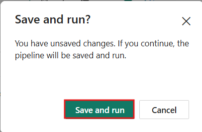

## Task 5: ForEach loop and conditional branches

1.  Select the **Activities** tab and then the **ForEach** activity to
    add this to your canvas. This activity allows you to iterate over a
    collection of items, performing a set of actions for each item in
    the collection.

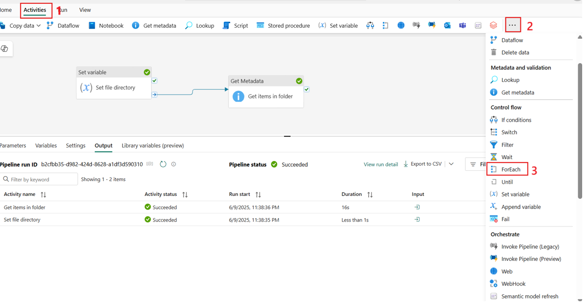

2.  With the **ForEach** activity selected, navigate to the **General**
    tab and update the **Name** field with the text +++**For each
    file+++**.

3.  Next, create a conditional path by dragging and dropping the **On
    success** option between the **Get items in folder activity** and
    the **For each file activity**.

4.  Select **For each file activity**, navigate to the **Settings** tab.
    Select the **Items** text input box. This will display the **Add
    dynamic content \[Alt+Shift+D\]** property. Select this text to open
    the pipeline expression builder. The sequential order ensures that
    the items are processed one after another, maintaining the order of
    execution.

5.  Within the Pipeline expression builder window, select the **Activity
    outputs** section. Then, choose the **Get items in folder** output
    of **childItems**. The full option title is **Get items in folder
    childItems**. This step ensures that the ForEach activity iterates
    over the child items retrieved from the specified directory.

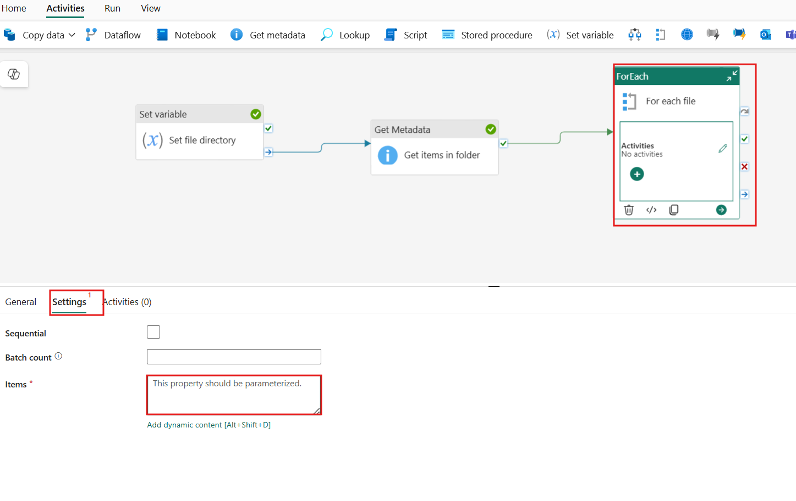

6.  Select the **add** option on the **For each activity** and then
    select **Copy data**. This step will allow us to repeatedly execute
    the copy data activity for each item in the array.

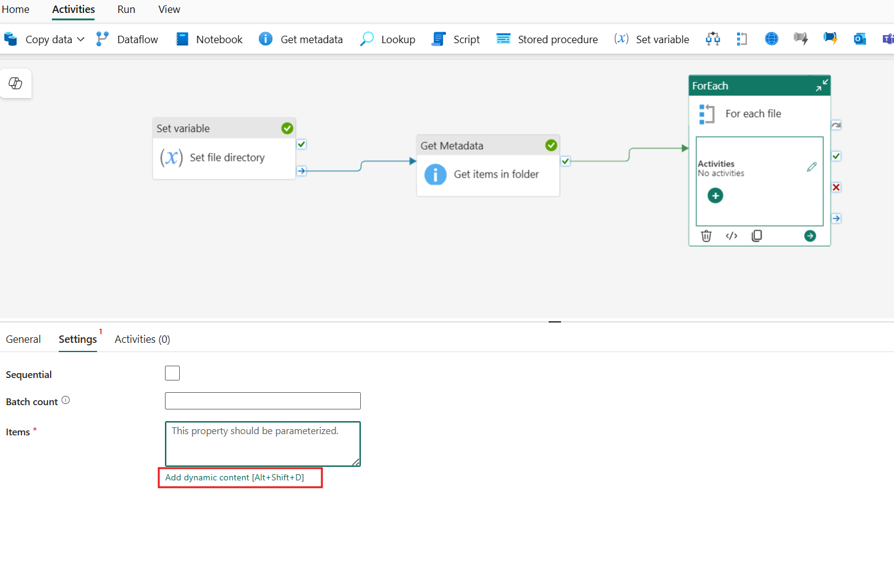

7.  Select the **Edit** option on the **For each activity** to drill
    into the nested authoring canvas. This step allows you to configure
    the activities that will be executed for each item in the
    collection.

8.  Navigate to the **General** tab with the **Copy data activity**
    selected. Update the **Name** field with the text +++**Copy
    tables**+++.

9.  With the **Copy data** activity still selected, configure the
    following options in the **Source** tab. Once complete select
    the **Directory** text input box. This will display the **Add
    dynamic content \[Alt+Shift+D\]** property.

[TABLE]

> 

10. Select this text to open the pipeline **Add dynamic content
    \[Alt+Shift+D\]** property expression builder.

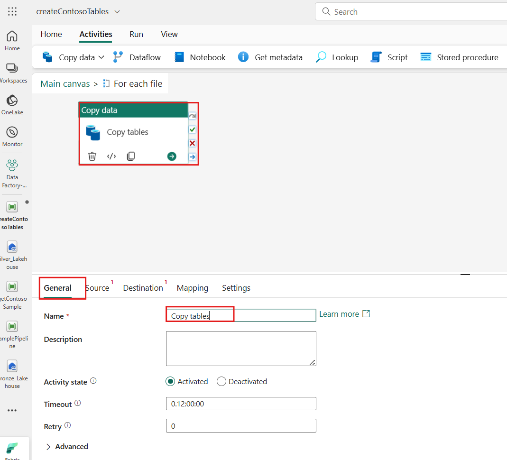

11. Select the variable **fileDirectory** within the expression
    builder's **Variables** section and **OK** to continue.

12. Select the **File name** text input box. This will display the **Add
    dynamic content \[Alt+Shift+D\]** property. Select this text to open
    the pipeline expression builder.

13. Select the item **For each file** within the expression builder's
    **ForEach iterator** section. Within the expression builder, add the
    suffix ".name" to access the name property of the current items
    array and then **OK** to continue once complete.

14. Copy and paste the code block below into the expression input box.

**@item().name**

15. With the **Copy data activity** selected, configure the following
    options in the **Destination** tab. Once complete select
    the Table text input box. This will display the Add dynamic content
    \[Alt+Shift+D\] property. Select this text to open the pipeline
    expression builder.

[TABLE]

16. In the **Pipeline expression builder**, select **Functions** and
    then choose **split** from the **String functions group** to divide
    each item name using the period delimiter **'.' .** From the
    resulting array, select the first item. Once complete, select
    '**OK**' to proceed

17. Copy and paste the code block below into the expression input box.

**@split(item().name, '.')\[0\]**

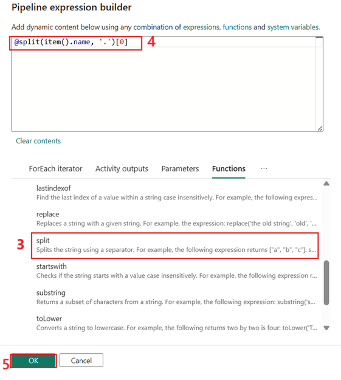

18. In the **Source** tab, select '**Append**' from the **Table action**
    values to display the **'Add dynamic content \[Alt+Shift+D\]'
    property**. Select this text to open **the Pipeline Expression
    Builder.**

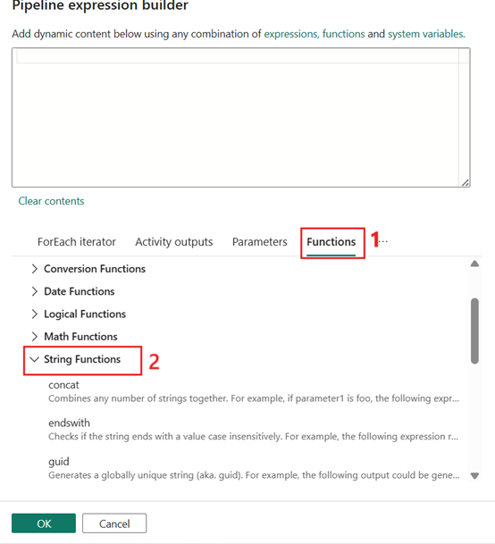

19. Within the expression builder, we'll use the if condition from the
    logical **functions** group and the startswith function from the
    string functions group to determine if the string starts with the
    prefix of **Dim** for our dimension tables. If true, we'll set the
    value to **Overwrite**, if false **Append**. Once complete
    select **OK** to continue.

20. Copy and paste the code block below into the expression input box.

**@if(**

**startswith(item().name, 'Dim'),**

**'Overwrite',**

**'Append'**

**)**

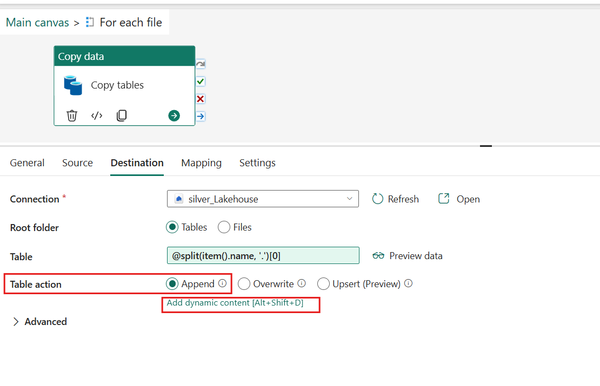

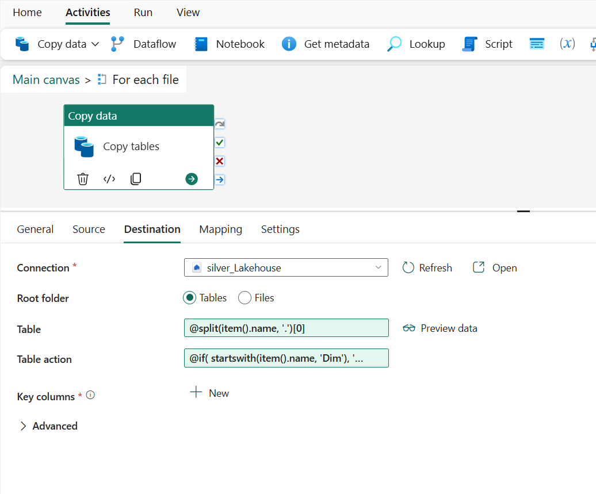

21. Select the **Main canvas** option from the breadcrumb trail to
    return to the top level of pipeline.

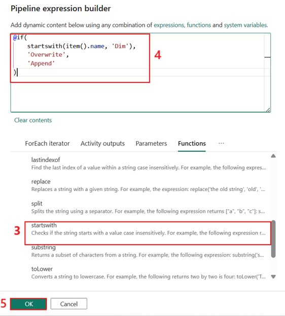

22. From the **Home** tab, select the **Validate** option to first
    confirm that there are no issues with in the pipeline. 

23. Once validated, select the  **Run** to start the ingestion from the
    data pipeline.

24. If a save window is prompted, confirm by selecting **Save and run**.

25. Running the pipeline initiates the data transfer, allowing you to
    see the results of your configuration in action within the output
    window.

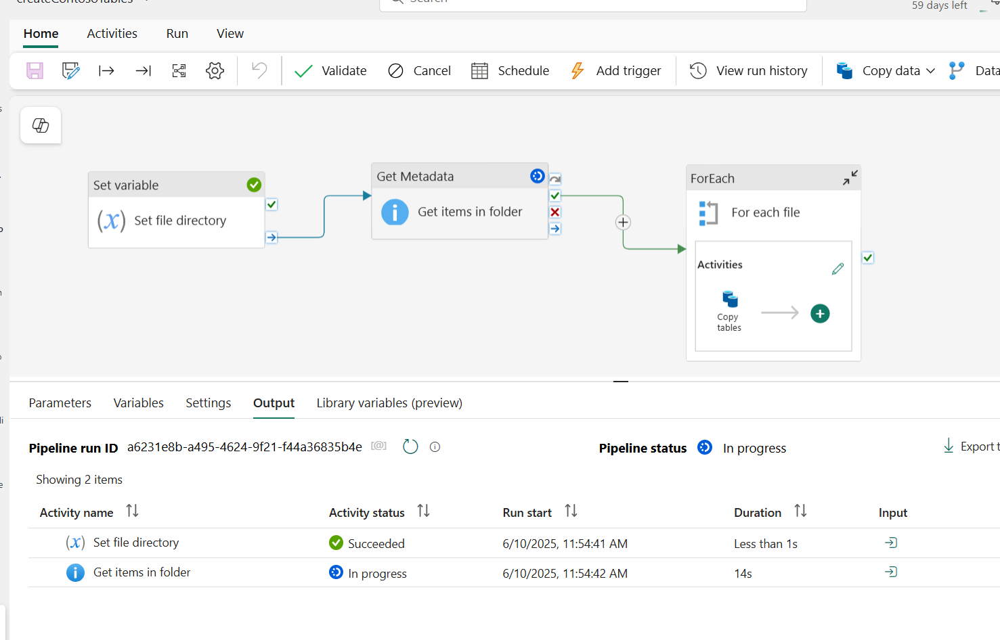

26. The data pipeline runs multiple activities sequentially, writing to
    the Silver data layer as delta parquet tables. v-Order optimized
    tables enhance performance, reduce storage costs, and support
    efficient querying and data updates—ideal for analytical workloads
    in Microsoft Fabric.

## Task 6: Attach data pipeline to task flow

1.  In the left-sided navigation menu, navigate and click on ***Data
    Factory-MedallionXX***, as shown in the below image.

2.  From the task flow select the **Initial process** task and the paper
    clip to assign a previously created item.

3.  Select the **createContosoTables** item and then press **Select**.

# Exercise 3: Transforming and copying data

## Task 1: Creating Golden data storage and a Dataflow Gen2

1.  Select the **New item** option on the **Gold data** from task flow
    to add another storage item.

2.  In the Create an item tab, select **Warehouse**.

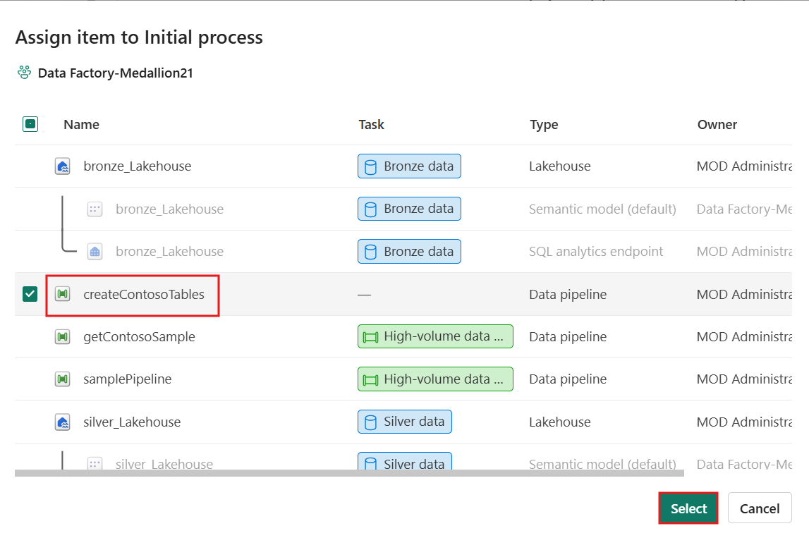

3.  In the New **warehouse** window, set the warehouse name to
    +++**gold_Warehouse**+++ and then select **Create**.

4.  Within the warehouse item from the **Home** tab select **Get
    data** from **New Dataflow Gen2**.

5.  In the **New Dataflow Gen2** window, click on **Dataflow1** and
    rename it to +++**PrepContoso**+++

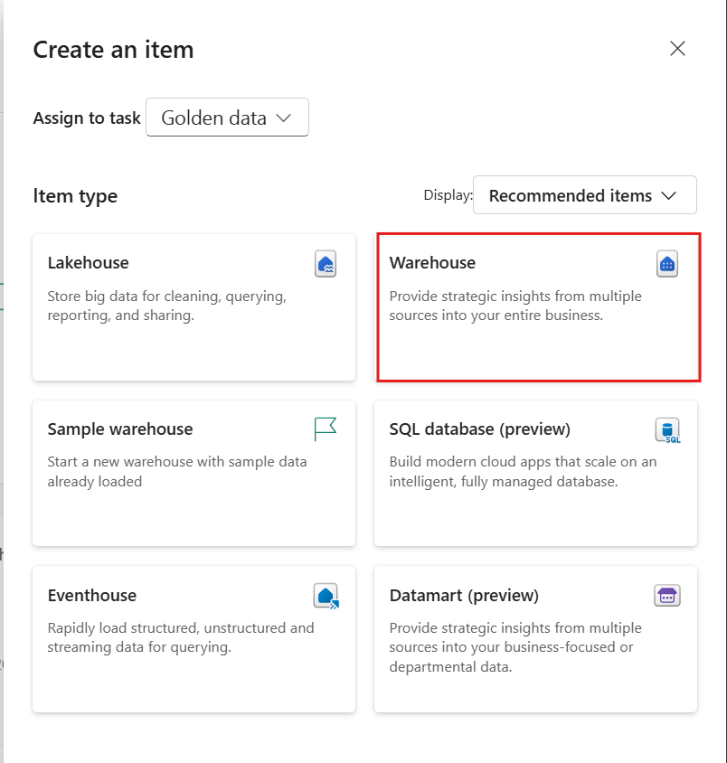

> 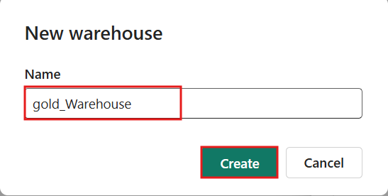

## Task 2: Connecting to lakehouse tables

1.  From the **Home** tab, select **Get data** and then
    the **More...** option.

2.  Within the **Get data** explorer's search bar,
    type +++**silver_Lakehouse+++** to locate the silver lakehouse item.
    Select the **silver_Lakehouse** item within the OneLake catalog's
    returned results.

3.  From the Get data table navigator, select the tables listed below to
    perform data transformation operations and merge the tables for our
    downstream business intelligence projects.

[TABLE]

## Task 3: Preparing data using Power Query Online

1.  Select the **DimCustomer** table and from the **Home** tab, click on
    the **Combine** dropdown, navigate to **Merge Queries**, and choose
    **Merge Queries as New** to create a new merged query.

2.  From the **Merge query** window, set the **Right table for
    merge** to **DimGeography**. In the top right corner, select the
    lightbulb which has detected a possible column match

3.  In this example, both tables contain a column
    titled **GeographyKey**. Select this option to set the columns to be
    merged on. For the join kind, select **Inner** and then **OK** to
    proceed. This activity ensures that the data is accurately combined
    based on matching columns.

4.  Navigate to the far right fo the **DimCustomer** table and select
    the joined **DimGeography** table column's top right corner to
    expand the table, from the avaialble column selections deselect
    **GeographyKey** since this column is what we used to merge on and
    already exists in the dataset before selecting **OK** to continue.

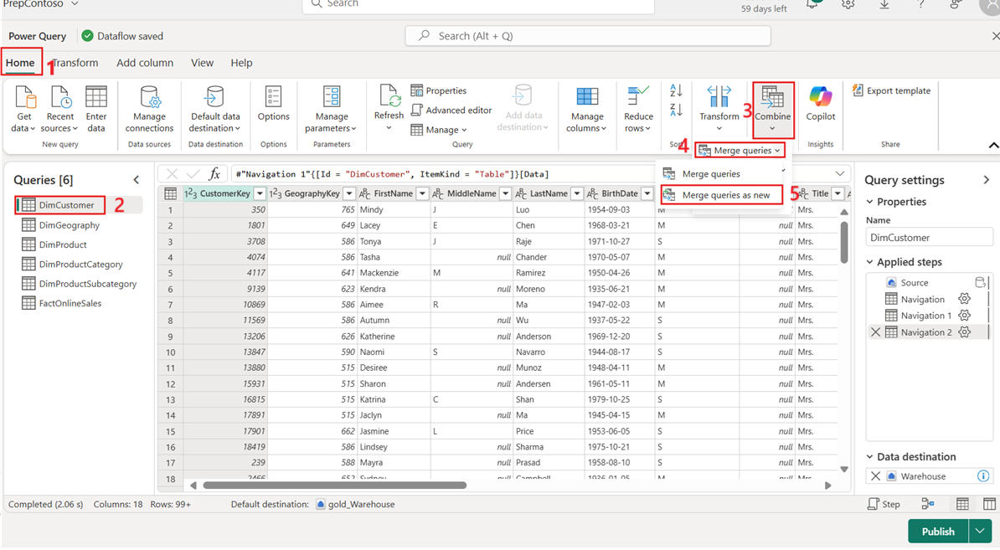

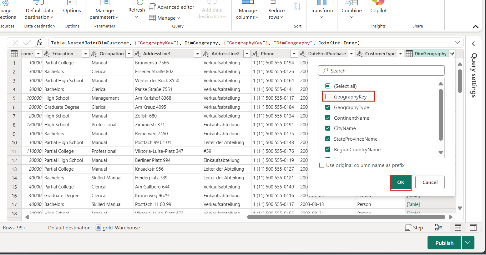

5.  On the right-hand side in the **Query settings** pane, update
    the **Name** of the query to be +++**DimCustomers+++**.

6.  Within the **Query settings** pane, review the Applied steps list,
    which records the steps of your transformations. In this example,
    query folding indicators highlight that our queries are successfully
    folding back to the lakehouse's SQL endpoint for large-scale
    transformations.

Additionally, the options to View data source query and View query plan
allow you to review the generated SQL or the execution plan for the
query. This step ensures that the data transformations are applied
correctly and efficiently, maintaining the integrity and performance of
your dataflow.

7.  Select the **DimProduct** table and from the **Home** tab, navigate
    to the **Merge queries** group and select **Merge queries as new**.

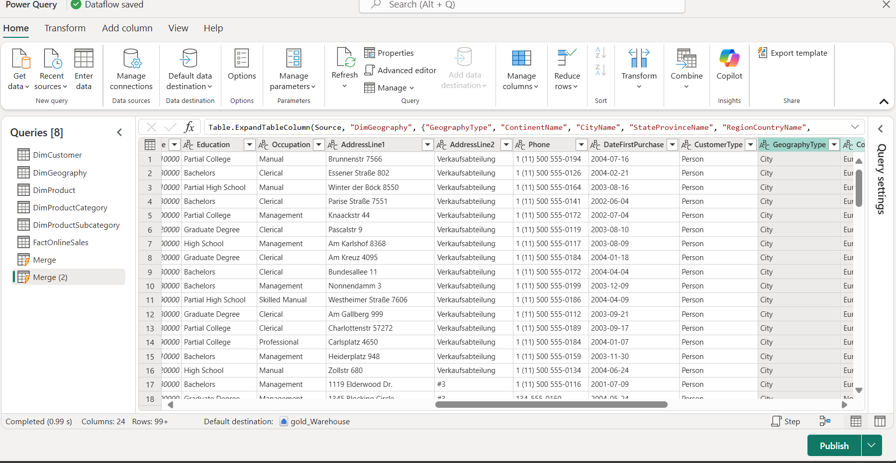

8.  From the **Merge query** window, set the Right table for merge to
    **DimProductSubcategory.**

9.  In the top right corner, select the lightbulb which has detected a
    possible column match. In this example, both tables contain a column
    titled **ProductSubcategoryKey**. Select this option to set the
    columns to be merged on. For the join kind, select **Inner** and
    then **OK** to proceed.

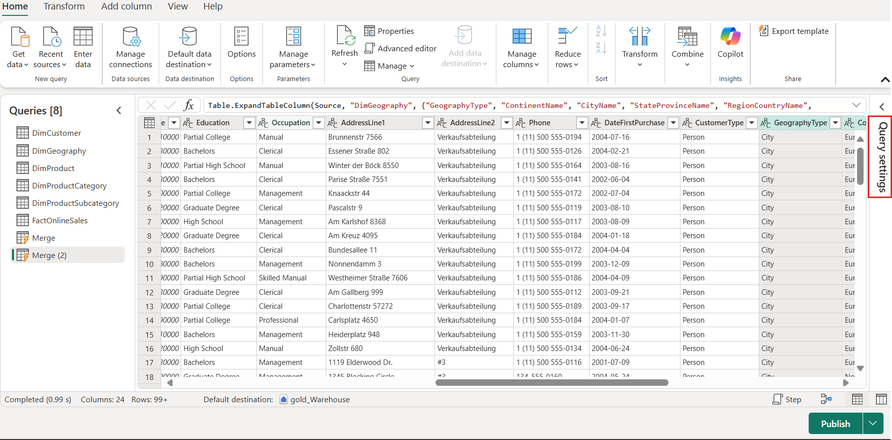

10. Navigate to the far right fo the **DimProduct** table and select the
    joined **DimProductSubcategory** table column's top right corner to
    expand the table, from the avaialble column selections
    deselect **ProductSubCategoryKey** since this column is what we used
    to merge on and already exists in the dataset before
    selecting **OK** to continue.

11. Select the **Merge** query and from the **Home** tab, navigate to
    the **Merge queries** group and select **Merge queries**.

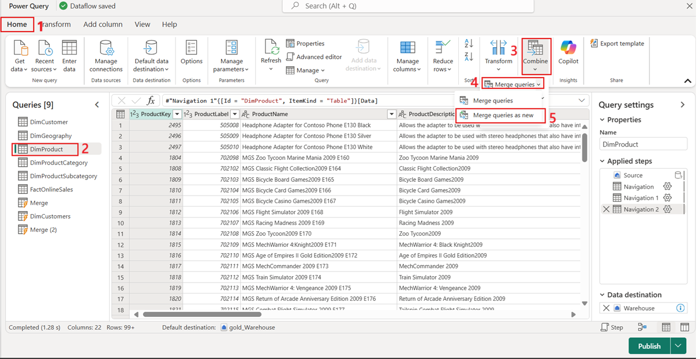

12. From the Merge query window, set the **Right table for
    merge** to **DimProductCategory**. In the top right corner, select
    the lightbulb which has detected a possible column match. In this
    example, both tables contain a column titled **ProductCategoryKey**.
    Select this option to set the columns to be merged on. For the join
    kind, select **Inner** and then **OK** to proceed.

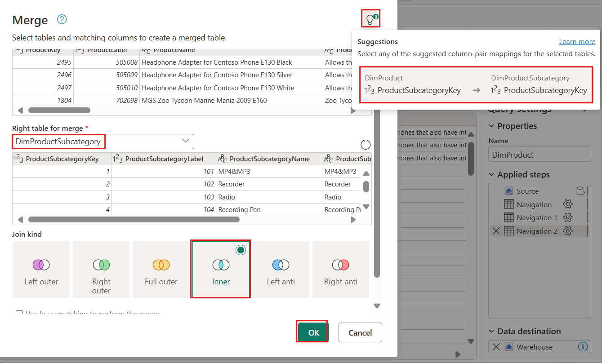

13. Navigate to the far right fo the **DimProduct** table and select the
    joined **DimProductCategory** table column's top right corner to
    expand the table, from the avaialble column selections
    deselect **ProductCategoryKey** since this column is what we used to
    merge on and already exists in the dataset before
    selecting **OK** to continue.

14. On the right-hand side in the Query settings pane, update
    the **Name** of the query to be +++**DimProducts+++**.

## Task 4:Group queries and save

1.  Select
    the **DimCustomer**, **DimGeography**, **DimProduct**, **DimProductCategory** and **DimProductSubcategory** queries
    by holding the shift key, as they are all adjacent to each other.
    Right-click and select **Move group**, then select **New group**.

2.  In the New group window, set the properties as needed below and
    select **OK**.

[TABLE]

3.  Select
    the **FactOnlineSales**, **DimCustomers** and **DimProducts** queries
    by holding the control key. Right-click and choose **Move group**,
    then select **New group**.

4.  In the New group window, set the properties as needed below and
    select **OK**. This step helps in organizing your queries into
    logical groups, making it easier to manage and navigate your data.

[TABLE]

5.  In the main editor window, confirm that you see your output
    destination on the **Query settings** pane for the **Output** table,
    and then select **Publish**.

## Task 5: Further transform task flow

1.  From the task flow, select the **Further transform** task and click
    on the paper clip icon to assign a previously created item.

2.  Select the **PrepContoso** item and then press **Select**.

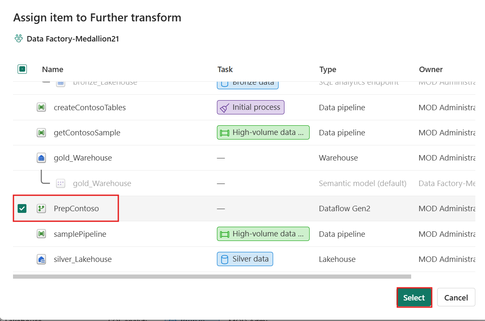

3.  From the task flow, select the **Further transform** task and click
    on the **New item** option. Within the Create an item pane display
    properties, change the toggle to the **All items** option.

4.  From the list of available items, navigate to the Data Factory
    section and select the **Copy job** item.

## Task 6: Copy data into the warehouse

1.  In the New copy job window, set the copy job name
    to +++**CopyContoso+++** and then select **Create**.

2.  From the Copy job window, search for the data source starting
    with **silver_Lakehouse** in the search bar and then
    select **silver_Lakehouse** from the OneLake catalog list.

You can also use the OneLake tab at the top if you want to set
additional criteria such as filters or item types.

3.  Now that you're on the **Choose data** step, select the following
    tables:

- DimDate

- DimEmployee

- DimStore

4.  The copy job also supports a limited set of transformations such as
    column mapping, setting schema names, and renaming tables. Expand
    the **DimStore** table and then deselect
    the **GeoLocation** and **Geometry** columns. Once done,
    select **Next** to continue.

5.  Within the Choose data destination step, search for the data source
    starting with +++**gold_Warehouse+++** in the search bar and then
    select **gold_Warehouse** from the OneLake catalog list.

6.  Within the **Map to destination** step, you can review the added
    tables and update the schema or table names. Once done reviewing,
    select **Next** to continue.

7.  On the **Settings** step, review the Copy job mode options and then
    select **Next** to continue.

8.  On the Review + save step, deselect the **Start data transfer
    immediately** option and then select **Save** to continue.

9.  Now that you've reviewed the configuration, from the **Home** tab,
    select the **Run** option to begin copying data from the lakehouse
    into the warehouse.

To configure the copy job items' name, description, refresh schedule, or
other properties, you can select the settings icon (cog) to edit.

10. You can monitor the copy job in the **Results** tab at the bottom to
    confirm that it has successfully completed.

11. Hover over the copy job on the left side-rail and select
    the **X** to close it.

## Task 7: End-to-end orchestration with pipelines

1.  In the left-sided navigation menu, navigate and click on **Data
    Factory-MedallionXX**, as shown in the below image.

> 

2.  Within the workspace, select the **Initial process** task flow item
    and from the filtered list, select
    the **createContosoTables** pipeline.

3.  From the **Home** tab, add a new **Dataflow** activity to the
    pipeline.

4.  Drag the **On success** conditional path between the **For each
    file** activity and the new **Dataflow1** activity.

5.  Select **Dataflow**, select **Settings** section and within the
    Dataflow drop-down, select the **PrepContoso** dataflow.

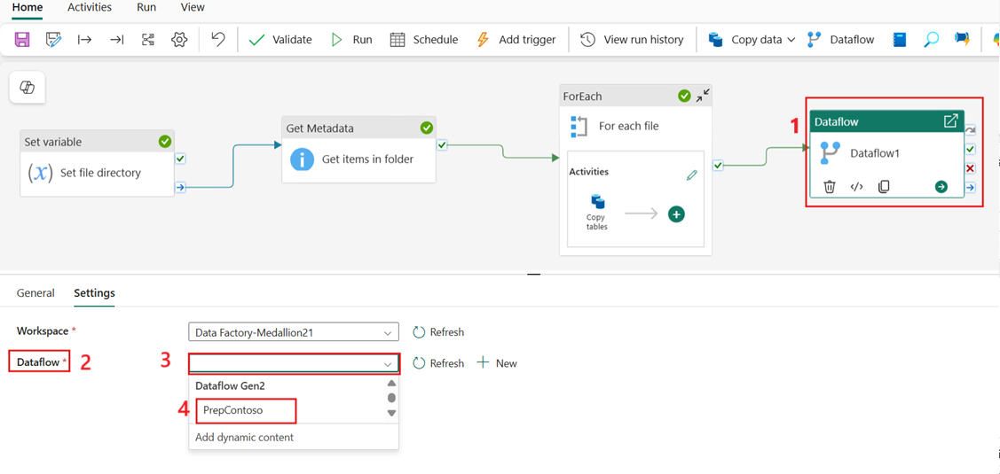

6.  With the dataflow activity still selected, go to the **General** tab
    and update the activity name to **PrepContoso**.

7.  Once complete, select the **Save** icon.

8.  In the left-sided navigation menu, navigate and click on ***Data
    Factory-MedallionXX***, as shown in the below image.

9.  Within the workspace, select the **High-volume data ingest** task
    flow item and from the filtered list, select
    the **getContosoSample** pipeline.

10. From the **Home** tab, add the **Invoke Pipeline
    (Preview)** activity.

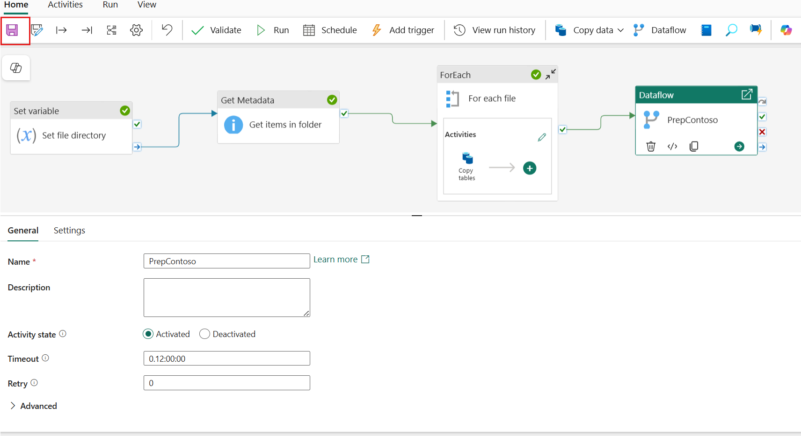

11. Create a conditional **On success** path between the **Get and Unzip
    files** activity and the **Invoke pipeline1** activity.

12. Select the **Invoke Pipeline** activity, then expand the
    **Connection** field under the **Settings** tab.

4.  In the Get data tab, type +++**Fabric Data Pipelines+++** and Select
    it.

5.  Select **Sign in** button and select the credentials

6.  In the **Connect data source** tab, select **Connect**

13. From the **activity** settings **Pipeline** option, select
    the **createContosoTables** pipeline.

14. With the invoke pipeline activity still selected, go to
    the **General** tab and update the activity **Name** to +++**Invoke
    createContosoTables+++**.

15. Once complete, select the **Save** icon and then **Run**.

**Note:** You can set a schedule from this first pipeline, and it will
call the subsequent pipelines and its dataflow upon successful
completion or have the pipeline triggered by events like when new files
are added to the lakehouse.

**Important:** Designing modular pipelines makes development, testing,
and maintenance easier. They are also portable, allowing components to
be reused across different projects. This approach is particularly
beneficial in large-scale data processing environments, where
reusability and modularization are key to efficient data integration
workflows.

16. From the **Output** pane monitor that the activities
    and **Succeedded** and once done close the pipeline by selecting
    the **X** on the left side-rail to return to the workspace.

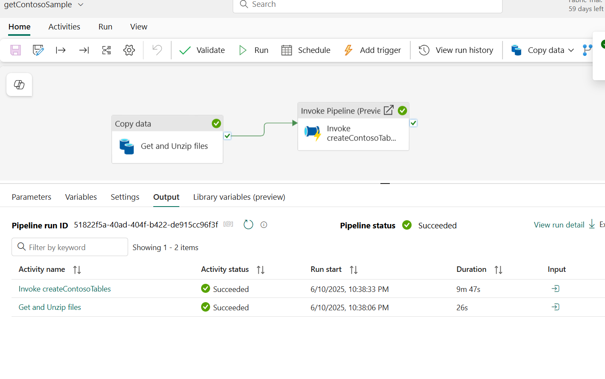

17. In the left-sided navigation menu, navigate and click on **Data
    Factory-MedallionXX**, as shown in the below image.

> 
>
> 
>
> **Summary:**
>
> This use case implementation of the Medallion Architecture using
> Microsoft Fabric tools. Beginning with workspace setup, users define a
> task flow that separates data processing into modular components. Data
> is ingested into the Bronze layer using pipelines and dynamic folder
> structures. From there, metadata-driven loops and conditional logic
> are used to enrich data into the Silver layer. The Gold layer is
> populated via Dataflow Gen2 transformations and Copy Jobs. Pipelines
> are orchestrated end-to-end with dynamic expressions, and integration
> points with Power BI and SQL interfaces are established. This
> structured approach improves data quality, traceability, and
> analytical readiness—making it ideal for enterprise-scale analytics
> solutions.
