# Use case 01: Implementing Medallion Architecture with Data Factory in Microsoft Fabric for Scalable Data Processing

**Introduction:**

Modern organizations generate large volumes of data from diverse
sources. Effectively organizing, processing, and transforming this data
is critical to enable reliable analytics and data-driven decisions.
Microsoft Fabric's Medallion Architecture provides a robust, scalable
solution by layering data across Bronze (raw), Silver (transformed), and
Gold (curated) stages. This use case explores how to implement a
complete data lifecycle using Microsoft Fabric’s capabilities—Data
Pipelines, Lakehouses, Warehouses, and Dataflows—within the Medallion
framework.

**Objective:**

- Setting up a Fabric workspace and Medallion task flow.

- Ingesting raw data into the Bronze layer.

- Transforming and enriching data in the Silver layer.

- Curating refined data for analytics in the Gold layer.

- Automating orchestration using pipelines and dynamic expressions.

- Demonstrating end-to-end integration of Power BI and T-SQL with Direct
  Lake mode.

## Prerequisites: Connect to the Wide World Importers OLTP database hosted on Azure SQL Database

### Task 1: Create a single database - Azure SQL Database

1.  From the Azure portal home page, click on **Azure portal
    menu** represented by three horizontal bars on the left side of the
    Microsoft Azure command bar. Select SQL database

> 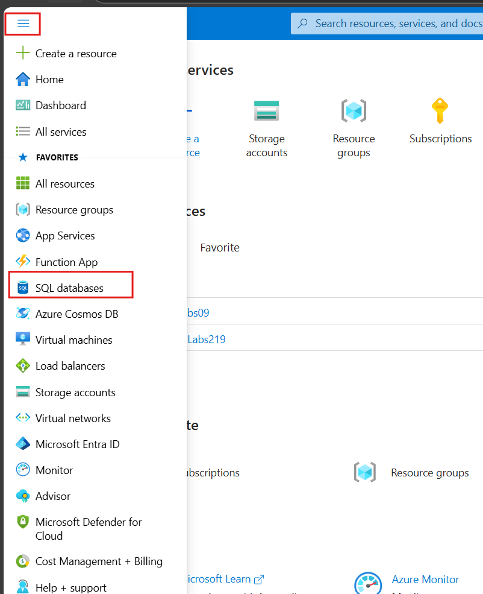

2.  Click on **+ Create**

> 

3.  On **Create a storage account** window, under the **Basics** tab,
    enter the below details to create a storage account and then click
    on **Next:Networking**

[TABLE]

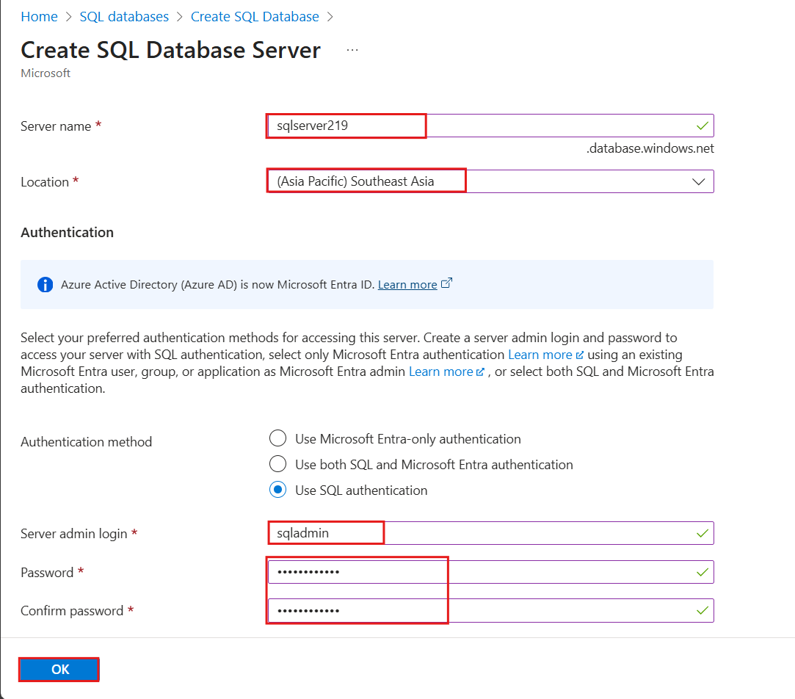

> 

4.  On the **Networking** tab, for **Connectivity method**,
    select **Public endpoint**.

5.  For **Firewall rules**, set **Add current client IP
    address** to **Yes**. Leave **Allow Azure services and resources to
    access this server** set to **No**. Click on **Next : Security**

> 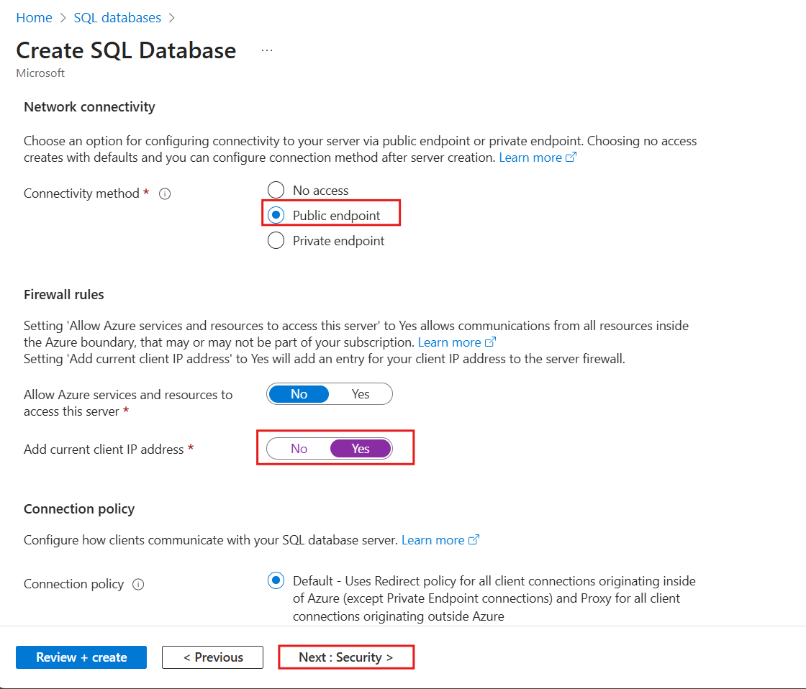

6.  Select **Next: Additional settings** at the bottom of the page

7.  On the **Additional settings** tab, select **Review + create** at
    the bottom of the page

> 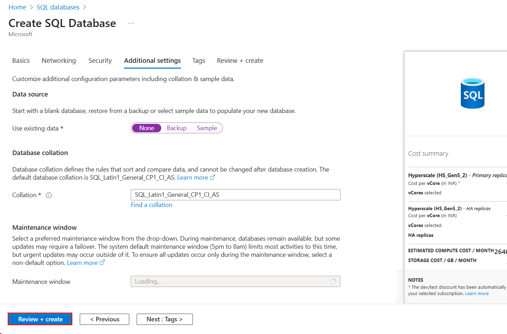

8.  On the **Review + create** page, after reviewing, select **Create**

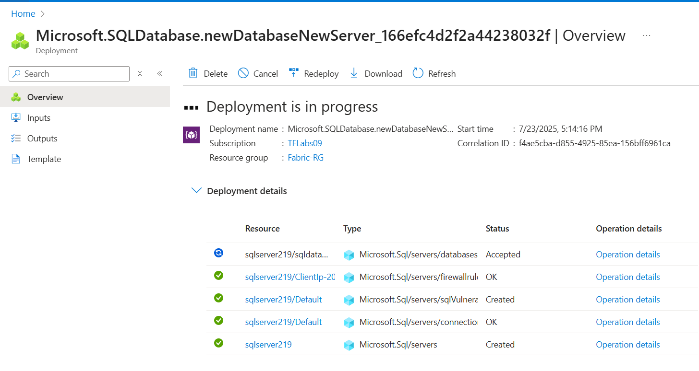

> 

9.  On **Microsoft.SQLDatabase** window, after the deployment is
    completed, click on the **Go to resource** button

> 

10. On the **Azure SQL Database** window, click on **Overview** in the
    left navigation menu, copy **Server name and SQL Databse name** ,
    paste them in a notepad, and then **Save** the notepad to use the
    information in the upcoming task.

> 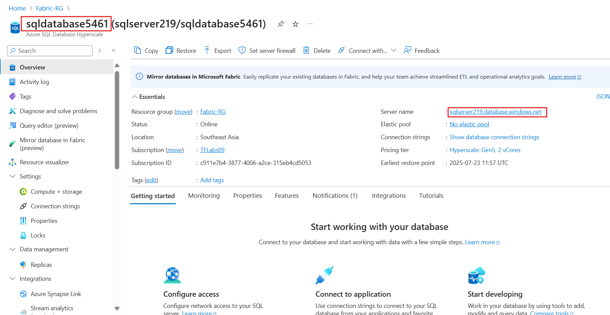

11. In the Fabric-RG resource group , select **sqlserverXXX**

> 

12. In your **SQL Server** window, navigate to the **Security**
     section, and click on **Networking**

> 

13. Select **Allow Azure service and resources to access this server**
    and click on **Save** button

> 

14. Navigate to your **Azure SQL Server.** Under **Identity**, enable
    the **System Assigned Managed Identity** and click on **Save**
    button.

> 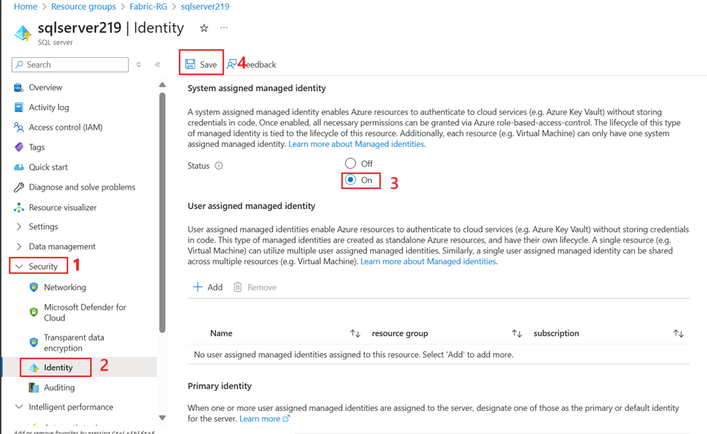
>
> 

### Task 2: Create an Azure Storage Account by using the portal

1.  Click on the **Portal Menu**, then select **+ Create a resource**

2.  In the **Create a resource** window search box, type **+++Storage
    account+++** and then click on the **storage account**.

3.  In the **Marketplace** page, click on the **Storage
    account** section.

> 

4.  In the **Storage account** window, click on the **Create** button.

> 

5.  On **Create a storage account** window, under the **Basics** tab,
    enter the below details to create a storage account and then click
    on **Next**

[TABLE]

> 

6.  Under the **Advanced** tab, Select **"Enable hierarchical
    namespace"** and click on **Review+create.**

> 

1.  On the **Review** tab, click on the **Create** button.

> 

2.  This new Azure Storage account is now set up to host data for an
    Azure Data Lake. Click on the **Go to resource** button.

> 

3.  After the account has been deployed, you will find options related
    to Azure Data Lake in the Overview page. In the left-side navigation
    pane, navigate to **Data storage** section, then click
    on **Containers**.

> 

4.  Click on **+Add Container.**

> 

5.  On the New container pane that appear on the right side, enter the
    container Name as +++**contososales**+++ and click on Create button.

> 
>
> 

6.  On **fabricstorageXX | Containers** page,
    select **contososales** container

> 

7.  On container page, click on **Upload** button.

> 

8.  In the **Upload blob** pane, click on **Browse for file**, navigate
    to **C:\Labfiles** location and select **ContosoSales.zip**, then
    click on the **Open** button.

> 

9.  In **Upload blob** pane, click on the **Upload** button.

> 
>
> 

10. On the **Storage account** window, select on **Access keys** in the
    left navigation menu, copy **Key and Storage account name** , paste
    them in a notepad, and then **Save** the notepad to use the
    information in the upcoming task.

> 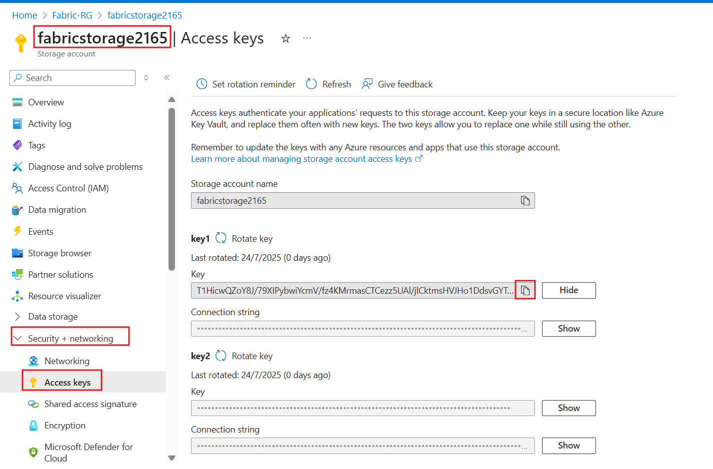

### Task 3: Restoring the WideWorldImporters Sample Database Using SQL Server Management Studio (SSMS)

1.  In your Windows search box, type +++**sql server management studio
    21**+++, then click on **SQL Server Mangement Studio 21**

2.  Click on **Sing in** button.

> 

3.  Select Microsoft

> 

4.  Select **Work or school account** and click on **Continue**

> 

5.  sign in with your cloud slice account below.

- Username: <+++@lab.CloudPortalCredential>(User1).Username+++

- Password: \<<+++@lab.CloudPortalCredential>(User1).Password\>+++

> 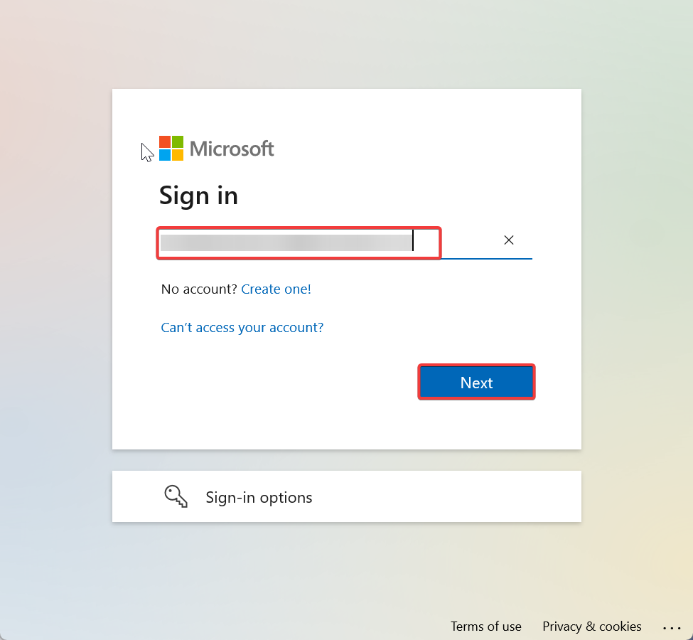

6.  In the SQL studio, select **Database Engine**

> 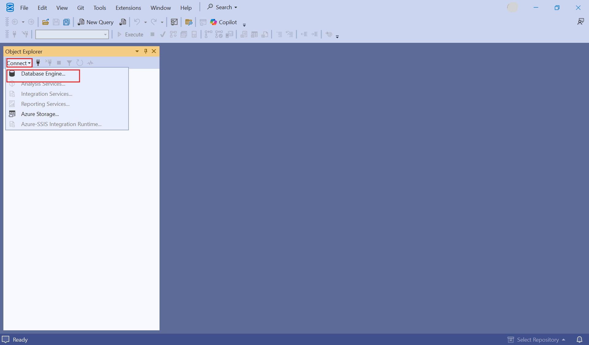

7.  In the Connect tab , select **Browse**

> 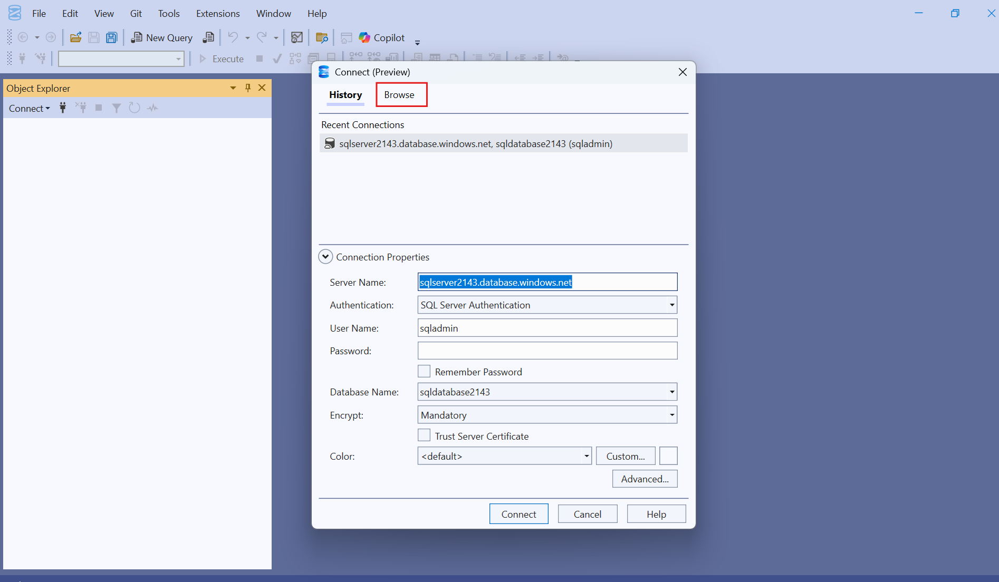

8.  Select your subscription

> 

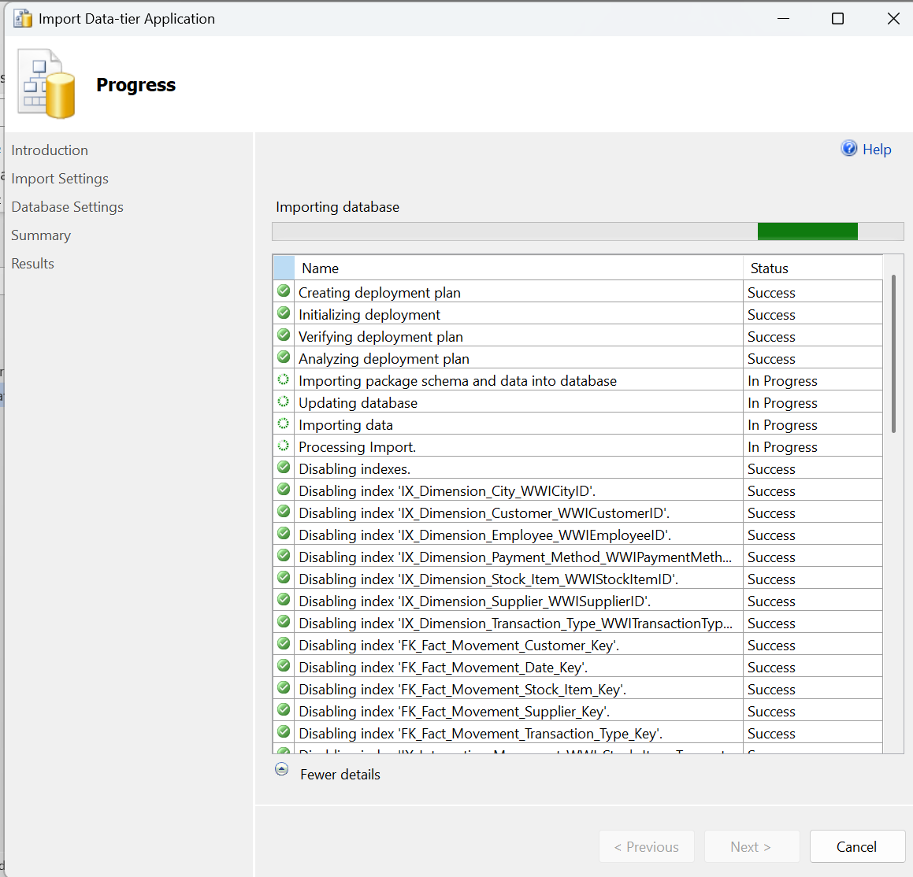

# Exercise 1: Setting Up a Medallion Architecture for Scalable Data Processing

## **Task 1: Create a Fabric workspace**

In this task, you create a Fabric workspace. The workspace contains all
the items needed for this lakehouse tutorial, which includes lakehouse,
dataflows, Data Factory pipelines, the notebooks, Power BI datasets, and
reports.

1.  Open your browser, navigate to the address bar, and type or paste
    the following URL: +++https://app.fabric.microsoft.com/+++ then
    press the **Enter** button.

2.  In the **Home** page click on **+ New Workspaces** as shown in the
    below image.

> 

3.  In the **Create a workspace** pane that appears on the right side,
    enter the following details, and click on the **Apply** button.

[TABLE]

> 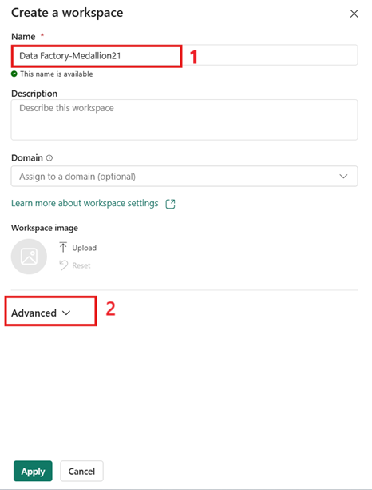
>
> 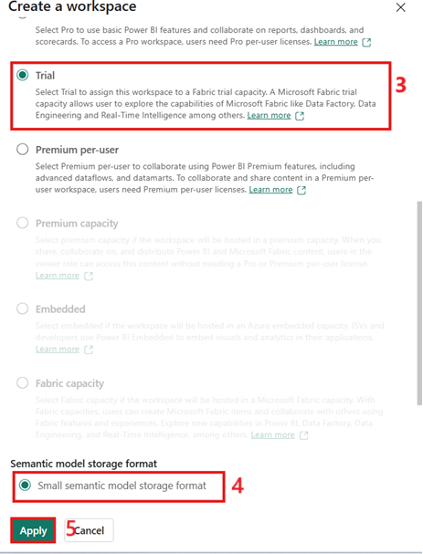
>
> 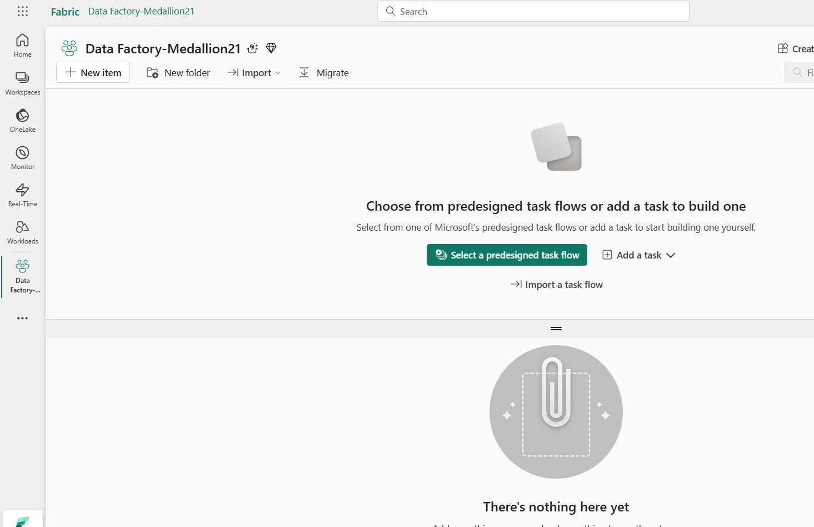

## Task 2: Create a Solution to Mirror Data in the Bronze Layer Using Azure SQL Mirroring

1.  From the empty workspace, select the option **Select a predefined
    task flow** to choose one of Microsoft's task flows. These
    predesigned task flows provide a structured approach to managing
    data projects

> 

2.  From the **Select a task flow** window, choose
    the **Medallion** option.

3.  This option includes the description "Organize and improve data
    progressively as it moves through each layer," which is crucial for
    data projects. The medallion architecture helps in structuring data
    into different layers, such as bronze, silver, and gold, to enhance
    data quality and accessibility.

4.  Select the **Select** option to continue.

> 

5.  A task flow has now been created within your workspace, which can be
    considered an architectural template. This template provides a
    structured framework for your data project.

> 

6.  Select the **New item** option on the **Bronze data** task to start
    adding items to task flow.

> 

7.  In the Create an item window, the available options within Microsoft
    Fabric have been filtered down to **All items**. This filtering is
    helpful for choosing the correct items for project.

8.  In the **Filter by item type** search box, enter **+++Mirroed Azure
    SQL Database+++** and select the **Mirroed Azure SQL Database**
    item.

> 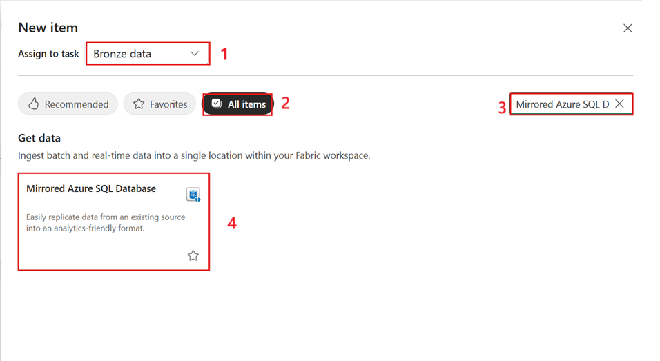

9.  In the **Choose a database connection to get started** window,
    select **Azure SQL database**

> 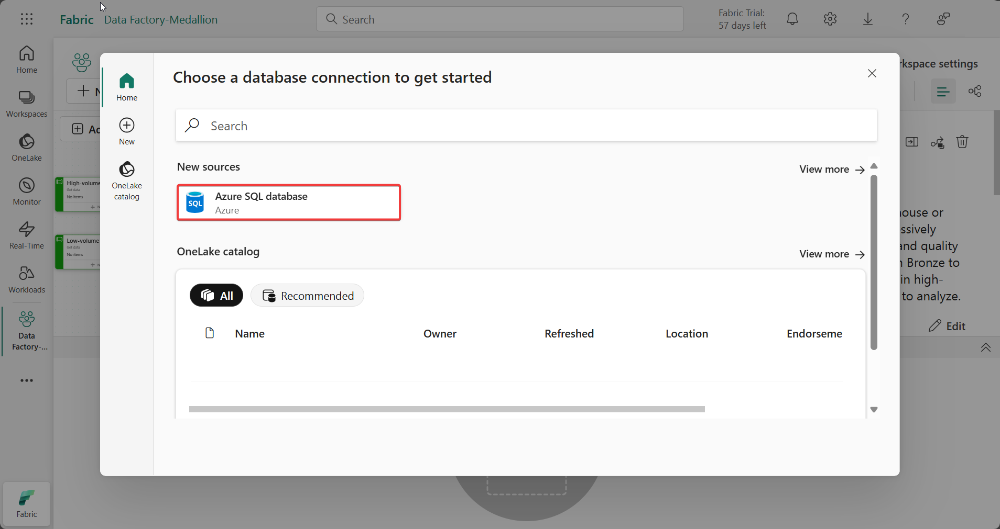

10. In the New source tab, enter the following details, and click on the
    **Connect** button.

- Server : Enter your SQL server URL

- Database: Enter the database as

> 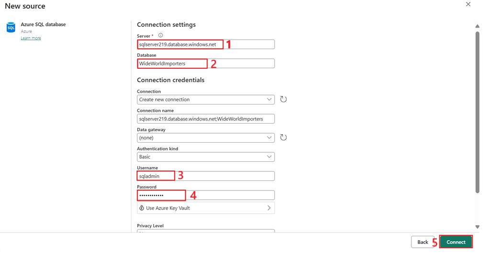

11. In the **Choose data** window, select **Select all** and click on
    **Connect** button

> 

12. In the Destination tab, click on **Create mirrored database**

> 
>
> 
>
> 

9.  In the left-sided navigation menu, navigate and click on ***Data
    Factory-MedallionXX***, as shown in the below image.

> 

13. Within the workspace, you will notice that three items have now been
    created and are associated with your Mirrored SQLdatabase. These
    items include the Mirrored database (storage), SQL analytics
    endpoint, and a default Semantic model.

> 

## Task 3: Create the Lakehouse in Bronze Layer 

1.  Select the **New item** option on the **Bronze data** task to start
    adding items to task flow.

> 

2.  In the Create an item window, the available options within Microsoft
    Fabric have been filtered down to **Recommended items**. This
    filtering is helpful for choosing the correct items for project.

3.  Select the **Lakehouse** item for data storage.

> 

4.  In the New lakehouse window, set the lakehouse name to
    +++**bronze_Lakehouse**+++ and then select **Create**. 

> 
>
> 

5.  In the left-sided navigation menu, navigate and click on ***Data
    Factory-MedallionXX***, as shown in the below image.

> 

6.  Within the workspace, you will notice that three items have now been
    created and are associated with your lakehouse. These items include
    the lakehouse (storage), SQL analytics endpoint, and a default
    Semantic model.

> 

7.  Select **New item** from the **High-volume data ingest** task. This
    task is crucial for handling large volumes of data efficiently,
    ensuring that your data ingestion processes are scalable and robust.

> 

8.  In the **Create an item** window, the available options within
    Microsoft Fabric have been filtered down to **Recommended items**.
    Select the **Data pipeline** item which is essential for automating
    the movement and transformation of data from various sources to
    destinations.

> 

9.  In the New pipeline window, set the data pipeline name to
    +++**samplePipeline**+++ and then select **Create**.

> 

## Task 4: Create a data pipeline

1.  In the left-sided navigation menu, navigate and click on ***Data
    Factory-MedallionXX***, as shown in the below image.

> 

2.   Now proceed to select and add a **New item** from the **High-volume
    data ingest** task.

> 

3.  Within the Create an item window, the available options within
    Microsoft Fabric have been filtered down to **Recommended
    items** only again. Select the **Data pipeline** item.

> 

14. In the New pipeline window, set the data pipeline name to
    +++**samplePipeline**+++ and then select **Create**.

> 

## Task 5: Copy activity

1.  From the data pipeline page, select the **Copy data assistant.**

2.  The **Copy data** dialog is displayed with the first step, **Choose
    data source**, highlighted. Select **Sample data** section, and
    select the **Public Holidays** data source type.

3.  A preview of the data source will now be displayed to verify the
    correct selection and understand the data structure. After reviewing
    the preview, select **Next** to proceed.

4.  Select the **bronze_Lakehouse** lakehouse item as the data
    destination from the **OneLake catalog list**. It determines the
    storage location for the data.

5.  Within the data destination configuration, select
    the **Files** option and set the File name
    to +++**Holidays.csv+++**. Set the Copy behavior to **Merge
    files** before selecting **Next**.

6.  Set the Compression type to **None**. This setting is important for
    determining how your data will be stored and accessed. In this case,
    no compression is applied, which can be useful for maintaining the
    original data format.

> 

7.  Set the **File format** to **DelimitedText** and then
    select **Next**. This format is commonly used for storing tabular
    data, making it easy to import and export data between different
    systems.

> 

8.  Within the **Review + save** window, disable the **Start data
    transfer immediately** option and then select **OK** to review the
    configured copy activity within the data pipeline canvas.

> 

## Task 6: Authoring canvas

1.  Within the authoring canvas, select the **Copy data activity**.

2.  The properties section below provides access to configurations for
    Source, Destination, Settings, and more. These configurations can be
    edited directly to ensure the data copy activity is correctly set up
    and aligned with specific requirements.

3.  Next, from the **Home** tab on the ribbon, select
    the **Validate** option.

This step is important to ensure that the entire pipeline (in this
sample, just the Copy activity) is valid. In the Pipeline validation
output window, a confirmation message stating 'The pipeline has been
validated. No errors were found.' should appear. This validation step
helps identify any potential issues before executing the pipeline

4.  Select the **Run** option to start the pipeline and begin your data
    ingestion process. Running the pipeline initiates the data transfer
    from the source to the destination.

5.  In the **Save and run?** dialog box, click on **Save and
    run** button to execute these activities. This activity will take
    around less than 1 min.

6.  The global properties and **Output** view will then become visible.
    After starting the run of your pipeline, both the **Pipeline
    status** and the **Activity status** should show
    a **Succeeded** status. This indicates that everything ran as
    intended, confirming that your data ingestion process was
    successful.

7.  In the left-sided navigation menu, navigate and click on
    **bronze_Lakehouse lakehouse** created in the previous task.

> 

8.  The **Holidays.csv** file has been successfully added to the
    **Files** section. Selecting the file provides a preview of the
    data, helping confirm that the ingestion process was completed
    correctly.

> 
>
> 

## Task 7: Pipeline expression builder

1.  Delete the existing **Holidays.csv** file from our lakehouse by
    selecting the ellipses (**...**) and then the **Delete** option.

2.  A confirmation window will be displayed. Select **Delete** to
    confirm the removal of the file.

3.  In the left-sided navigation menu, navigate and click on
    **samplePipeline** 

4.  Select the **Copy data** activity and then go to
    the **Destination** tab.

5.  Select the text box input for the **File path**, where after
    selection you will see the text **Add dynamic content
    \[Alt+Shift+D\]**. Select this text to open the pipeline expression
    builder.

6.  Within the Pipeline expression builder window, select
    the **Functions** tab. Here, you can explore various functions that
    exist within the expression library. These functions provide
    powerful tools for creating dynamic expressions. When you're ready,
    copy and paste the code block below into the expression input box.
    Press **Ok** when complete.

> @formatDateTime(
>
> convertFromUtc(
>
> utcnow(), 'Central Standard Time'
>
> ),
>
> 'yyyy/MM/dd'
>
> )

**Note:** This expression will be used to create a folder structure
within your pipeline that writes the file to nested folders based on the
current year, the current month, and the current date of the run time.
The forward slash "**/**" character is how the folder structure is
defined. This dynamic folder structure helps in organizing your data
based on the date, making it easier to manage and retrieve.

7.  From the **Home** tab on the ribbon, select the **Validate** option
    once again.

8.  Select the **Run** option to start the pipeline and begin data
    ingestion process. Running the pipeline initiates the data transfer
    from the source to the updated destination folder path.

9.  In the **Save and run?** dialog box, click on **Save and
    run** button to execute these activities. This activity will take
    around less than 1 min.

> 

10. The global properties and **Output** view will then become visible.
    After starting the run of your pipeline, both the **Pipeline
    status** and the **Activity status** should show
    a **Succeeded** status. This indicates that everything ran as
    intended, confirming that your data ingestion process was
    successful.

11. In the left-sided navigation menu, navigate and click on
    **bronze_Lakehouse lakehouse** created in the previous task.

12. The **Holidays.csv** file has been successfully added to the
    **Files** section, organized within a nested folder structure based
    on the **year, month, and date** of execution. This confirms that
    the dynamic file output is functioning correctly and that the data
    is being structured as intended.

**Note:** If the contents are not yet visible, navigate to the Home tab
and select the Refresh icon to start the metadata sync process and
update the lakehouse viewer content.

13. Select the **ellipses (...)** next to the top level year folder and
    then the **Delete** option to remove the **sample data**

> 

14. A confirmation window will appear, select **Delete** to proceed with
    removing the contents.

> 
>
> 

# Exercise 2: Orchestrating Dynamic and Conditional Data Workflows with Data Factory: Moving Data from Bronze to Silver Layer

This exercise focuses on orchestrating data movement using Data Factory
experiences, including the creation of dynamic expressions and
conditional paths. It provides practical guidance for building flexible
and efficient data workflows.

The first step involves creating a dynamic pipeline using variables to
manage and copy data efficiently through reusable components. This
approach enhances modularity and simplifies pipeline maintenance.

Next, conditional paths are set up to handle different scenarios and
ensure a logical flow within the pipeline. These paths enable
decision-making capabilities that adapt to varying data conditions and
processing requirements.

Finally, data is moved between medallion layers—specifically from the
bronze to the silver layer—to optimize data storage and retrieval for
analytical purposes. This structured movement supports improved data
quality and accessibility across the data lifecycle.

## Task 1: Create a Data Pipeline and Establish a Connection to ADLS Gen2 Storage

1.  In the left-sided navigation menu, navigate and click on ***Data
    Factory-MedallionXX***, as shown in the below image.

> 

2.   Now proceed to select and add a **New item** from the **High-volume
    data ingest** task.

> 

3.  Within the Create an item window, the available options within
    Microsoft Fabric have been filtered down to **Recommended
    items** only again. Select the **Data pipeline** item.

> 

4.  In the New pipeline window, set the data pipeline name to
    +++**getContosoSample**+++ and then select **Create**.

> 

5.  From the new and empty data pipeline, select the **Pipeline
    activity** watermark option and then choose **Copy data** to add
    this activity to the authoring canvas.

6.  With the **Copy data** activity selected, navigate to
    the **Source** tab. Within the **Connection** drop-down menu, select
    the **More** option to launch the Get data navigator. 

This navigator provides a comprehensive interface for connecting to
various data sources, ensuring that you can easily integrate different
data streams into pipeline.

7.  From the Get data navigator, select **Add** from the left side-rail.

8.  From the list of **New sources**, select **View more**, search
    for **Azure Blobs** and select it.

9.  In the **Connect to data source** window, enter the details from the
    table below and select **Connect**.

[TABLE]

10. In the **Copy data** activity selected and the **Source** tab
    displayed, in the **File path** enter your **container name** and
    **File name**

## Task 2: Copy activity settings

1.  In the **Copy data** activity selected and the **Source** tab
    displayed, select the **Settings** option next to the File format
    field

2.  In the **Compression type** setting, choose **ZipDeflate
    (.zip)** and select **OK** to complete.

3.  In the Source tab, expand the **Advanced** section. Deselect the
    option to **Preserve zip file name as folder**. This allows you to
    customize the folder name for your zip contents, providing more
    flexibility in organizing data.

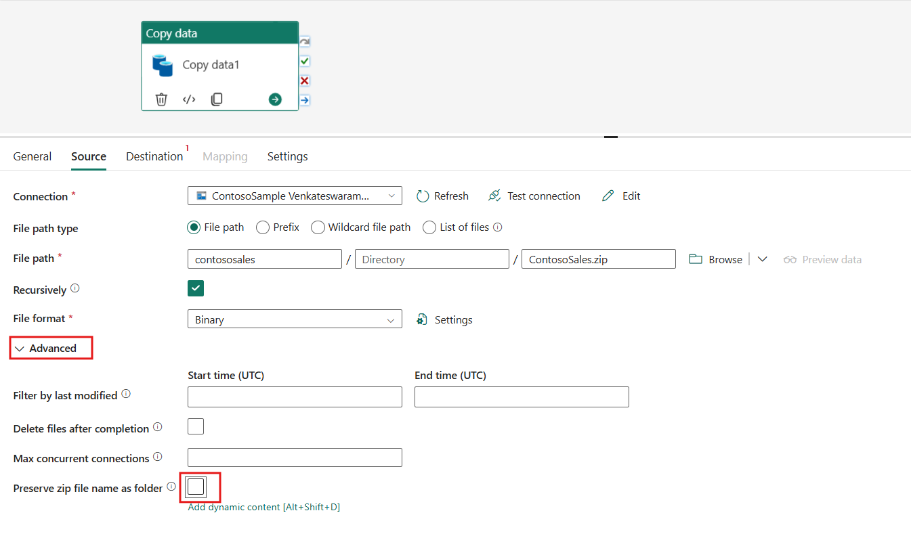

4.  In the Copy data activity, navigate to the **Destination** tab.

5.  From the list of connections, select the configured
    lakehouse **bronze_Lakehouse**. 

This step ensures that the data is being copied to the correct
destination, which is essential for maintaining data integrity and
organization.

6.  Within the Destination settings, select the **Files** option and
    then the **Directory** file path text input box. This will display
    the **Add dynamic content \[Alt+Shift+D\]** property.

7.  Select this text to open the pipeline expression builder. The
    expression builder allows us to create dynamic file paths, which can
    be customized based on various dynamic parameters such as date and
    time or static text values.

8.  In the Pipeline expression builder window, select
    the **Functions** tab. Here, you can explore various functions that
    exist within the expression library, in this example we'll use both
    date and string functions to create a dynamic folder path. Copy and
    paste the code block below into the expression input box.
    Press **Ok** when complete.

@concat(

'ContosoSales\\,

formatDateTime(

convertFromUtc(

utcnow(), 'Central Standard Time'

),

'yyyy/MM/dd'

)

)

9.  With the Copy data activity and Destination settings still selected,
    expand the **Advanced** section, select the drop-down for the **Copy
    behavior** and then choose the **Preserve hierarchy** option.

10. This option maintains the original file names as they are within the
    zip file, ensuring that the file structure is preserved during the
    copy process.

11. Navigate to the **General** tab with the Copy data activity
    selected. Update the **Name** and **Description** fields with the
    appropriate text. This step helps in identifying and managing the
    activity within your pipeline, making it easier to understand its
    purpose and functionality.

[TABLE]

12. From the **Home** tab, select the **Validate** option to first
    confirm that there are no issues with your pipeline. This validation
    step helps in identifying any errors to be fixed before running the
    pipeline.

13. Once validated, select the **Save** option and then **Run** to start
    the ingestion from the data pipeline. Running the pipeline initiates
    the data transfer, allowing you to see the results of your
    configuration in action within the output window.

14. This action will make the global properties and **Output** view
    visible. After starting the run of your pipeline, both the Pipeline
    status and any individual Activity statuses should show
    a **Succeeded** status. This indicates that everything ran as
    intended, confirming that your data ingestion process was
    successful.

15. In the left-sided navigation menu, navigate and click on
    **bronze_Lakehouse lakehouse**

16. The contents of the **zip file** have been successfully added to the
    **Files** section, organized in a nested folder structure based on
    the data source title, year, month, and date of the pipeline run.

## Task 3: Create a Silver Lakehouse and New Data Pipeline

1.  In the left-sided navigation menu, navigate and click on ***Data
    Factory-MedallionXX***, as shown in the below image.

2.  Select the **New item** option on the **Silver data** from your task
    flow to add another storage item to project. Within the **Item
    type** selection, select **Lakehouse**.

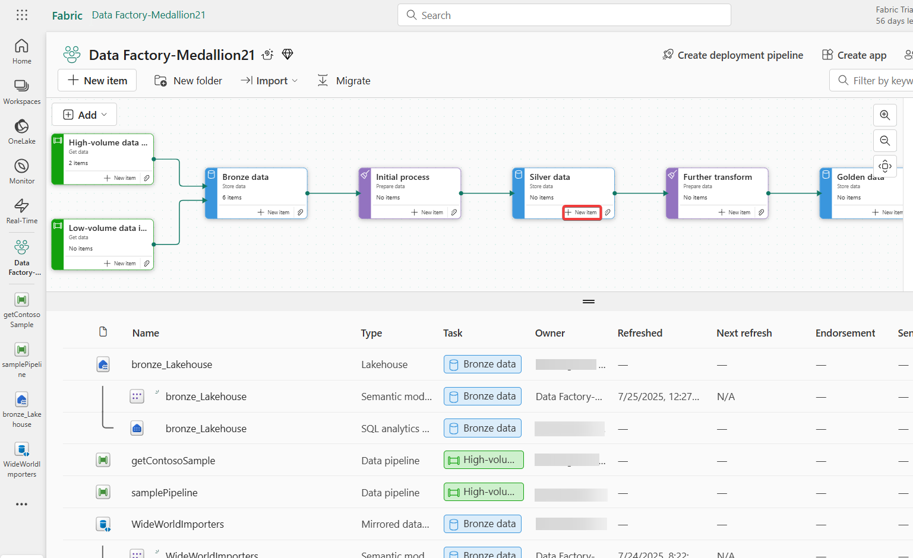

3.  In the New lakehouse window, set the lakehouse name to
    +++**silver_Lakehouse**+++ and then select **Create**. 

> 

4.  Within the lakehouse item from the **Home** tab select **Get
    data** from **New data pipeline**.

5.  In the New pipeline window, set the data pipeline name to
    +++**createContosoTables**+++ and then select **Create**

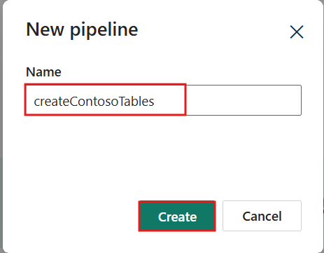

6.  If prompted with the **Copy data assistant** window, select **X** in
    the top right corner to be taken into an empty authoring canvas.
    This ensures that start with a clean slate for pipeline
    configuration.

## Task 4: Configure a Variable for File Directory

1.  Select the **Activities** tab and then the **Set variable** activity
    to add this to your canvas. The Set variable activity allows to
    define and assign values to variables that can be used throughout
    pipeline.

2.  With the Set variable activity selected, navigate to the
    **Settings** tab. Next to the Name property, select '**New'** to
    create a variable that will be used within the pipeline.

3.  In the **Add new** **variable** window, set the **Name** value
    to +++**fileDirectory+++** and ensure the Type remains as a string
    before selecting **Confirm.**

4.  Select the **Value **text input box. This will display the **Add
    dynamic content** \[Alt+Shift+D\] property. Select this text to open
    the pipeline expression builder.

5.  In the Pipeline expression builder window **copy and paste** the
    code block below into the expression input box. Press **Ok** when
    complete.

@concat(

'ContosoSales\\,

formatDateTime(

convertFromUtc(

utcnow(), 'Central Standard Time'

),

'yyyy/MM/dd'

)

)

> 
>
> 

6.  Navigate to the **General** tab with the Set variable activity
    selected. Update the **Name** field with the text +++**Set file
    directory**+++.

This step helps in identifying and managing the activity within your
pipeline in subsequent steps, making it easier to understand its purpose
and functionality.

## Task 5: Retrieve Metadata Using Dynamic Path

1.  Navigate to the **Activities** tab and select the **Get
    metadata** activity to add it to your canvas.

2.  In the **Settings** options, set
    the **Connection** to **bronze_Lakehouse** from the available
    connection options.

3.  Choose the **Files** option and then click on the **Directory** file
    path text input box. This will display the **Add dynamic content
    \[Alt+Shift+D\]**. Click on this text to open the pipeline
    expression builder.

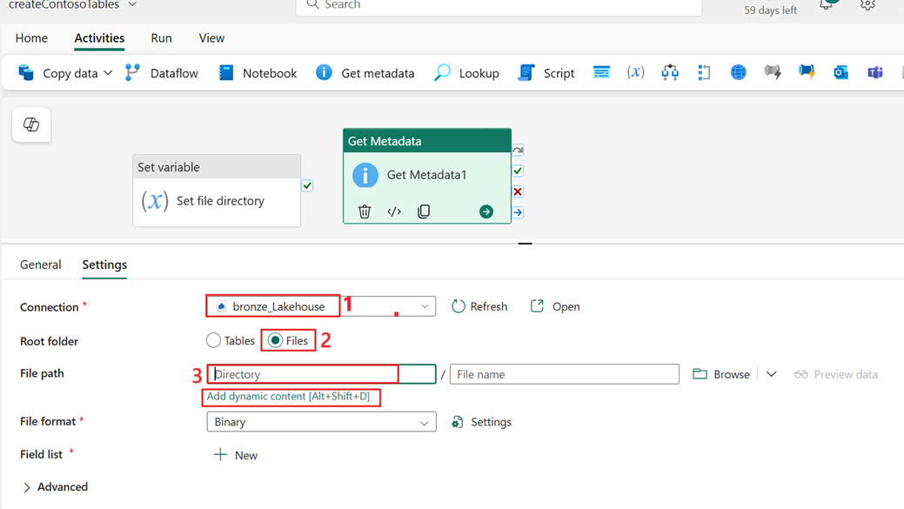

4.  In the Pipeline expression builder window, select
    the **Variables** option. Within the available variable list,
    select **fileDirectory** and then **OK**.

5.  This step ensures that the file path for the metadata retrieval is
    dynamically set based on the value of the fileDirectory variable.

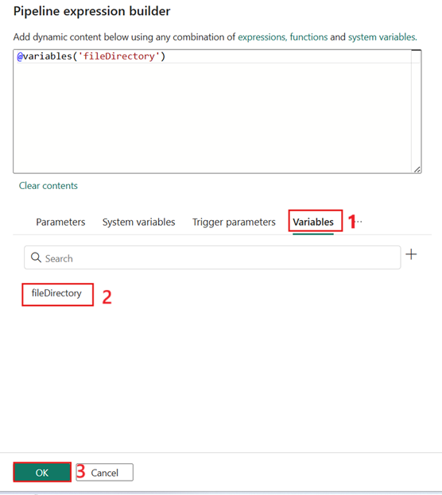

6.  Select Get metadata activity, navigate to the **Settings** tab. From
    the **Field list** select **New**.

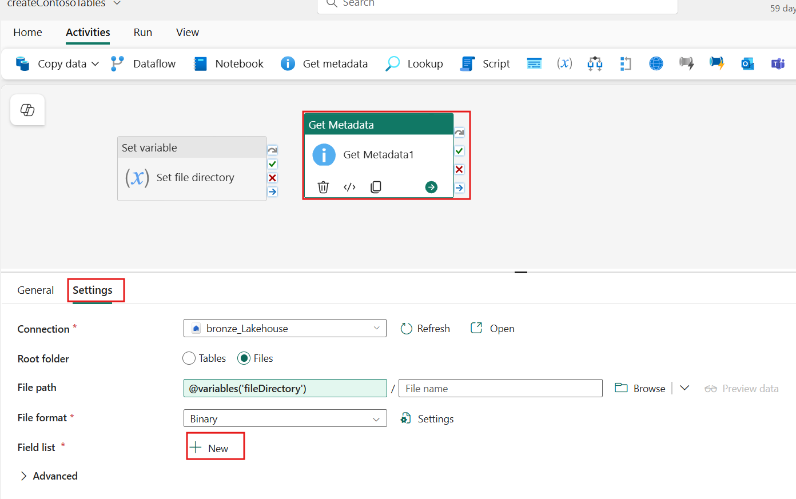

7.  Within the drop-downs, configure the value as **Child items**. This
    ensures that the metadata activity retrieves information about the
    child items and their names within the specified directory.

8.  Select the **Get Metadata** activity and update the **Name** field
    with the text +++**Get items in folder**+++.

9.  This naming step aids in identifying and managing the activity
    within the pipeline, enhancing clarity around its purpose and
    functionality**.**

10. Create a conditional path by dragging and dropping the **On
    completion** option between the **Set file directory** activity and
    the **Get items in folder** activity.

11. Select **Validate** on the **Home** tab to ensure there are no
    errors within the pipeline.

12. After validation, select **Run** to start the pipeline.

13. Both the Pipeline status and the Activity status should display a
    '**Succeeded**' status, indicating that the execution completed
    successfully.

14. From the **'Get items in fo**lder' activity, select the last column
    labeled '**Output**' to review the activity's contents. This step
    verifies that the filenames from the directory have been correctly
    retrieved and included in the output**.**

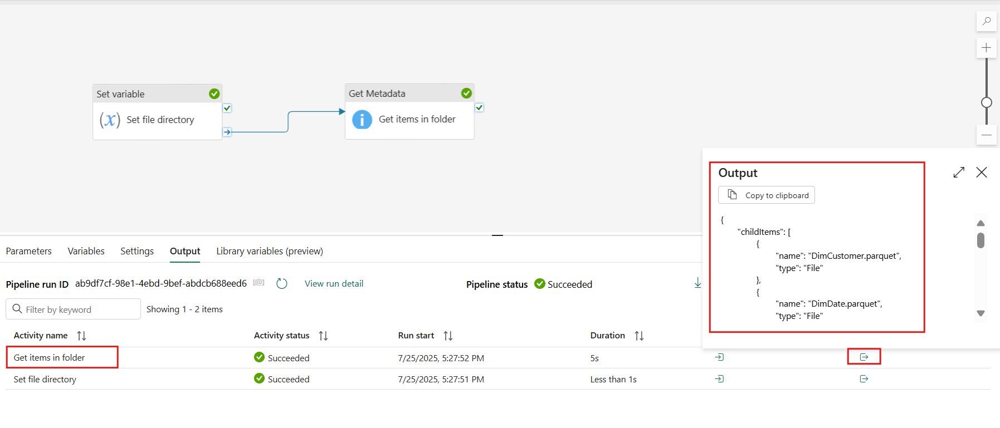

## Task 6: ForEach loop and conditional branches

1.  Select the **Activities** tab and then the **ForEach** activity to
    add this to your canvas. This activity allows you to iterate over a
    collection of items, performing a set of actions for each item in
    the collection.

2.  With the **ForEach** activity selected, navigate to the **General**
    tab and update the **Name** field with the text +++**For each
    file+++**.

3.  Next, create a conditional path by dragging and dropping the **On
    success** option between the **Get items in folder activity** and
    the **For each file activity**.

4.  Select **For each file activity**, navigate to the **Settings** tab.
    Select the **Items** text input box. This will display the **Add
    dynamic content \[Alt+Shift+D\]** property. Select this text to open
    the pipeline expression builder. The sequential order ensures that
    the items are processed one after another, maintaining the order of
    execution.

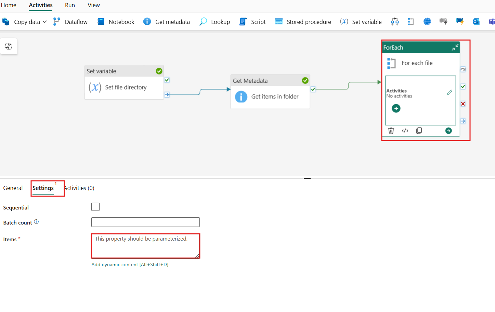

5.  Within the Pipeline expression builder window, select the **Activity
    outputs** section. Then, choose the **Get items in folder** output
    of **childItems**. The full option title is **Get items in folder
    childItems**. This step ensures that the ForEach activity iterates
    over the child items retrieved from the specified directory.

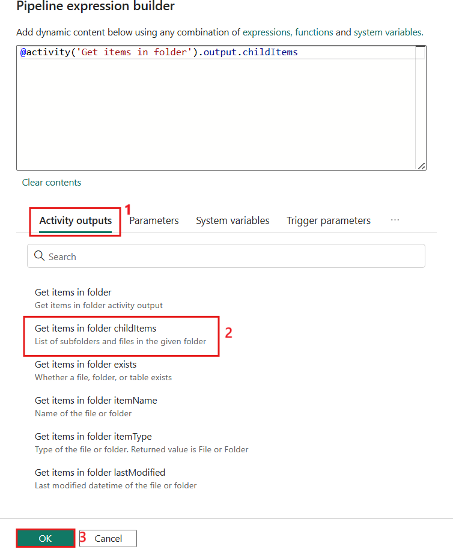

6.  Select the **add** option on the **For each activity** and then
    select **Copy data**. This step will allow us to repeatedly execute
    the copy data activity for each item in the array.

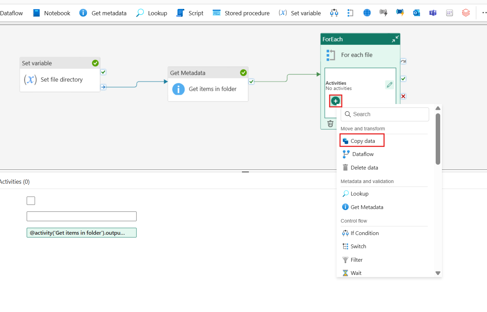

7.  Select the **Edit** option on the **For each activity** to drill
    into the nested authoring canvas. This step allows you to configure
    the activities that will be executed for each item in the
    collection.

8.  Navigate to the **General** tab with the **Copy data activity**
    selected. Update the **Name** field with the text +++**Copy
    tables**+++.

9.  With the **Copy data** activity still selected, configure the
    following options in the **Source** tab. Once complete select
    the **Directory** text input box. This will display the **Add
    dynamic content \[Alt+Shift+D\]** property.

[TABLE]

> 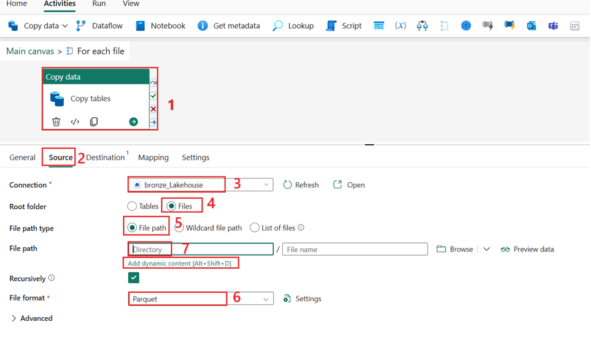

10. Select this text to open the pipeline **Add dynamic content
    \[Alt+Shift+D\]** property expression builder.

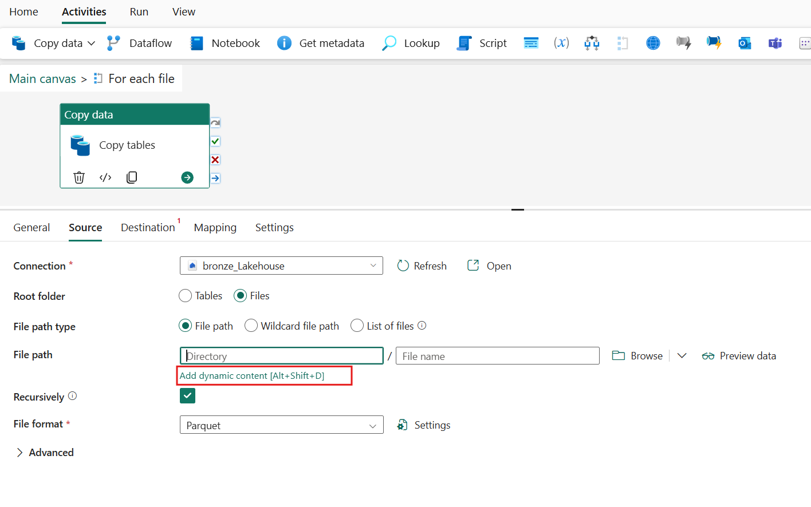

11. Select the variable **fileDirectory** within the expression
    builder's **Variables** section and **OK** to continue.

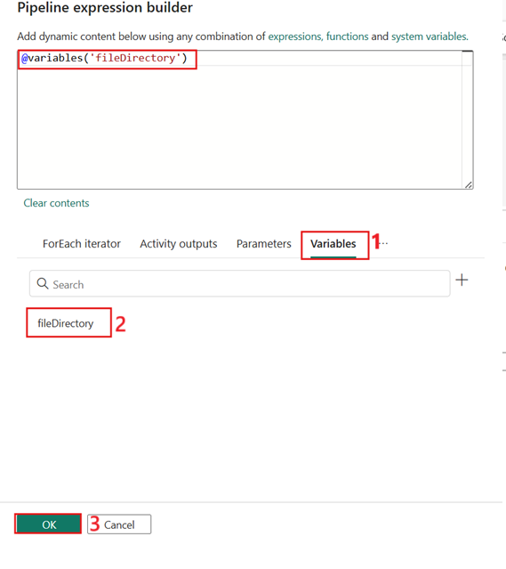

12. Select the **File name** text input box. This will display the **Add
    dynamic content \[Alt+Shift+D\]** property. Select this text to open
    the pipeline expression builder.

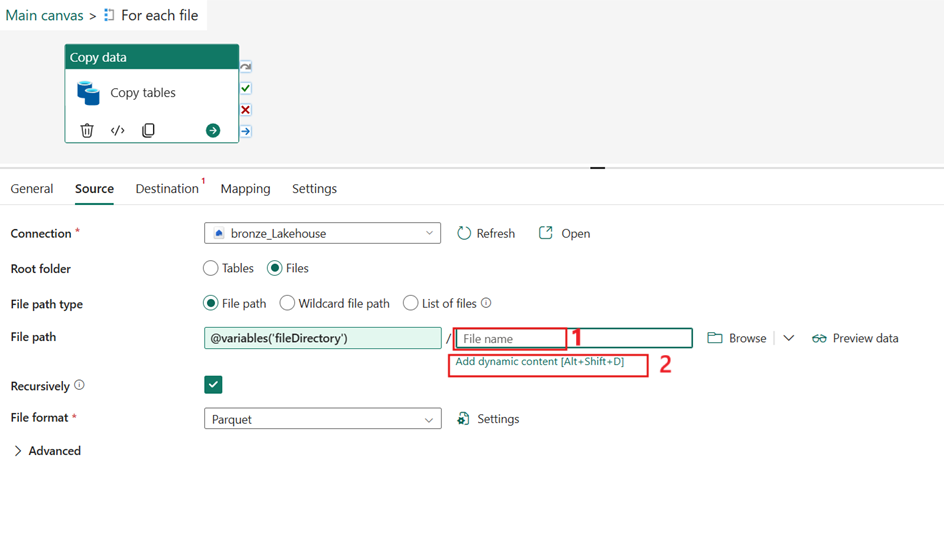

13. Select the item **For each file** within the expression builder's
    **ForEach iterator** section. Within the expression builder, add the
    suffix ".name" to access the name property of the current items
    array and then **OK** to continue once complete.

14. Copy and paste the code block below into the expression input box.

**@item().name**

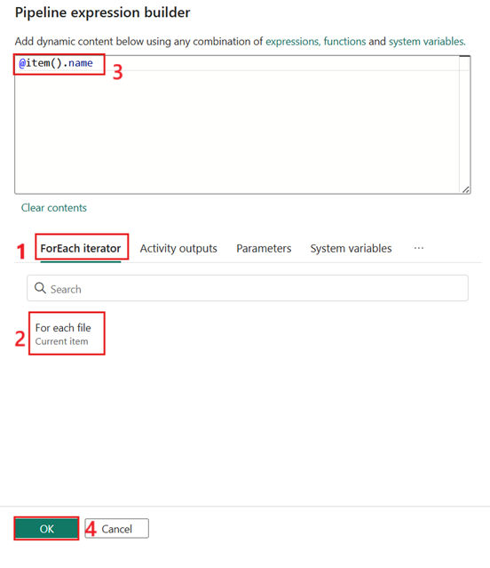

15. With the **Copy data activity** selected, configure the following
    options in the **Destination** tab. Once complete select
    the Table text input box. This will display the Add dynamic content
    \[Alt+Shift+D\] property. Select this text to open the pipeline
    expression builder.

[TABLE]

16. In the **Pipeline expression builder**, select **Functions** and
    then choose **split** from the **String functions group** to divide
    each item name using the period delimiter **'.' .** From the
    resulting array, select the first item. Once complete, select
    '**OK**' to proceed

17. Copy and paste the code block below into the expression input box.

**@split(item().name, '.')\[0\]**

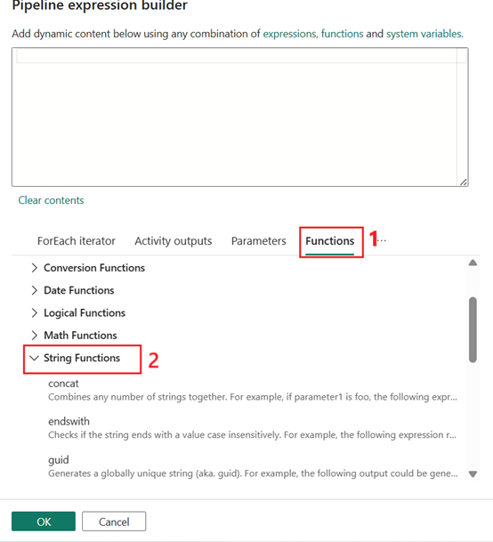

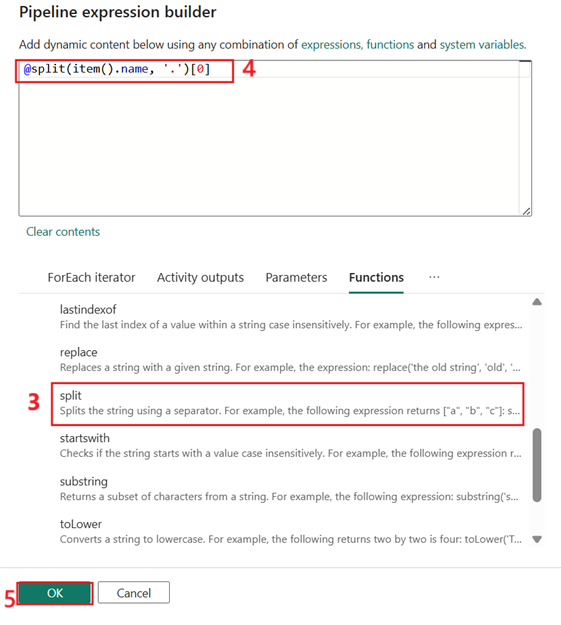

18. In the **Source** tab, select '**Append**' from the **Table action**
    values to display the **'Add dynamic content \[Alt+Shift+D\]'
    property**. Select this text to open **the Pipeline Expression
    Builder.**

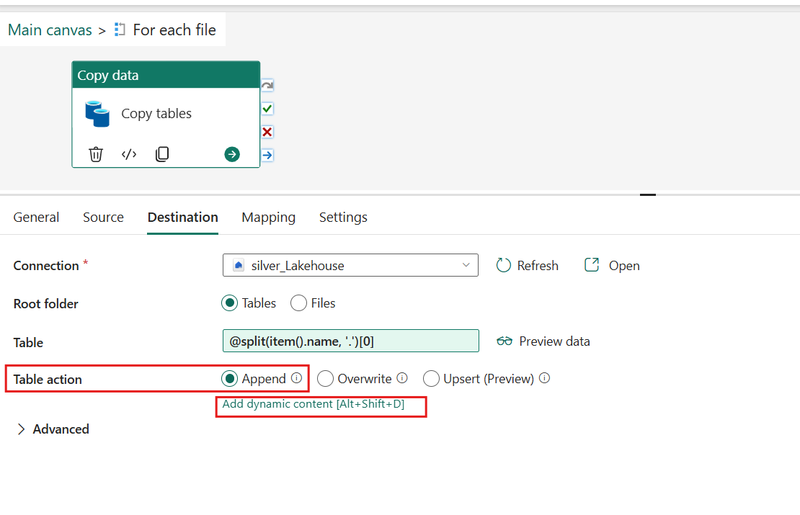

19. Within the expression builder, we'll use the if condition from the
    logical **functions** group and the startswith function from the
    string functions group to determine if the string starts with the
    prefix of **Dim** for our dimension tables. If true, we'll set the
    value to **Overwrite**, if false **Append**. Once complete
    select **OK** to continue.

20. Copy and paste the code block below into the expression input box.

**@if(**

**startswith(item().name, 'Dim'),**

**'Overwrite',**

**'Append'**

**)**

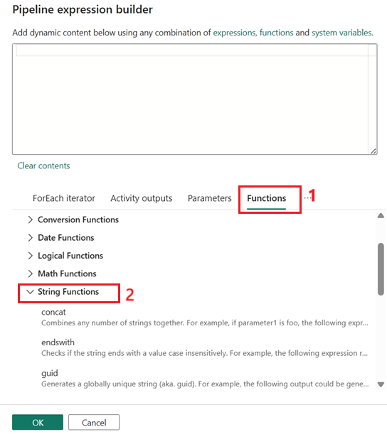

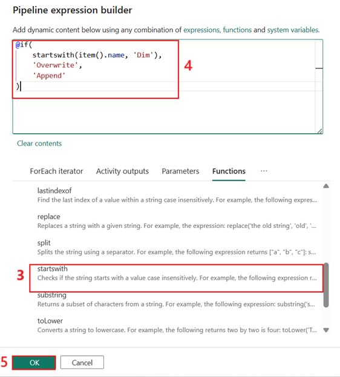

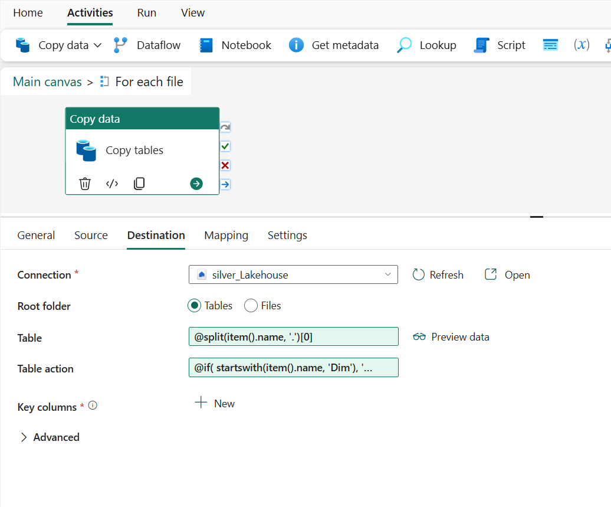

21. Select the **Main canvas** option from the breadcrumb trail to
    return to the top level of pipeline.

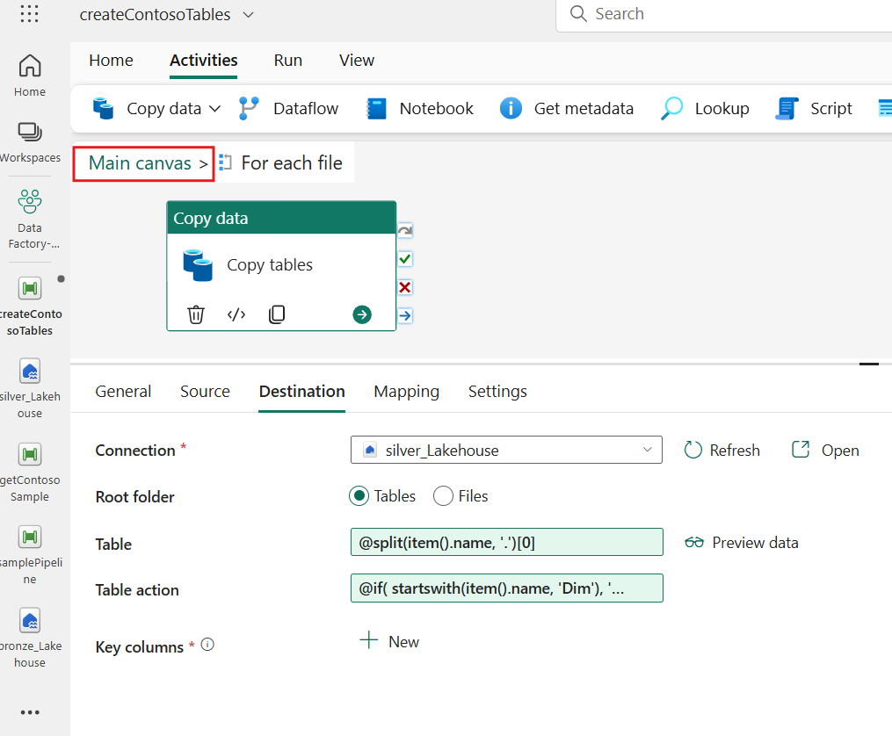

22. From the **Home** tab, select the **Validate** option to first
    confirm that there are no issues with in the pipeline. 

23. Once validated, select the  **Run** to start the ingestion from the
    data pipeline.

24. If a save window is prompted, confirm by selecting **Save and run**.

25. Running the pipeline initiates the data transfer, allowing you to
    see the results of your configuration in action within the output
    window.

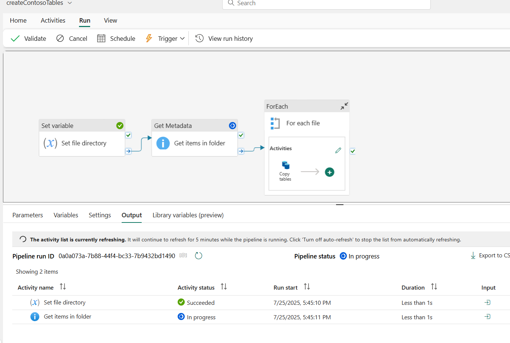

26. The data pipeline runs multiple activities sequentially, writing to
    the Silver data layer as delta parquet tables. v-Order optimized
    tables enhance performance, reduce storage costs, and support
    efficient querying and data updates—ideal for analytical workloads
    in Microsoft Fabric.

## Task 7: Attach data pipeline to task flow

1.  In the left-sided navigation menu, navigate and click on ***Data
    Factory-MedallionXX***, as shown in the below image.

2.  From the task flow select the **Initial process** task and the paper
    clip to assign a previously created item.

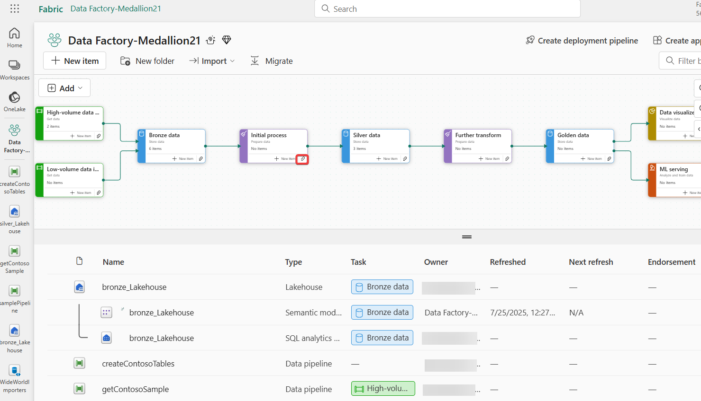

3.  Select the **createContosoTables** item and then press **Select**.

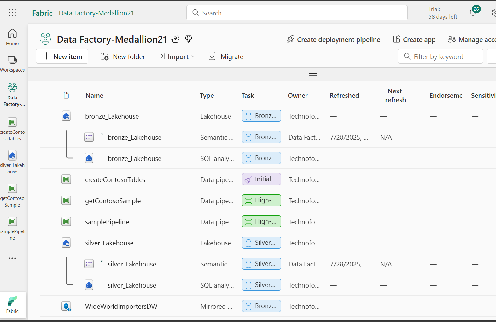
